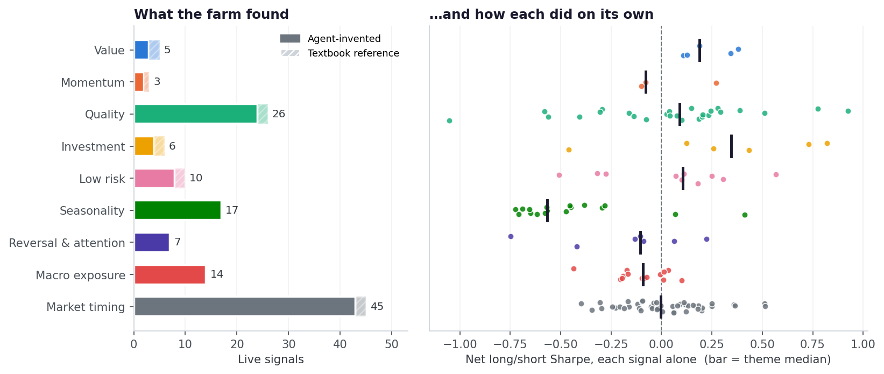
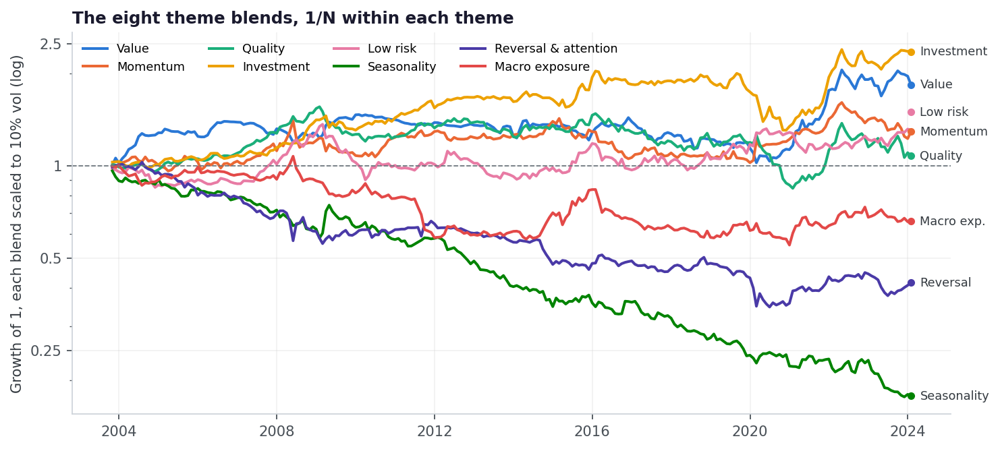
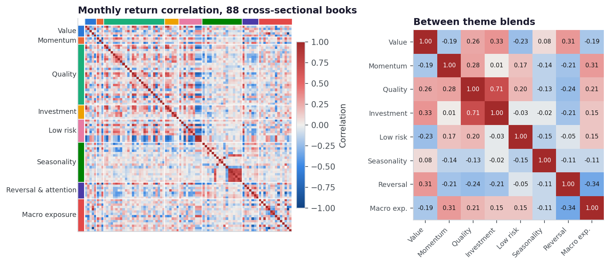
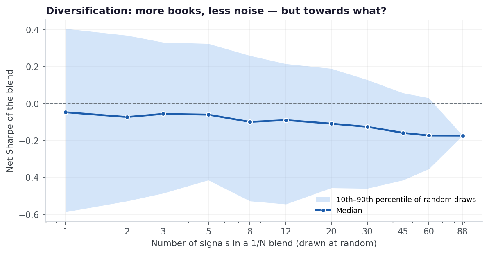
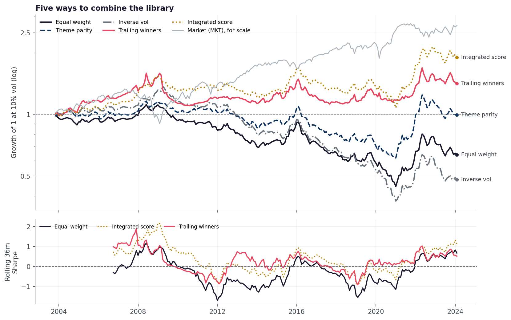
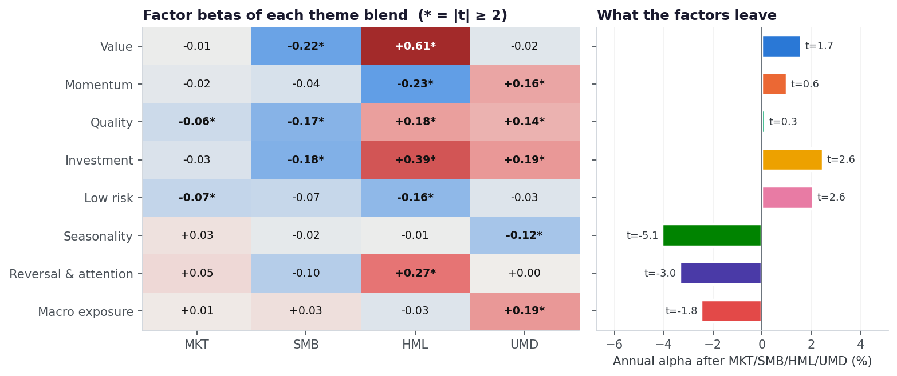

<style>
.sc-hero{background:linear-gradient(135deg,#1a1a2e 0%,#0f3460 100%);color:#fff;
  border-radius:14px;padding:2.5rem 2rem;margin:0 0 2rem}
.sc-hero h2{color:#fff;margin:0 0 .4rem;font-size:1.9rem;border:0}
.sc-hero .sc-sub{opacity:.85;font-weight:300;font-size:1.05rem;margin-bottom:1.25rem}
.sc-hero .sc-chip{background:rgba(255,255,255,.14);border:1px solid rgba(255,255,255,.28);
  padding:.32rem .85rem;border-radius:2rem;font-size:.8rem;font-weight:500;
  display:inline-block;margin:.2rem .3rem .2rem 0}
.sc-metrics{display:grid;grid-template-columns:repeat(auto-fit,minmax(170px,1fr));
  gap:1rem;margin:1.5rem 0 2rem}
.sc-metric{background:#fff;border:1px solid #e9ecef;border-radius:10px;padding:1.15rem;text-align:center}
.sc-metric .v{font-size:1.7rem;font-weight:700;color:#1a1a2e;line-height:1.15}
.sc-metric .l{font-size:.72rem;color:#6c757d;text-transform:uppercase;letter-spacing:.05em;margin-top:.3rem}
.sc-table{width:100%;border-collapse:collapse;font-size:.87rem;margin:1rem 0}
.sc-table th{background:#f8f9fa;color:#1a1a2e;text-align:left;padding:.6rem .7rem;
  border-bottom:2px solid #dee2e6;font-size:.78rem;text-transform:uppercase;letter-spacing:.04em}
.sc-table td{padding:.55rem .7rem;border-bottom:1px solid #f1f3f5;vertical-align:top}
.sc-table tr:hover td{background:#fbfcfd}
.sc-table .num{text-align:right;font-family:'JetBrains Mono',monospace;font-size:.84rem;white-space:nowrap}
.sc-table .small{font-size:.78rem;color:#6c757d}
.sc-swatch{display:inline-block;width:.75rem;height:.75rem;border-radius:3px;margin-right:.45rem;
  vertical-align:-.05rem}
.sc-pos{color:#198754;font-weight:600}
.sc-neg{color:#b02a37;font-weight:600}
.sc-note{background:#f8f9fa;border-left:4px solid #0f3460;border-radius:8px;
  padding:1rem 1.15rem;margin:1.4rem 0;font-size:.9rem}
.sc-note strong{color:#0f3460}
.sc-warn{background:#fff8f0;border-left:4px solid #b8860b;border-radius:8px;
  padding:1rem 1.15rem;margin:1.4rem 0;font-size:.9rem}
.sc-warn strong{color:#b8860b}
</style>


<div class="sc-hero">
<h2>From a pile of signals to a portfolio</h2>
<div class="sc-sub">The farming pipeline judges every signal alone. A fund would not trade them alone.
This page sorts the library into themes, measures how different the ideas really are, then blends
them &mdash; and asks whether the blend earns a premium, and whose premium it is.</div>
<span class="sc-chip">88 cross-sectional signals</span>
<span class="sc-chip">45 market-timing rules</span>
<span class="sc-chip">8 themes</span>
<span class="sc-chip">Oct 2003&ndash;Jan 2024, monthly, net of 10bp</span>
</div>

<div class="sc-metrics">
<div class="sc-metric"><div class="v">15</div><div class="l">Effective bets among 88</div></div>
<div class="sc-metric"><div class="v">-0.17</div><div class="l">Sharpe, 1/N of everything</div></div>
<div class="sc-metric"><div class="v">+0.47 / -0.36</div><div class="l">Textbook / agent-invented blend</div></div>
<div class="sc-metric"><div class="v">46–62%</div><div class="l">Blend variance explained by 4 factors</div></div>
</div>

## The question

The [main farming page](../llm-alpha/index.qmd) asks of each signal: *does this predict returns on
its own?* Most of the library fails that test after correcting for the size of the search, and a
reasonable response is that single signals were never the point. Weak, imperfectly correlated
edges are supposed to add up. That is the whole argument for multi-factor portfolios.

So this study takes the argument seriously. It asks three things:

1. **What did the farm actually find?** A map of the library by theme, data source and origin.
2. **Do the signals diversify each other?** Correlation structure and the effective number of
   independent bets.
3. **Does a combination harvest a premium, and is it a *factor* premium?** Five blends, each
   regressed on market, size, value and momentum factors built from the same panel.

<div class="sc-note">
<strong>Two rules keep the blends honest.</strong> Every signal keeps the sign its idea agent
committed to <em>before</em> the backtest; nothing is flipped because it lost money. And the
catalog keeps every idea that was implemented, regardless of how it performed, so "all live
signals" is not a set chosen by outcome. Near-duplicates (|correlation| above the novelty
threshold) are excluded so one bet is not counted twice. The two adaptive blends size month
<em>t</em> using returns through month <em>t</em>&minus;1 only.
</div>

## 1. What the farm found

The catalog's own categories are coarse: a third of the library was filed as "other". Sorting by
what the signal actually does gives eight cross-sectional themes, plus the market-timing rules,
which are a different kind of strategy altogether (a time-varying market exposure rather than a
long/short stock book).

{fig-alt="Bar chart of signal counts by theme and strip plot of each signal's Sharpe by theme"}

<table class="sc-table"><thead><tr><th>Theme</th><th class="num">Signals</th><th class="num">Median Sharpe</th><th class="num">Positive</th><th class="num">Theme blend Sharpe</th><th>Best single signal</th><th>Data used</th></tr></thead><tbody><tr><td><span class="sc-swatch" style="background:#2a78d6"></span><strong>Value</strong></td><td class="num">5<span class="small"> (2 textbook)</span></td><td class="num"><span class="sc-pos">+0.19</span></td><td class="num">100%</td><td class="num"><span class="sc-pos">+0.46</span></td><td><code>retained_vs_contributed_capital_value</code> <span class="small">(+0.38)</span></td><td class="small">price 60%, fundamental 60%, macro 20%</td></tr><tr><td><span class="sc-swatch" style="background:#eb6834"></span><strong>Momentum</strong></td><td class="num">3<span class="small"> (1 textbook)</span></td><td class="num"><span class="sc-neg">-0.08</span></td><td class="num">33%</td><td class="num"><span class="sc-pos">+0.09</span></td><td><code>momentum_12_1</code> <span class="small">(+0.27)</span></td><td class="small">price 67%, macro 33%, fundamental 33%</td></tr><tr><td><span class="sc-swatch" style="background:#1baf7a"></span><strong>Quality</strong></td><td class="num">26<span class="small"> (2 textbook)</span></td><td class="num"><span class="sc-pos">+0.09</span></td><td class="num">65%</td><td class="num"><span class="sc-pos">+0.16</span></td><td><code>gross_profitability</code> <span class="small">(+0.92)</span></td><td class="small">fundamental 92%, price 38%, macro 15%</td></tr><tr><td><span class="sc-swatch" style="background:#eda100"></span><strong>Investment</strong></td><td class="num">6<span class="small"> (2 textbook)</span></td><td class="num"><span class="sc-pos">+0.35</span></td><td class="num">83%</td><td class="num"><span class="sc-pos">+0.63</span></td><td><code>payout_funding_gap</code> <span class="small">(+0.82)</span></td><td class="small">fundamental 67%, price 33%, macro 17%</td></tr><tr><td><span class="sc-swatch" style="background:#e87ba4"></span><strong>Low risk</strong></td><td class="num">10<span class="small"> (2 textbook)</span></td><td class="num"><span class="sc-pos">+0.11</span></td><td class="num">70%</td><td class="num"><span class="sc-pos">+0.14</span></td><td><code>macro_systematic_variance_share</code> <span class="small">(+0.57)</span></td><td class="small">price 90%, macro 90%, fundamental 30%</td></tr><tr><td><span class="sc-swatch" style="background:#008300"></span><strong>Seasonality</strong></td><td class="num">17<span class="small"></span></td><td class="num"><span class="sc-neg">-0.57</span></td><td class="num">12%</td><td class="num"><span class="sc-neg">-0.76</span></td><td><code>predicted_dividend_month_premium</code> <span class="small">(+0.41)</span></td><td class="small">price 100%, fundamental 18%</td></tr><tr><td><span class="sc-swatch" style="background:#4a3aa7"></span><strong>Reversal &amp; attention</strong></td><td class="num">7<span class="small"></span></td><td class="num"><span class="sc-neg">-0.10</span></td><td class="num">29%</td><td class="num"><span class="sc-neg">-0.23</span></td><td><code>quiet_strength_low_attention_high</code> <span class="small">(+0.22)</span></td><td class="small">price 100%, macro 43%</td></tr><tr><td><span class="sc-swatch" style="background:#e34948"></span><strong>Macro exposure</strong></td><td class="num">14<span class="small"></span></td><td class="num"><span class="sc-neg">-0.09</span></td><td class="num">29%</td><td class="num"><span class="sc-neg">-0.28</span></td><td><code>oil_beta_trend_interaction</code> <span class="small">(+0.10)</span></td><td class="small">macro 100%, price 93%, fundamental 50%</td></tr><tr><td><span class="sc-swatch" style="background:#6c757d"></span><strong>Market timing</strong></td><td class="num">45<span class="small"> (2 textbook)</span></td><td class="num"><span class="sc-neg">-0.01</span></td><td class="num">49%</td><td class="num"><span class="sc-pos">+0.16</span></td><td><code>stagflation_supply_shock_timing</code> <span class="small">(+0.52)</span></td><td class="small">macro 73%, price 49%, fundamental 22%</td></tr></tbody></table>

The shape of the library says something about how the idea agent searches. It went deepest where
the accounting data is richest: 26 quality and earnings-quality ideas,
nearly all built on fundamentals. The second-largest cluster is calendar seasonality
(17 ideas), built mostly from price data, and it is the
worst-performing theme in the library. Only 12%
of those signals have a positive Sharpe, and their 1/N blend runs at
-0.76. Many are variations on published
calendar anomalies (same-month return persistence, tax-loss selling around the turn of the year),
and on this universe and period, net of costs, they lost steadily. Reversing their signs now would be
exactly the after-the-fact decision the study refuses to make.

Value and investment are the only themes where a clear majority of ideas work. They are also small
and close to the textbook: 4 of their 11 signals are the reference anomalies the harness
ships with.

{fig-alt="Equity curves of the eight theme blends"}

## 2. How different are they?

{fig-alt="Correlation heatmap of signal returns grouped by theme, and of theme blends"}

The library is genuinely diverse. The average absolute correlation between two signals' returns
is 0.17. Themes are weak clusters: two signals from the *same* theme correlate
+0.054 on average, barely more than two from different themes (+0.004).
The eigenvalues of the correlation matrix put the library at about **15 effective
independent bets** out of 88. That is plenty of room to diversify.

The exception is on the right: the quality and investment blends correlate
0.71. Low accruals, conservative payouts and restrained
asset growth describe the same kind of company, and the returns agree.

## 3. Diversification converges &mdash; to the average

{fig-alt="Median and 10th-90th percentile Sharpe of random 1/N blends by number of signals"}

This chart is the key to everything that follows. Blending does exactly what it promises: the
spread of outcomes collapses, from a 10th&ndash;90th percentile range of -0.59 to
0.40 for one signal to a single number for all 88, and volatility falls
from 12.3% to 2.3% a year. But diversification removes
*noise*. It does not add *edge*. It converges on the average signal, and in this library the average
signal loses money after costs. The median line slopes gently **down**: the more signals you blend,
the more certainly you get the library's mean, which is -0.17 Sharpe.

## 4. Five ways to combine

<table class="sc-table"><thead><tr><th>Blend</th><th class="num">Sharpe</th><th class="num">Ann. return</th><th class="num">Ann. vol</th><th class="num">Max drawdown</th><th class="num">Sharpe pre / post 2012</th></tr></thead><tbody><tr><td><strong>Equal weight</strong><br><span class='small'>1/N across every cross-sectional book</span></td><td class="num">-0.17</td><td class="num">-0.4%</td><td class="num">2.3%</td><td class="num">-18.2%</td><td class="num">-0.34 / -0.13</td></tr><tr><td><strong>Theme parity</strong><br><span class='small'>1/N across the eight theme blends, so 26 quality ideas count once</span></td><td class="num">0.05</td><td class="num">0.1%</td><td class="num">2.4%</td><td class="num">-13.5%</td><td class="num">0.08 / 0.04</td></tr><tr><td><strong>Inverse vol</strong><br><span class='small'>each book weighted by 1 / trailing 36-month volatility</span></td><td class="num">-0.31</td><td class="num">-0.6%</td><td class="num">1.7%</td><td class="num">-19.5%</td><td class="num">0.18 / -0.51</td></tr><tr><td><strong>Trailing winners</strong><br><span class='small'>1/N across books with a positive trailing 60-month mean; cash if none</span></td><td class="num">0.22</td><td class="num">0.9%</td><td class="num">4.6%</td><td class="num">-14.9%</td><td class="num">0.27 / 0.19</td></tr><tr><td><strong>Integrated score</strong><br><span class='small'>one decile book on the average cross-sectional rank of every signal</span></td><td class="num">0.36</td><td class="num">4.0%</td><td class="num">13.3%</td><td class="num">-45.7%</td><td class="num">0.57 / 0.31</td></tr></tbody></table>

{fig-alt="Equity curves and rolling Sharpe of five signal-combination methods"}

- **Equal weight** lands at -0.17, as the diversification curve predicted.
- **Theme parity** caps each theme at one-eighth of the book, so the 26 quality ideas no longer
  outvote the 5 value ideas. That lifts Sharpe to +0.05,
  which is still zero for practical purposes.
- **Inverse vol** is the worst of the five (-0.31). The
  lowest-volatility books in this library are disproportionately the losing ones (the calmest
  third has a median Sharpe of -0.22, the most volatile third
  +0.01), so risk parity scales the losers *up*.
- **Trailing winners** holds only books whose trailing five-year mean is positive (a median of
  39 of 88 at any time). It recovers +0.22. That is
  consistent with factor momentum, but it is not distinguishable from zero (t = 0.99).
- **Integrated score** is the only blend that clears the others comfortably, at
  +0.36. It is also a different animal. Averaging ranks *before* trading lets
  opposing views on a stock cancel out, so the book concentrates on names most signals agree on. It
  runs at 13.3% volatility against 2.3% for the return blend,
  with a -45.7% maximum drawdown and one-way turnover of
  1.22 a month (the median single signal turns over
  0.59).

4 of the 5 blends are weaker after 2012 than before, in line with the evidence that anomalies decay once published. The exception is equal weight, which loses less in the second half, though losing less is not the same as working.

## 5. Whose premium is it?

A blend that earns something might be harvesting new return, or it might be a roundabout way to
own the factors everyone already knows. Regressing each blend on market, size, value and momentum
separates the two.

<table class="sc-table"><thead><tr><th>Blend</th><th class="num">β MKT (t)</th><th class="num">β SMB (t)</th><th class="num">β HML (t)</th><th class="num">β UMD (t)</th><th class="num">Alpha / yr</th><th class="num">Alpha t</th><th class="num">R²</th></tr></thead><tbody><tr><td><strong>Equal weight</strong></td><td class="num">-0.02<span class="small"> (-3.2)</span></td><td class="num">-0.10<span class="small"> (-8.1)</span></td><td class="num">+0.16<span class="small"> (7.5)</span></td><td class="num">+0.11<span class="small"> (5.5)</span></td><td class="num"><span class="sc-neg">-0.7%</span></td><td class="num"><strong>-1.75</strong></td><td class="num">56%</td></tr><tr><td><strong>Theme parity</strong></td><td class="num">-0.02<span class="small"> (-2.4)</span></td><td class="num">-0.11<span class="small"> (-7.0)</span></td><td class="num">+0.19<span class="small"> (6.8)</span></td><td class="num">+0.10<span class="small"> (5.4)</span></td><td class="num"><span class="sc-neg">-0.2%</span></td><td class="num"><strong>-0.49</strong></td><td class="num">53%</td></tr><tr><td><strong>Inverse vol</strong></td><td class="num">-0.02<span class="small"> (-3.4)</span></td><td class="num">-0.07<span class="small"> (-7.1)</span></td><td class="num">+0.13<span class="small"> (8.0)</span></td><td class="num">+0.06<span class="small"> (3.4)</span></td><td class="num"><span class="sc-neg">-0.7%</span></td><td class="num"><strong>-2.07</strong></td><td class="num">46%</td></tr><tr><td><strong>Trailing winners</strong></td><td class="num">-0.02<span class="small"> (-1.5)</span></td><td class="num">-0.19<span class="small"> (-5.7)</span></td><td class="num">+0.17<span class="small"> (4.7)</span></td><td class="num">+0.25<span class="small"> (9.1)</span></td><td class="num"><span class="sc-pos">+0.4%</span></td><td class="num"><strong>0.57</strong></td><td class="num">62%</td></tr><tr><td><strong>Integrated score</strong></td><td class="num">-0.21<span class="small"> (-6.9)</span></td><td class="num">-0.50<span class="small"> (-6.7)</span></td><td class="num">+0.95<span class="small"> (8.7)</span></td><td class="num">+0.59<span class="small"> (8.0)</span></td><td class="num"><span class="sc-pos">+4.6%</span></td><td class="num"><strong>2.36</strong></td><td class="num">60%</td></tr></tbody></table>

<div class="sc-note">
<strong>How to read this.</strong> Betas are loadings on the factor long/short portfolios (t-stats
in brackets, Newey-West). Alpha is the return the four factors do not explain; it is the part of
the premium that is actually the library's own.
</div>

The loadings are the clearest result on the page. **Every blend is long value, long momentum and
short small caps**, with t-stats between 3 and 9, and the four factors explain
46&ndash;62% of every blend's variance. Individually the signals looked
diverse. In aggregate the library leans the way the academic literature leans, because that is
where the idea agent most plausibly learned what a good signal looks like.

So the blends do harvest factor premia, in the sense that they load on them. The problem is what
those premia paid over this window:

<table class="sc-table"><thead><tr><th>Factor</th><th class="num">Ann. return</th><th class="num">Sharpe</th><th class="num">t-stat (NW)</th></tr></thead><tbody><tr><td><strong>MKT</strong> <span class='small'>Market (equal-weighted universe)</span></td><td class="num">9.0%</td><td class="num">0.54</td><td class="num">2.45</td></tr><tr><td><strong>SMB</strong> <span class='small'>Size: small minus big</span></td><td class="num">-2.4%</td><td class="num">-0.20</td><td class="num">-0.96</td></tr><tr><td><strong>HML</strong> <span class='small'>Value: low minus high price/book</span></td><td class="num">0.1%</td><td class="num">0.06</td><td class="num">0.24</td></tr><tr><td><strong>UMD</strong> <span class='small'>Momentum: winners minus losers</span></td><td class="num">0.9%</td><td class="num">0.13</td><td class="num">0.59</td></tr></tbody></table>

Over Oct 2003&ndash;Jan 2024, value was flat, momentum barely positive and size negative; only the market paid.
A portfolio that loads on HML and UMD collects roughly nothing from those loadings. That is why the
return blends have
alphas near zero or below: equal weight -0.7% a year
(t = -1.75), inverse vol t = -2.07.

The integrated book is the exception, with alpha of +4.6% a year
(t = 2.36). Look at its betas, though: an HML loading of
0.95 and a UMD loading of 0.59, several times the return
blends'. Integrating scores turned a mild, diluted factor tilt into a concentrated one. The alpha
clears t = 2 only narrowly, and it is the best of five combinations tried, before any correction
for having tried five.

### By theme: which ideas are factors in disguise?

{fig-alt="Heatmap of factor betas per theme and bar chart of theme alphas"}

The themes load where their names say they should. The value blend is a value tilt (HML
+0.61); quality and investment are value plus momentum;
low risk is <em>short</em> value, and the
macro-exposure blend loads on momentum. After the factors,
investment and low risk keep a
significant positive alpha (t &ge; 2), and seasonality and reversal & attention
carry a significant *negative* one. The negative
alphas are not a factor story: seasonality and reversal barely load on anything (R&sup2;
15% and 20%). They
are losses of their own.

Across single signals, 9 of 88 have a factor-adjusted alpha with t &ge; 2
and 20 have t &le; &minus;2. A search with no skill would put about two in each tail.

### Textbook versus invented

<table class="sc-table"><thead><tr><th>1/N blend of</th><th class="num">Signals</th><th class="num">Sharpe</th><th class="num">Alpha / yr</th><th class="num">Alpha t</th><th class="num">R²</th></tr></thead><tbody><tr><td><strong>Textbook references</strong></td><td class='num'>9</td><td class='num'>0.47</td><td class="num"><span class="sc-pos">+2.6%</span></td><td class='num'>2.98</td><td class='num'>70%</td></tr><tr><td><strong>Agent-invented</strong></td><td class='num'>79</td><td class='num'>-0.36</td><td class="num"><span class="sc-neg">-1.0%</span></td><td class='num'>-2.50</td><td class='num'>42%</td></tr></tbody></table>

Split the library by who wrote the signal and the picture sharpens. The 9 textbook
references, blended 1/N, earn Sharpe 0.47 with a factor-adjusted alpha
t-stat of 2.98. The 79 agent-invented signals, blended the same
way, earn -0.36 with alpha t = -2.50: significantly
*negative* after the factors. As a portfolio, the farm's inventions subtract value. The positive
premium in the library comes from the ideas it was seeded with.

### Do the blends add anything to the factors?

The formal version of the question is spanning: if you can already hold the four factors, does
adding a blend raise the best achievable Sharpe?

<table class="sc-table"><thead><tr><th>Investable set</th><th class="num">Max Sharpe (in-sample)</th><th class="num">Gain over factors</th></tr></thead><tbody><tr><td>The four factors alone</td><td class='num'>0.93</td><td class="num"><span class="">+0.00</span></td></tr><tr><td>Factors + equal weight</td><td class='num'>1.02</td><td class="num"><span class="sc-pos">+0.10</span></td></tr><tr><td>Factors + theme parity</td><td class='num'>0.93</td><td class="num"><span class="sc-pos">+0.01</span></td></tr><tr><td>Factors + inverse vol</td><td class='num'>1.08</td><td class="num"><span class="sc-pos">+0.15</span></td></tr><tr><td>Factors + trailing winners</td><td class='num'>0.94</td><td class="num"><span class="sc-pos">+0.01</span></td></tr><tr><td>Factors + integrated score</td><td class='num'>1.07</td><td class="num"><span class="sc-pos">+0.15</span></td></tr><tr><td>Factors + all eight theme blends</td><td class='num'>1.81</td><td class="num"><span class="sc-pos">+0.89</span></td></tr></tbody></table>

The best single blend adds +0.15 to the factors' 0.93. Adding all
eight theme blends at once reaches 1.81, but that number should not be
trusted. It comes from an in-sample optimiser choosing twelve weights with hindsight, free to
*short* the seasonality theme it now knows lost money. That is the sign flip the rest of the page
refuses, done by an optimiser instead of by hand.

## 6. The timing sleeve

The 45 market-timing rules are a separate kind of strategy, so they stay out of the blends
above. Blended 1/N they earn Sharpe 0.06 at 1.7% volatility. The
factors explain only 7% of that, with a market beta of
+0.03 and alpha t = -0.56. They are
uncorrelated with the factors, which is useful in principle, but there is no premium to harvest.

## What this adds up to

Combining signals works exactly as advertised on risk and not at all on return. The farmed library
is diverse enough to diversify, about 15 independent bets, and blending it produces
smooth, low-volatility return streams. But a blend converges on the average signal, and the average
farmed signal does not earn its trading costs. What the blends *do* reliably hold is the classic
factors: long value, long momentum, short size, and that accounts for
46&ndash;62% of their variance. That is a factor premium the combination genuinely harvests, and over Oct 2003&ndash;Jan 2024 it was
worth very little.

The best result on the page, the integrated score book, is the one that concentrates those
factor bets most. It earns a marginal alpha, and it wins a five-way comparison in which it was the
most aggressive entrant.

<div class="sc-warn">
<strong>What this does not show.</strong> The common window starts in October 2003 because
the adaptive blends need history to estimate from; single-signal results on the main page use the
full sample. The factors are equal-weighted tercile spreads built from this panel, not the
Fama-French series, so they share this universe's liquidity filter and exclude the smallest
stocks. Costs are a flat 10bp on traded notional. The integrated book and the seasonality signals trade
the most, so a realistic cost model would hurt them the most. And the theme labels are a keyword
mapping written for this page; a different taxonomy would move the theme-level numbers, though not
the library-wide blends.
</div>

## Reproduce

```bash
python scripts/run_combination_study.py      # ~10 min, writes runs/combination/
python -c "from llm_alpha.reporting.combination_page import build; build()"
```

The blending rules live in `src/llm_alpha/backtest/combination.py`, where each adaptive rule has a
test that shocks one month and checks that no earlier month moves.
