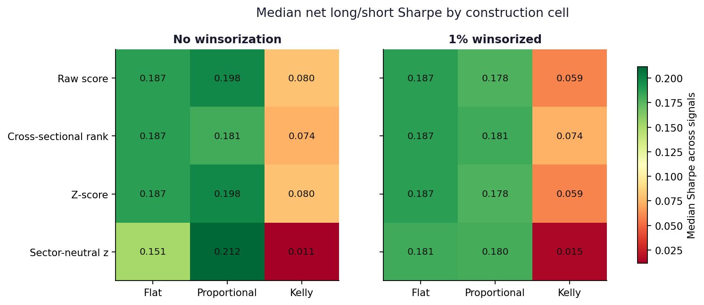
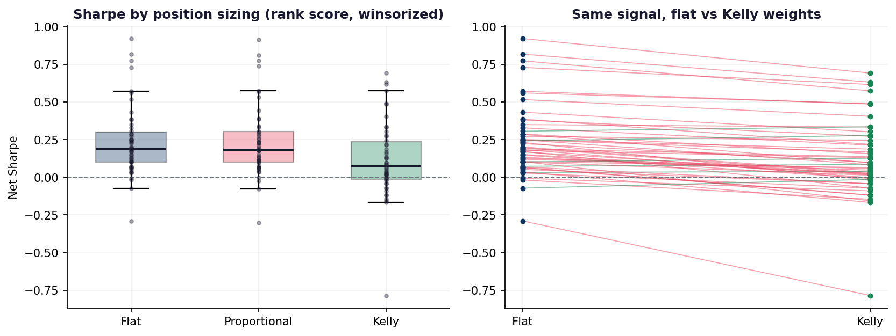
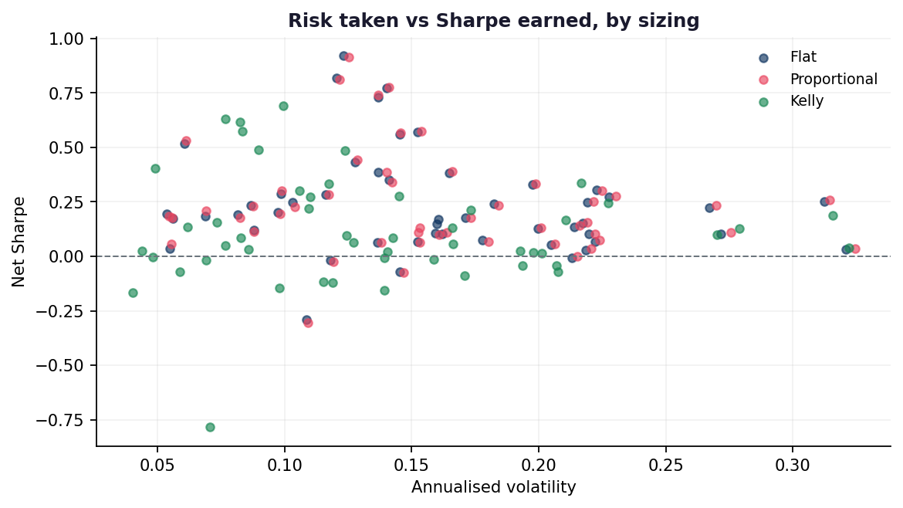
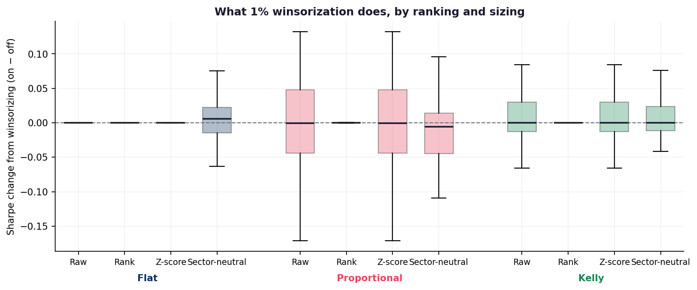
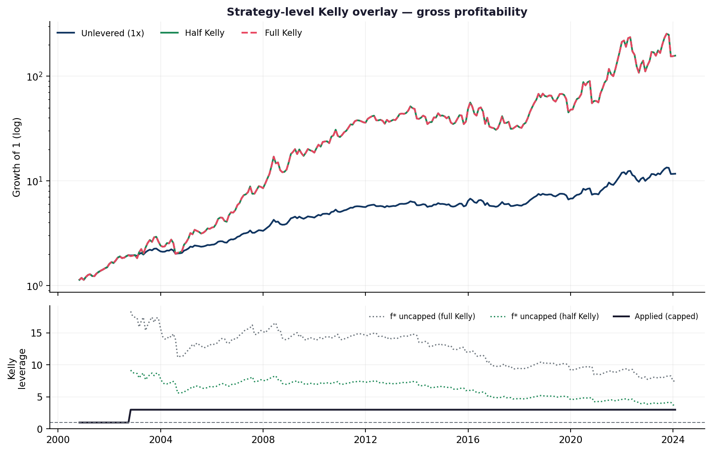

<style>
.pc-hero{background:linear-gradient(135deg,#1a1a2e 0%,#0f3460 100%);color:#fff;
  border-radius:14px;padding:2.5rem 2rem;margin:0 0 2rem}
.pc-hero h2{color:#fff;margin:0 0 .4rem;font-size:1.9rem;border:0}
.pc-hero .pc-sub{opacity:.85;font-weight:300;font-size:1.05rem;margin-bottom:1.25rem}
.pc-hero .pc-chip{background:rgba(255,255,255,.14);border:1px solid rgba(255,255,255,.28);
  padding:.32rem .85rem;border-radius:2rem;font-size:.8rem;font-weight:500;
  display:inline-block;margin:.2rem .3rem .2rem 0}
.pc-metrics{display:grid;grid-template-columns:repeat(auto-fit,minmax(170px,1fr));
  gap:1rem;margin:1.5rem 0 2rem}
.pc-metric{background:#fff;border:1px solid #e9ecef;border-radius:10px;padding:1.15rem;text-align:center}
.pc-metric .v{font-size:1.7rem;font-weight:700;color:#1a1a2e;line-height:1.15}
.pc-metric .l{font-size:.72rem;color:#6c757d;text-transform:uppercase;letter-spacing:.05em;margin-top:.3rem}
.pc-metric.bad .v{color:#b02a37}
.pc-metric.good .v{color:#198754}
.pc-table{width:100%;border-collapse:collapse;font-size:.87rem;margin:1rem 0}
.pc-table th{background:#f8f9fa;color:#1a1a2e;text-align:left;padding:.6rem .7rem;
  border-bottom:2px solid #dee2e6;font-size:.78rem;text-transform:uppercase;letter-spacing:.04em}
.pc-table td{padding:.55rem .7rem;border-bottom:1px solid #f1f3f5}
.pc-table tr:hover td{background:#fbfcfd}
.pc-table .num{text-align:right;font-family:'JetBrains Mono',monospace;font-size:.84rem}
.pc-pos{color:#198754;font-weight:600}
.pc-neg{color:#b02a37;font-weight:600}
.pc-note{background:#f8f9fa;border-left:4px solid #0f3460;border-radius:8px;
  padding:1rem 1.15rem;margin:1.4rem 0;font-size:.9rem}
.pc-note strong{color:#0f3460}
.pc-warn{background:#fff8f0;border-left:4px solid #b8860b;border-radius:8px;
  padding:1rem 1.15rem;margin:1.4rem 0;font-size:.9rem}
.pc-warn strong{color:#b8860b}
</style>


<div class="pc-hero">
<h2>Twenty-four ways to build the same book</h2>
<div class="pc-sub">The farming harness judges every signal under one fixed construction:
decile ranks, 1% winsorization, equal weights. That is a choice, not a law &mdash; and a
generous reading of any backtest is that the construction did some of the work.
This page holds the signals still and varies the construction instead.</div>
<span class="pc-chip">50 signals</span>
<span class="pc-chip">1,200 backtested cells</span>
<span class="pc-chip">4 rankings &times; 2 winsorizations &times; 3 sizings</span>
<span class="pc-chip">2000&ndash;2024, monthly</span>
</div>

<div class="pc-metrics">
<div class="pc-metric "><div class="v">0.187</div><div class="l">Median baseline Sharpe</div></div>
<div class="pc-metric "><div class="v">0.339</div><div class="l">Median spread across 24 cells</div></div>
<div class="pc-metric bad"><div class="v">-0.113</div><div class="l">Kelly vs flat (median)</div></div>
<div class="pc-metric "><div class="v">10/50</div><div class="l">Best cell wins at most</div></div>
</div>

## The question

The shared harness answers *does this signal predict returns?* &mdash; and it answers it
with one construction wired in. Every Sharpe on the [main farming page](../llm-alpha/index.qmd)
is really a statement about a signal **and** a way of turning that signal into positions.

So: of the number you read off the leaderboard, how much is the signal and how much is
the construction? Take the 50 highest raw-Sharpe cross-sectional signals in
the library, and rebuild each one 24 ways.

| Axis | Variants | What it changes |
|---|---|---|
| **Ranking** | raw / cross-sectional rank / z-score / sector-neutral z | the score that orders the cross-section |
| **Winsorization** | off / 1% tails | whether extreme scores are clipped first |
| **Sizing** | flat / proportional / Kelly | how the score becomes a position weight |

<div class="pc-note">
<strong>Two invariants make the cells comparable.</strong>
Every cell normalises <em>gross exposure to 1 per leg</em>, so sizing schemes redistribute
weight and never lever the book &mdash; otherwise Kelly would win or lose on leverage rather than
on construction. And nothing looks forward: ranking uses only the current cross-section,
the Kelly variance is trailing realised volatility, and the strategy-level overlay further down
estimates its parameters from an expanding window strictly before the month it sizes.
</div>

## Finding 1: three of the four rankings *cannot* matter under flat weights

Raw scores, cross-sectional ranks and z-scores are monotone transforms of one another.
They order the cross-section identically, so they select the identical decile &mdash; and if every
selected name gets the same weight, they must produce the identical return, to the last
decimal. The transform only starts to matter once the *weights* depend on the shape of the score.

That is a claim worth testing rather than asserting. Across all 50 signals,
**44 produce bit-identical streams** for the raw / rank / z-score cells
under flat sizing. The remaining 6 differ by at most
0.0013 per month &mdash; floating-point noise reordering names that sit
exactly tied on the decile boundary. Across winsorization levels the difference is a slightly
larger 0.0027, because clipping creates the ties that do the
reordering.

Six of the twenty-four cells, then, are the same experiment wearing different labels. The grid
reports them rather than quietly dropping them, because a reader comparing "four ranking methods"
deserves to know that three of them coincide wherever weights are flat.

## Finding 2: sizing is the only axis that moves anything &mdash; downward

{fig-alt="Heatmap of median Sharpe by ranking and sizing"}

<table class="pc-table"><thead><tr><th>Sizing</th><th class="num">Median ΔSharpe</th><th class="num">Mean ΔSharpe</th><th class="num">Beats flat</th></tr></thead><tbody><tr><td><strong>Flat</strong></td><td class="num"><span class="">+0.000</span></td><td class="num"><span class="">+0.000</span></td><td class="num">0/50</td></tr><tr><td><strong>Proportional</strong></td><td class="num"><span class="pc-pos">+0.002</span></td><td class="num"><span class="pc-neg">-0.000</span></td><td class="num">27/50</td></tr><tr><td><strong>Kelly</strong></td><td class="num"><span class="pc-neg">-0.113</span></td><td class="num"><span class="pc-neg">-0.119</span></td><td class="num">6/50</td></tr></tbody></table>

Proportional weighting is a coin flip: median +0.002 Sharpe against the
flat baseline, better on 27 of 50 signals. Kelly is not a coin
flip. It costs **-0.113 Sharpe at the median** and beats flat weights on
only 6 of 50 signals.

The mechanism is visible in the components. Going from flat to Kelly weights cuts median annualised
volatility from 15.2% to 12.4% &mdash; it does
de-risk, as advertised. But it takes the return with it, from 1.34%
to 0.01% a year. Dividing conviction by trailing variance piles
weight onto the lowest-volatility names in each decile, and on this library those names carry
proportionally less of the edge than of the risk.

{fig-alt="Box plot and paired slope chart of Sharpe by sizing"}

{fig-alt="Scatter of Sharpe against annualised volatility by sizing"}

## Finding 3: winsorization is a coin flip, not a lever

{fig-alt="Box plots of the Sharpe change from winsorization"}

<table class="pc-table"><thead><tr><th>Ranking</th><th class="num">Flat</th><th class="num">Proportional</th><th class="num">Kelly</th></tr></thead><tbody><tr><td><strong>Raw score</strong></td><td class="num"><span class="">+0.000</span></td><td class="num"><span class="pc-neg">-0.001</span></td><td class="num"><span class="pc-neg">-0.000</span></td></tr><tr><td><strong>Cross-sectional rank</strong></td><td class="num"><span class="">+0.000</span></td><td class="num"><span class="pc-neg">-0.000</span></td><td class="num"><span class="pc-pos">+0.000</span></td></tr><tr><td><strong>Z-score</strong></td><td class="num"><span class="">+0.000</span></td><td class="num"><span class="pc-neg">-0.001</span></td><td class="num"><span class="pc-neg">-0.000</span></td></tr><tr><td><strong>Sector-neutral z</strong></td><td class="num"><span class="pc-pos">+0.006</span></td><td class="num"><span class="pc-neg">-0.006</span></td><td class="num"><span class="pc-neg">-0.000</span></td></tr></tbody></table>

The largest median effect anywhere in the table is 0.0058 Sharpe. Under flat
weights that is exactly what theory predicts &mdash; clipping the tails of a score barely disturbs a
ranking, and a ranking is all flat weights consume. The surprise is that the *median* stays negligible
under proportional and Kelly weights too, where clipping genuinely changes the numbers that become
weights.
Deciles are already a blunt instrument: by the time a score has been bucketed into the top and
bottom tenth, the outliers have been absorbed into their buckets and there is little left for
winsorization to do.

The box plot adds the part the medians hide. Under flat weights the effect really is nil &mdash; those
boxes are flat lines on zero. Under proportional and Kelly weights the median is still zero but the
distribution is wide: the middle half of those cells lands between -0.010 and
0.009 Sharpe, 27% move by more than 0.05, and the largest single swing among them is
0.36. Winsorization improves 46% of them &mdash; a coin flip.

So it is not a free lever and not a safe default either; it is a source of variance with no expected
return attached. Flip it on any individual backtest and you have a one-in-four chance of moving the
Sharpe by more than 0.05 in a direction you cannot predict beforehand. That is worth knowing precisely
because it is the kind of knob that gets tuned quietly, and then reported as though it were free.

## Finding 4: the ranking transform barely registers

<table class="pc-table"><thead><tr><th>Ranking</th><th class="num">Median ΔSharpe vs baseline</th><th class="num">Beats baseline</th></tr></thead><tbody><tr><td><strong>Raw score</strong></td><td class="num"><span class="pc-pos">+0.000</span></td><td class="num">26/50</td></tr><tr><td><strong>Cross-sectional rank</strong></td><td class="num"><span class="pc-pos">+0.002</span></td><td class="num">27/50</td></tr><tr><td><strong>Z-score</strong></td><td class="num"><span class="pc-pos">+0.000</span></td><td class="num">26/50</td></tr><tr><td><strong>Sector-neutral z</strong></td><td class="num"><span class="pc-neg">-0.009</span></td><td class="num">23/50</td></tr></tbody></table>

Measured under proportional sizing &mdash; the setting where the transform actually reaches the weights
&mdash; every ranking method lands within a hundredth of a Sharpe point of the baseline. Sector-neutral
scoring, the one transform that genuinely changes decile membership rather than just rescaling the
score, is the weakest of the four at the median.

Which sits oddly against the heatmap, where the best cell in the whole grid is
sector-neutral z scoring, unwinsorized, proportional weights at a median Sharpe of 0.212 &mdash; comfortably above the
0.187 baseline. Both numbers are correct, and the gap between them is the
point. The heatmap compares a *difference of medians*: the median signal under one construction
against the median signal under another, with no requirement that they be the same signal. The table
above compares a *median of differences*: what the change does to each signal, paired. That same cell
has a median paired effect of **-0.017** and improves only
24 of 50 signals. It looks best in aggregate because
it flatters a handful of signals enormously while quietly hurting slightly more than half of them.
Aggregate league tables of construction settings are built from the first number; the decision you
actually face is the second.

## Finding 5: Kelly asks for leverage nobody would take

The sizing axis above applies Kelly *within* the cross-section. The other reading of Kelly is at the
strategy level: size the whole book by f\* = mu / sigma^2, re-estimated each month on an expanding
window. Applied to **gross profitability**, the strongest signal in the library:

<table class="pc-table"><thead><tr><th>Variant</th><th class="num">Sharpe</th><th class="num">Ann. return</th><th class="num">Ann. vol</th><th class="num">Max drawdown</th><th class="num">Median leverage</th></tr></thead><tbody><tr><td><strong>Unlevered (1x)</strong></td><td class="num">0.921</td><td class="num">11.1%</td><td class="num">12.3%</td><td class="num">-21.4%</td><td class="num">—</td></tr><tr><td><strong>Half Kelly</strong></td><td class="num">0.810</td><td class="num">24.2%</td><td class="num">34.6%</td><td class="num">-54.2%</td><td class="num">3.0x</td></tr><tr><td><strong>Full Kelly</strong></td><td class="num">0.810</td><td class="num">24.2%</td><td class="num">34.6%</td><td class="num">-54.2%</td><td class="num">3.0x</td></tr></tbody></table>

{fig-alt="Equity curves and leverage paths under Kelly overlays"}

Full and half Kelly produce *identical* results, which looks like a bug and is not. Uncapped, the
formula asks for a median of **13x leverage**: Kelly divides by variance, and the
variance of a monthly market-neutral book is tiny, so f\* explodes. Half of 13x is
still 7x. Both sit far above any tolerable limit, so both bind at the 3x cap in
almost every month and the "full versus half Kelly" distinction dissolves. The cap, not the formula,
is what sizes the book &mdash; which is worth knowing before quoting Kelly as though it were a
parameter-free answer.

What the cap does deliver is the classic Kelly trade: annual return roughly doubles, volatility
roughly doubles with it, and maximum drawdown deepens from -21.4% to
-54.2%. Sharpe *falls*, from 0.921 to
0.810, because leverage forced through a cap is no longer proportional to
the edge. Kelly maximises long-run growth, not Sharpe &mdash; but you have to actually want that
drawdown, and you have to fund 3x on a strategy whose edge was estimated on the same history you are
levering against.

## The best cell is a mirage

Pick the best of 24 cells for each signal and the improvements look substantial &mdash; the median
signal spans **0.339 Sharpe** between its worst and best construction, wider
than the median signal's entire Sharpe of 0.187. It is tempting to read that as
0.339 of available upside.

It is not. No cell wins reliably:

<table class="pc-table"><thead><tr><th>Ranking</th><th>Winsorization</th><th>Sizing</th><th class="num">Times best</th></tr></thead><tbody><tr><td>Raw score</td><td>none</td><td>Proportional</td><td class="num">10/50</td></tr><tr><td>Sector-neutral z</td><td>none</td><td>Proportional</td><td class="num">9/50</td></tr><tr><td>Sector-neutral z</td><td>1% winsorized</td><td>Proportional</td><td class="num">5/50</td></tr><tr><td>Sector-neutral z</td><td>1% winsorized</td><td>Flat</td><td class="num">4/50</td></tr><tr><td>Z-score</td><td>none</td><td>Proportional</td><td class="num">4/50</td></tr><tr><td>Raw score</td><td>none</td><td>Flat</td><td class="num">4/50</td></tr></tbody></table>

The most frequent winner takes the crown on 10 of 50 signals &mdash; barely better
than the 4% you would expect from drawing cells at random. The spread is real; the
*choosability* is not. Picking the best construction per signal after the fact is the same mining that
inflates a raw-Sharpe leaderboard, one level down. The honest summary of this grid is the marginal
column: flat weights, any monotone ranking, winsorization optional.

<div class="pc-warn">
<strong>What this does not show.</strong> The 50 signals here were chosen by raw Sharpe,
so the study is conditional on a signal already looking good &mdash; it describes what construction does
to apparent winners, not to signals in general, and those winners carry their own selection bias from
the farming search. Everything is monthly rebalancing on one US equity panel with flat 10bp costs; the
Kelly variance input is trailing total volatility rather than an idiosyncratic estimate; and the
gross-exposure normalisation deliberately removes leverage as a channel. A practitioner who sizes by
conviction <em>and</em> levers accordingly is running a different experiment from this one.
</div>

## Reproduce

```bash
python scripts/run_construction_grid.py --top 50   # ~12 min, writes runs/construction/
python -c "from llm_alpha.reporting.construction_page import build; build()"
```

The grid evaluator is `src/llm_alpha/backtest/construction.py`; it computes all 24 cells in a single
pass over the dates, so a full sweep costs about one backtest per signal rather than twenty-four.
