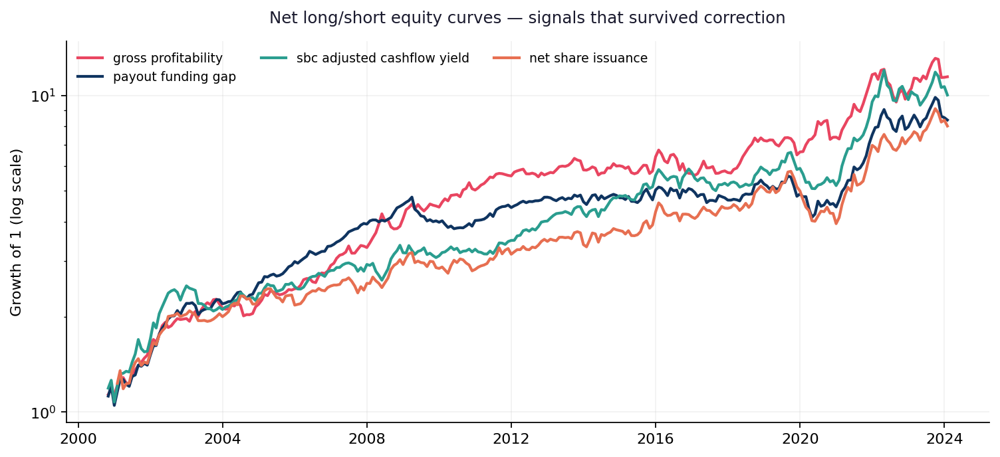
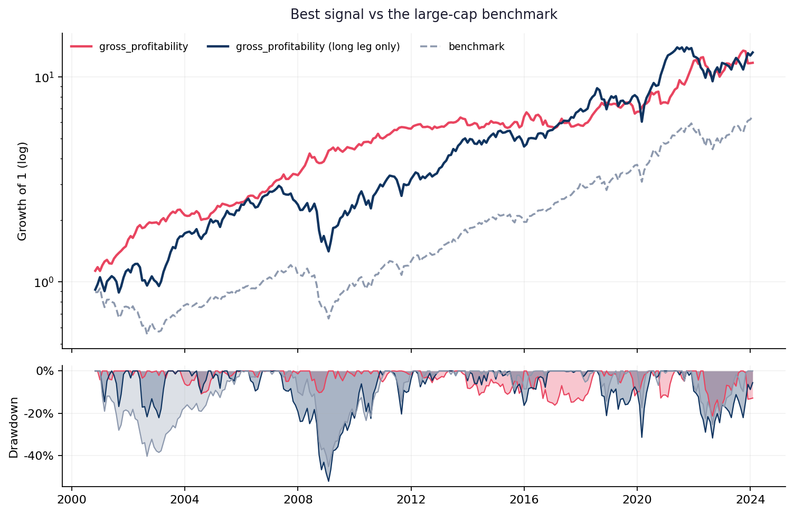

  <h2>Farming alpha out of a language model</h2>
  
Three cooperating agents invent, implement and document equity
    signals. One deterministic harness judges every one of them under identical,
    point-in-time-correct rules — and then discounts the result for the size of the search.

  
Run 2026-08-3096 signals evaluated280 months of historyAPI spend $0.87

96

Signals evaluated

0

Survive correction

0.94

Search hurdle (Sharpe)

101

Trials priced in

0.92

Best raw Sharpe

4.26

Best alpha t-stat

## How the pipeline works

The premise is a meta-experiment: generate hypotheses with the most capable model
available, implement them with a cheaper one, and measure how many survive a
ruthless, uniform backtest. The interesting number was never the best Sharpe — it
is the **survival rate**, and that only means something if the judging is identical
for every candidate and honest about the size of the search.

The six stages, end to end click to expand

01
<h4>Idea agent</h4>
Mines the asset-pricing literature for an economically motivated hypothesis that can actually be built from the panel — with a stated mechanism, a formula, an expected sign, and references.
Opus 5

02
<h4>Data agent</h4>
Maps each requested concept onto a real panel column and gates on coverage. An idea that needs data we do not have dies here, cheaply, before any code is written.
Sonnet 5

03
<h4>Coder agent</h4>
Writes a self-contained module implementing the signal interface, then self-corrects against the validator's complaints. Generated code is untrusted: a static check blocks file, network and process access before the module is ever imported.
Sonnet 5

04
<h4>Shared harness</h4>
Monthly cross-sectional decile long/short on a survivorship-safe, liquidity-filtered universe. Identical for every signal — invented or canonical — so nothing gets a bespoke advantage.
deterministic

05
<h4>Robustness battery</h4>
Subperiod stability, transaction-cost sweep, sector-neutral variant, parameter and universe sensitivity, and holding-horizon decay.
deterministic

06
<h4>Selection-bias layer</h4>
Factor attribution against market, size, value and momentum; Benjamini-Hochberg across the library; and a deflated Sharpe that prices in how many ideas were tried to find this one.
deterministic

<strong>Everything is point-in-time.</strong> Fundamentals join as of the SEC filing
date, never the fiscal period. The universe keeps delisted names. Signals must pass a
no-look-ahead validator: recomputing on a time-truncated panel may not change any
earlier value, or even its missing/not-missing status. A name that leaves the panel
books a delisting return rather than silently disappearing from the cross-section —
otherwise the worst outcomes quietly vanish from whichever decile was holding them.

## Results

*Last refreshed 2026-08-30 — regenerated automatically on every pipeline run.*

<table class="la-table">
<thead><tr>
  <th>Signal</th><th>Verdict</th><th>Sharpe</th>
  <th>Alpha t</th><th>Factor R²</th><th>Deflated Sharpe</th><th>q-value</th>
</tr></thead>
<tbody><tr><td class="sig"><code>gross_profitability</code></td><td>Noise</td><td class="mono">0.92</td><td class="mono">3.22</td><td class="mono">21%</td><td>0.47</td><td class="mono">0.001</td></tr><tr><td class="sig"><code>payout_funding_gap</code></td><td>Noise</td><td class="mono">0.82</td><td class="mono">3.55</td><td class="mono">42%</td><td>0.28</td><td class="mono">0.006</td></tr><tr><td class="sig"><code>net_share_issuance</code></td><td>Noise</td><td class="mono">0.73</td><td class="mono">4.26</td><td class="mono">59%</td><td>0.14</td><td class="mono">0.010</td></tr><tr><td class="sig"><code>macro_systematic_variance_share</code></td><td>Noise</td><td class="mono">0.57</td><td class="mono">1.78</td><td class="mono">53%</td><td>0.06</td><td class="mono">0.071</td></tr><tr><td class="sig"><code>cross_sectional_beta_dispersion_timing</code></td><td>Noise</td><td class="mono">0.51</td><td class="mono">1.10</td><td class="mono">39%</td><td>0.02</td><td class="mono">0.132</td></tr><tr><td class="sig"><code>predicted_dividend_month_premium</code></td><td>Loses to factors</td><td class="mono">0.41</td><td class="mono">-4.06</td><td class="mono">95%</td><td>0.01</td><td class="mono">0.205</td></tr><tr><td class="sig"><code>asset_growth</code></td><td>Noise</td><td class="mono">0.43</td><td class="mono">2.27</td><td class="mono">45%</td><td>0.01</td><td class="mono">0.205</td></tr><tr><td class="sig"><code>aggregate_accruals_market_timing</code></td><td>Noise</td><td class="mono">0.37</td><td class="mono">1.70</td><td class="mono">14%</td><td>0.00</td><td class="mono">0.411</td></tr><tr><td class="sig"><code>average_systematic_comovement_timing</code></td><td>Noise</td><td class="mono">0.36</td><td class="mono">0.25</td><td class="mono">39%</td><td>0.00</td><td class="mono">0.456</td></tr><tr><td class="sig"><code>retained_vs_contributed_capital_value</code></td><td>Noise</td><td class="mono">0.38</td><td class="mono">1.76</td><td class="mono">65%</td><td>0.00</td><td class="mono">0.232</td></tr></tbody>
</table>

The 10 best of 96 signals, ranked by deflated Sharpe. <a href="#all-results">All 96, with confidence intervals, are further down.</a>

<strong>Why the board is not sorted by Sharpe.</strong> Farm enough strategies and one
will post a fine Sharpe by luck alone. With 101 trials priced in,
the expected best-of-search Sharpe — the <em>hurdle</em> — is
<strong>0.94</strong>. Anything below that is
indistinguishable from noise no matter how good the raw number looks.
  
<strong>Alpha t</strong> is the return left after regressing on market, size, value and
momentum, with Newey-West standard errors. A high Sharpe next to a high <strong>Factor
R²</strong> and a flat alpha t means the strategy is a repackaged factor tilt, not a
discovery. The reverse also happens: a modest Sharpe with a strong alpha t is worth
more than it first looks.
  
<strong>Deflated Sharpe</strong> is the probability the signal is real once the size of
the search is accounted for; <strong>q-value</strong> is the Benjamini-Hochberg
false-discovery rate across the whole library.

{fig-alt="Equity curves of surviving alpha signals"}

## What this run found

- No signal in this run survives correction. With a hurdle Sharpe of 0.94, nothing on the board is currently distinguishable from the best of a random search of the same size — which is itself the honest headline, not a failure of the machinery.

- 3 are factor tilts in disguise. The clearest case is <code>momentum_12_1</code>, whose returns are 92% explained by the standard factors with an alpha t-stat of -0.10 — it is not adding anything the four-factor model does not already capture.

- <code>excess_speculative_volatility</code> is the case for looking past raw Sharpe: only 0.29 on its own, but an alpha t-stat of 2.95 once the known factors are stripped out — its raw performance understates it.

- <code>predicted_dividend_month_premium</code> is the inverse warning: it tracks the standard factors closely (95% of variance) yet delivers significantly *negative* alpha against them (t=-4.06). On this universe and sample you would have been better off holding the plain factor than this construction of it.

All 96 signals, with 95% confidence intervals
click to expand

<table class="la-table">
<thead><tr>
  <th>Signal</th><th>Verdict</th><th>Sharpe</th><th>95% CI</th>
  <th>Alpha t</th><th>Factor R²</th><th>Deflated Sharpe</th><th>q-value</th>
</tr></thead>
<tbody><tr><td class="sig"><code>gross_profitability</code></td><td>Noise</td><td class="mono">0.92</td><td class="mono">[0.51, 1.36]</td><td class="mono">3.22</td><td class="mono">21%</td><td>0.47</td><td class="mono">0.001</td></tr><tr><td class="sig"><code>payout_funding_gap</code></td><td>Noise</td><td class="mono">0.82</td><td class="mono">[0.40, 1.28]</td><td class="mono">3.55</td><td class="mono">42%</td><td>0.28</td><td class="mono">0.006</td></tr><tr><td class="sig"><code>net_share_issuance</code></td><td>Noise</td><td class="mono">0.73</td><td class="mono">[0.36, 1.09]</td><td class="mono">4.26</td><td class="mono">59%</td><td>0.14</td><td class="mono">0.010</td></tr><tr><td class="sig"><code>macro_systematic_variance_share</code></td><td>Noise</td><td class="mono">0.57</td><td class="mono">[0.11, 0.98]</td><td class="mono">1.78</td><td class="mono">53%</td><td>0.06</td><td class="mono">0.071</td></tr><tr><td class="sig"><code>cross_sectional_beta_dispersion_timing</code></td><td>Noise</td><td class="mono">0.51</td><td class="mono">[0.07, 1.00]</td><td class="mono">1.10</td><td class="mono">39%</td><td>0.02</td><td class="mono">0.132</td></tr><tr><td class="sig"><code>predicted_dividend_month_premium</code></td><td>Loses to factors</td><td class="mono">0.41</td><td class="mono">[-0.00, 0.89]</td><td class="mono">-4.06</td><td class="mono">95%</td><td>0.01</td><td class="mono">0.205</td></tr><tr><td class="sig"><code>asset_growth</code></td><td>Noise</td><td class="mono">0.43</td><td class="mono">[0.02, 0.81]</td><td class="mono">2.27</td><td class="mono">45%</td><td>0.01</td><td class="mono">0.205</td></tr><tr><td class="sig"><code>aggregate_accruals_market_timing</code></td><td>Noise</td><td class="mono">0.37</td><td class="mono">[-0.07, 0.78]</td><td class="mono">1.70</td><td class="mono">14%</td><td>0.00</td><td class="mono">0.411</td></tr><tr><td class="sig"><code>average_systematic_comovement_timing</code></td><td>Noise</td><td class="mono">0.36</td><td class="mono">[-0.12, 0.88]</td><td class="mono">0.25</td><td class="mono">39%</td><td>0.00</td><td class="mono">0.456</td></tr><tr><td class="sig"><code>retained_vs_contributed_capital_value</code></td><td>Noise</td><td class="mono">0.38</td><td class="mono">[0.01, 0.75]</td><td class="mono">1.76</td><td class="mono">65%</td><td>0.00</td><td class="mono">0.232</td></tr><tr><td class="sig"><code>tax_loss_selling_turn_of_year_pressure</code></td><td>Noise</td><td class="mono">-0.58</td><td class="mono">[-1.48, 0.18]</td><td class="mono">-0.73</td><td class="mono">8%</td><td>0.00</td><td class="mono">0.413</td></tr><tr><td class="sig"><code>frog_in_the_pan_gradual_momentum</code></td><td>Factor tilt</td><td class="mono">0.33</td><td class="mono">[-0.10, 0.76]</td><td class="mono">1.07</td><td class="mono">90%</td><td>0.00</td><td class="mono">0.411</td></tr><tr><td class="sig"><code>lottery_demand_sentiment_interaction</code></td><td>Noise</td><td class="mono">0.31</td><td class="mono">[-0.15, 0.79]</td><td class="mono">1.08</td><td class="mono">7%</td><td>0.00</td><td class="mono">0.510</td></tr><tr><td class="sig"><code>earnings_yield</code></td><td>Noise</td><td class="mono">0.34</td><td class="mono">[-0.10, 0.80]</td><td class="mono">-0.00</td><td class="mono">62%</td><td>0.00</td><td class="mono">0.456</td></tr><tr><td class="sig"><code>cash_backed_earnings_surprise</code></td><td>Noise</td><td class="mono">0.28</td><td class="mono">[-0.13, 0.69]</td><td class="mono">0.81</td><td class="mono">57%</td><td>0.00</td><td class="mono">0.468</td></tr><tr><td class="sig"><code>momentum_12_1</code></td><td>Factor tilt</td><td class="mono">0.27</td><td class="mono">[-0.16, 0.73]</td><td class="mono">-0.10</td><td class="mono">92%</td><td>0.00</td><td class="mono">0.510</td></tr><tr><td class="sig"><code>excess_speculative_volatility</code></td><td>Noise</td><td class="mono">0.29</td><td class="mono">[-0.09, 0.67]</td><td class="mono">2.95</td><td class="mono">50%</td><td>0.00</td><td class="mono">0.432</td></tr><tr><td class="sig"><code>equity_rate_correlation_regime_timing</code></td><td>Noise</td><td class="mono">0.25</td><td class="mono">[-0.17, 0.73]</td><td class="mono">0.18</td><td class="mono">26%</td><td>0.00</td><td class="mono">0.586</td></tr><tr><td class="sig"><code>inventory_growth_gap</code></td><td>Noise</td><td class="mono">0.26</td><td class="mono">[-0.14, 0.70]</td><td class="mono">0.22</td><td class="mono">25%</td><td>0.00</td><td class="mono">0.507</td></tr><tr><td class="sig"><code>inflation_passthrough_margin_expansion</code></td><td>Noise</td><td class="mono">0.23</td><td class="mono">[-0.20, 0.69]</td><td class="mono">0.75</td><td class="mono">27%</td><td>0.00</td><td class="mono">0.586</td></tr><tr><td class="sig"><code>sticky_cost_downturn_drag</code></td><td>Noise</td><td class="mono">0.24</td><td class="mono">[-0.14, 0.62]</td><td class="mono">-0.15</td><td class="mono">42%</td><td>0.00</td><td class="mono">0.515</td></tr><tr><td class="sig"><code>low_volatility</code></td><td>Noise</td><td class="mono">0.25</td><td class="mono">[-0.15, 0.65]</td><td class="mono">2.39</td><td class="mono">83%</td><td>0.00</td><td class="mono">0.515</td></tr><tr><td class="sig"><code>tax_loss_overhang_turn_of_year</code></td><td>Noise</td><td class="mono">-0.49</td><td class="mono">[-1.37, 0.44]</td><td class="mono">-0.62</td><td class="mono">3%</td><td>0.00</td><td class="mono">0.586</td></tr><tr><td class="sig"><code>aggregate_rollover_risk_funding_shock_timing</code></td><td>Noise</td><td class="mono">0.17</td><td class="mono">[-0.35, 0.68]</td><td class="mono">0.45</td><td class="mono">7%</td><td>0.00</td><td class="mono">0.841</td></tr><tr><td class="sig"><code>aggregate_equity_issuance_market_timing</code></td><td>Noise</td><td class="mono">0.20</td><td class="mono">[-0.34, 0.70]</td><td class="mono">1.11</td><td class="mono">7%</td><td>0.00</td><td class="mono">0.797</td></tr><tr><td class="sig"><code>depreciation_conservatism_reserve</code></td><td>Noise</td><td class="mono">0.20</td><td class="mono">[-0.27, 0.65]</td><td class="mono">0.77</td><td class="mono">4%</td><td>0.00</td><td class="mono">0.756</td></tr><tr><td class="sig"><code>credit_vol_complacency_divergence_timing</code></td><td>Noise</td><td class="mono">0.12</td><td class="mono">[-0.21, 0.51]</td><td class="mono">-0.47</td><td class="mono">17%</td><td>0.00</td><td class="mono">0.834</td></tr><tr><td class="sig"><code>seasonal_risk_appetite_credit_timing</code></td><td>Noise</td><td class="mono">0.20</td><td class="mono">[-0.19, 0.52]</td><td class="mono">1.41</td><td class="mono">4%</td><td>0.00</td><td class="mono">0.659</td></tr><tr><td class="sig"><code>accruals</code></td><td>Noise</td><td class="mono">0.18</td><td class="mono">[-0.25, 0.64]</td><td class="mono">1.96</td><td class="mono">21%</td><td>0.00</td><td class="mono">0.756</td></tr><tr><td class="sig"><code>cash_vs_accounting_value_divergence</code></td><td>Noise</td><td class="mono">0.19</td><td class="mono">[-0.25, 0.64]</td><td class="mono">1.90</td><td class="mono">26%</td><td>0.00</td><td class="mono">0.756</td></tr><tr><td class="sig"><code>effective_tax_rate_earnings_quality</code></td><td>Noise</td><td class="mono">0.15</td><td class="mono">[-0.20, 0.51]</td><td class="mono">0.15</td><td class="mono">6%</td><td>0.00</td><td class="mono">0.793</td></tr><tr><td class="sig"><code>market_breadth_high_ratio_timing</code></td><td>Noise</td><td class="mono">0.12</td><td class="mono">[-0.24, 0.50]</td><td class="mono">2.64</td><td class="mono">24%</td><td>0.00</td><td class="mono">0.841</td></tr><tr><td class="sig"><code>equity_duration_rate_trend_interaction</code></td><td>Noise</td><td class="mono">0.13</td><td class="mono">[-0.37, 0.68]</td><td class="mono">1.28</td><td class="mono">7%</td><td>0.00</td><td class="mono">0.864</td></tr><tr><td class="sig"><code>unproductive_acquisition_growth</code></td><td>Noise</td><td class="mono">0.12</td><td class="mono">[-0.31, 0.58]</td><td class="mono">-0.27</td><td class="mono">13%</td><td>0.00</td><td class="mono">0.850</td></tr><tr><td class="sig"><code>credit_spread_timing</code></td><td>Noise</td><td class="mono">0.09</td><td class="mono">[-0.40, 0.52]</td><td class="mono">0.60</td><td class="mono">15%</td><td>0.00</td><td class="mono">0.879</td></tr><tr><td class="sig"><code>market_trend_timing</code></td><td>Noise</td><td class="mono">0.06</td><td class="mono">[-0.43, 0.53]</td><td class="mono">1.17</td><td class="mono">36%</td><td>0.00</td><td class="mono">0.925</td></tr><tr><td class="sig"><code>credit_beta_defensive</code></td><td>Noise</td><td class="mono">0.11</td><td class="mono">[-0.29, 0.44]</td><td class="mono">0.25</td><td class="mono">34%</td><td>0.00</td><td class="mono">0.850</td></tr><tr><td class="sig"><code>oil_beta_trend_interaction</code></td><td>Noise</td><td class="mono">0.10</td><td class="mono">[-0.33, 0.50]</td><td class="mono">-0.49</td><td class="mono">16%</td><td>0.00</td><td class="mono">0.864</td></tr><tr><td class="sig"><code>book_to_market</code></td><td>Loses to factors</td><td class="mono">0.11</td><td class="mono">[-0.36, 0.58]</td><td class="mono">-3.14</td><td class="mono">92%</td><td>0.00</td><td class="mono">0.864</td></tr><tr><td class="sig"><code>macro_momentum_diffusion_timing</code></td><td>Noise</td><td class="mono">0.06</td><td class="mono">[-0.46, 0.59]</td><td class="mono">1.02</td><td class="mono">29%</td><td>0.00</td><td class="mono">0.925</td></tr><tr><td class="sig"><code>money_illusion_real_yield_gap_timing</code></td><td>Noise</td><td class="mono">0.05</td><td class="mono">[-0.34, 0.49]</td><td class="mono">-1.86</td><td class="mono">39%</td><td>0.00</td><td class="mono">0.925</td></tr><tr><td class="sig"><code>vix_conditioned_reversal_flip</code></td><td>Noise</td><td class="mono">0.06</td><td class="mono">[-0.25, 0.39]</td><td class="mono">-0.70</td><td class="mono">11%</td><td>0.00</td><td class="mono">0.880</td></tr><tr><td class="sig"><code>vix_beta_drift</code></td><td>Noise</td><td class="mono">0.07</td><td class="mono">[-0.41, 0.52]</td><td class="mono">0.02</td><td class="mono">15%</td><td>0.00</td><td class="mono">0.908</td></tr><tr><td class="sig"><code>stock_comp_earnings_dilution</code></td><td>Noise</td><td class="mono">0.08</td><td class="mono">[-0.39, 0.53]</td><td class="mono">-1.27</td><td class="mono">53%</td><td>0.00</td><td class="mono">0.898</td></tr><tr><td class="sig"><code>usd_exposure_dollar_trend_interaction</code></td><td>Noise</td><td class="mono">-0.10</td><td class="mono">[-0.58, 0.42]</td><td class="mono">-0.50</td><td class="mono">25%</td><td>0.00</td><td class="mono">0.864</td></tr><tr><td class="sig"><code>net_trade_credit_expansion</code></td><td>Noise</td><td class="mono">0.04</td><td class="mono">[-0.31, 0.41]</td><td class="mono">-0.47</td><td class="mono">9%</td><td>0.00</td><td class="mono">0.925</td></tr><tr><td class="sig"><code>macro_beta_instability</code></td><td>Factor tilt</td><td class="mono">0.04</td><td class="mono">[-0.33, 0.41]</td><td class="mono">0.93</td><td class="mono">70%</td><td>0.00</td><td class="mono">0.925</td></tr><tr><td class="sig"><code>hidden_rate_duration_mismatch</code></td><td>Noise</td><td class="mono">0.04</td><td class="mono">[-0.36, 0.52]</td><td class="mono">1.23</td><td class="mono">32%</td><td>0.00</td><td class="mono">0.925</td></tr><tr><td class="sig"><code>unemployment_news_regime_asymmetry_timing</code></td><td>Noise</td><td class="mono">-0.02</td><td class="mono">[-0.58, 0.55]</td><td class="mono">0.55</td><td class="mono">13%</td><td>0.00</td><td class="mono">0.980</td></tr><tr><td class="sig"><code>sentiment_fundamental_divergence_timing</code></td><td>Noise</td><td class="mono">0.01</td><td class="mono">[-0.48, 0.46]</td><td class="mono">0.12</td><td class="mono">7%</td><td>0.00</td><td class="mono">0.983</td></tr><tr><td class="sig"><code>funding_conditioned_beta_tilt</code></td><td>Noise</td><td class="mono">0.03</td><td class="mono">[-0.35, 0.38]</td><td class="mono">-0.47</td><td class="mono">7%</td><td>0.00</td><td class="mono">0.925</td></tr><tr><td class="sig"><code>rate_duration_mispricing</code></td><td>Noise</td><td class="mono">0.03</td><td class="mono">[-0.36, 0.50]</td><td class="mono">1.05</td><td class="mono">29%</td><td>0.00</td><td class="mono">0.943</td></tr><tr><td class="sig"><code>cross_sectional_return_dispersion_timing</code></td><td>Noise</td><td class="mono">-0.05</td><td class="mono">[-0.62, 0.45]</td><td class="mono">0.49</td><td class="mono">28%</td><td>0.00</td><td class="mono">0.925</td></tr><tr><td class="sig"><code>book_tax_gap_earnings_quality</code></td><td>Noise</td><td class="mono">0.03</td><td class="mono">[-0.38, 0.42]</td><td class="mono">-0.97</td><td class="mono">13%</td><td>0.00</td><td class="mono">0.943</td></tr><tr><td class="sig"><code>variance_risk_premium_timing</code></td><td>Noise</td><td class="mono">-0.01</td><td class="mono">[-0.46, 0.45]</td><td class="mono">-1.67</td><td class="mono">31%</td><td>0.00</td><td class="mono">0.983</td></tr><tr><td class="sig"><code>aggregate_earnings_growth_breadth_timing</code></td><td>Noise</td><td class="mono">-0.05</td><td class="mono">[-0.52, 0.40]</td><td class="mono">-0.51</td><td class="mono">21%</td><td>0.00</td><td class="mono">0.925</td></tr><tr><td class="sig"><code>rollover_risk_credit_cycle_interaction</code></td><td>Noise</td><td class="mono">0.01</td><td class="mono">[-0.39, 0.45]</td><td class="mono">1.40</td><td class="mono">12%</td><td>0.00</td><td class="mono">0.980</td></tr><tr><td class="sig"><code>aggregate_illiquidity_shock_timing</code></td><td>Noise</td><td class="mono">-0.04</td><td class="mono">[-0.50, 0.36]</td><td class="mono">-1.47</td><td class="mono">29%</td><td>0.00</td><td class="mono">0.925</td></tr><tr><td class="sig"><code>long_term_reversal_sentiment_conditioned</code></td><td>Noise</td><td class="mono">-0.10</td><td class="mono">[-0.65, 0.40]</td><td class="mono">-0.87</td><td class="mono">40%</td><td>0.00</td><td class="mono">0.864</td></tr><tr><td class="sig"><code>aggregate_turnover_sentiment_timing</code></td><td>Noise</td><td class="mono">-0.10</td><td class="mono">[-0.52, 0.37]</td><td class="mono">-1.43</td><td class="mono">20%</td><td>0.00</td><td class="mono">0.864</td></tr><tr><td class="sig"><code>sentiment_gap_contrarian_timing</code></td><td>Noise</td><td class="mono">-0.12</td><td class="mono">[-0.74, 0.50]</td><td class="mono">-0.69</td><td class="mono">9%</td><td>0.00</td><td class="mono">0.864</td></tr><tr><td class="sig"><code>household_sentiment_fundamental_divergence_timing</code></td><td>Noise</td><td class="mono">-0.17</td><td class="mono">[-0.63, 0.30]</td><td class="mono">-1.11</td><td class="mono">11%</td><td>0.00</td><td class="mono">0.814</td></tr><tr><td class="sig"><code>sentiment_fundamental_disagreement_timing</code></td><td>Noise</td><td class="mono">-0.23</td><td class="mono">[-0.71, 0.20]</td><td class="mono">-0.84</td><td class="mono">9%</td><td>0.00</td><td class="mono">0.586</td></tr><tr><td class="sig"><code>attention_shock_amplified_reversal</code></td><td>Noise</td><td class="mono">-0.09</td><td class="mono">[-0.46, 0.25]</td><td class="mono">-2.14</td><td class="mono">22%</td><td>0.00</td><td class="mono">0.864</td></tr><tr><td class="sig"><code>hidden_refinancing_rate_exposure</code></td><td>Noise</td><td class="mono">-0.07</td><td class="mono">[-0.41, 0.27]</td><td class="mono">-1.71</td><td class="mono">16%</td><td>0.00</td><td class="mono">0.864</td></tr><tr><td class="sig"><code>halloween_volatility_scaled_timing</code></td><td>Noise</td><td class="mono">-0.11</td><td class="mono">[-0.47, 0.27]</td><td class="mono">0.30</td><td class="mono">5%</td><td>0.00</td><td class="mono">0.850</td></tr><tr><td class="sig"><code>net_cash_yield_rate_change_interaction</code></td><td>Noise</td><td class="mono">-0.09</td><td class="mono">[-0.48, 0.32]</td><td class="mono">-1.04</td><td class="mono">12%</td><td>0.00</td><td class="mono">0.864</td></tr><tr><td class="sig"><code>credit_sensitivity_amplified_balance_sheet_safety</code></td><td>Noise</td><td class="mono">-0.10</td><td class="mono">[-0.55, 0.34]</td><td class="mono">2.54</td><td class="mono">60%</td><td>0.00</td><td class="mono">0.864</td></tr><tr><td class="sig"><code>macro_trend_beta_spillover</code></td><td>Noise</td><td class="mono">-0.15</td><td class="mono">[-0.60, 0.30]</td><td class="mono">-1.07</td><td class="mono">34%</td><td>0.00</td><td class="mono">0.823</td></tr><tr><td class="sig"><code>credit_beta_leverage_mismatch</code></td><td>Loses to factors</td><td class="mono">-0.13</td><td class="mono">[-0.57, 0.32]</td><td class="mono">-3.30</td><td class="mono">66%</td><td>0.00</td><td class="mono">0.850</td></tr><tr><td class="sig"><code>real_policy_stance_timing</code></td><td>Noise</td><td class="mono">-0.16</td><td class="mono">[-0.55, 0.33]</td><td class="mono">-2.07</td><td class="mono">21%</td><td>0.00</td><td class="mono">0.814</td></tr><tr><td class="sig"><code>seasonal_same_month_return_persistence</code></td><td>Noise</td><td class="mono">-0.28</td><td class="mono">[-0.76, 0.11]</td><td class="mono">-1.44</td><td class="mono">53%</td><td>0.00</td><td class="mono">0.468</td></tr><tr><td class="sig"><code>abnormal_reporting_lag</code></td><td>Noise</td><td class="mono">-0.16</td><td class="mono">[-0.60, 0.29]</td><td class="mono">0.17</td><td class="mono">21%</td><td>0.00</td><td class="mono">0.814</td></tr><tr><td class="sig"><code>rate_beta_duration_mismatch</code></td><td>Noise</td><td class="mono">-0.20</td><td class="mono">[-0.74, 0.25]</td><td class="mono">-2.15</td><td class="mono">13%</td><td>0.00</td><td class="mono">0.675</td></tr><tr><td class="sig"><code>operating_leverage_business_cycle</code></td><td>Noise</td><td class="mono">-0.19</td><td class="mono">[-0.69, 0.28]</td><td class="mono">-0.56</td><td class="mono">3%</td><td>0.00</td><td class="mono">0.797</td></tr><tr><td class="sig"><code>same_quarter_earnings_seasonality</code></td><td>Noise</td><td class="mono">-0.29</td><td class="mono">[-0.72, 0.16]</td><td class="mono">-0.68</td><td class="mono">23%</td><td>0.00</td><td class="mono">0.468</td></tr><tr><td class="sig"><code>earnings_smoothing_detection</code></td><td>Noise</td><td class="mono">-0.35</td><td class="mono">[-0.81, 0.15]</td><td class="mono">-2.36</td><td class="mono">34%</td><td>0.00</td><td class="mono">0.456</td></tr><tr><td class="sig"><code>attention_shock_return_reversal</code></td><td>Noise</td><td class="mono">-0.42</td><td class="mono">[-0.78, -0.10]</td><td class="mono">-3.92</td><td class="mono">31%</td><td>0.00</td><td class="mono">0.045</td></tr><tr><td class="sig"><code>turnover_shock_price_run_reversal</code></td><td>Noise</td><td class="mono">-0.42</td><td class="mono">[-0.78, -0.10]</td><td class="mono">-3.92</td><td class="mono">31%</td><td>0.00</td><td class="mono">0.045</td></tr><tr><td class="sig"><code>oil_shock_demand_supply_timing</code></td><td>Noise</td><td class="mono">-0.30</td><td class="mono">[-0.68, 0.12]</td><td class="mono">-1.32</td><td class="mono">13%</td><td>0.00</td><td class="mono">0.465</td></tr><tr><td class="sig"><code>earnings_smoothing_vs_cashflow_volatility</code></td><td>Noise</td><td class="mono">-0.41</td><td class="mono">[-0.84, 0.01]</td><td class="mono">-2.58</td><td class="mono">42%</td><td>0.00</td><td class="mono">0.247</td></tr><tr><td class="sig"><code>annual_return_seasonality_spread</code></td><td>Noise</td><td class="mono">-0.66</td><td class="mono">[-1.20, -0.19]</td><td class="mono">-2.60</td><td class="mono">10%</td><td>0.00</td><td class="mono">0.041</td></tr><tr><td class="sig"><code>same_month_seasonality_excess</code></td><td>Noise</td><td class="mono">-0.65</td><td class="mono">[-1.13, -0.24]</td><td class="mono">-2.45</td><td class="mono">4%</td><td>0.00</td><td class="mono">0.030</td></tr><tr><td class="sig"><code>zero_earnings_threshold_management</code></td><td>Noise</td><td class="mono">-0.56</td><td class="mono">[-1.00, -0.16]</td><td class="mono">-1.06</td><td class="mono">46%</td><td>0.00</td><td class="mono">0.042</td></tr><tr><td class="sig"><code>pre_earnings_filing_clock_premium</code></td><td>Noise</td><td class="mono">-0.47</td><td class="mono">[-0.85, -0.10]</td><td class="mono">-2.51</td><td class="mono">2%</td><td>0.00</td><td class="mono">0.066</td></tr><tr><td class="sig"><code>hidden_credit_risk_mismatch</code></td><td>Noise</td><td class="mono">-0.48</td><td class="mono">[-0.81, -0.15]</td><td class="mono">-1.29</td><td class="mono">46%</td><td>0.00</td><td class="mono">0.070</td></tr><tr><td class="sig"><code>same_calendar_month_seasonality</code></td><td>Noise</td><td class="mono">-0.71</td><td class="mono">[-1.27, -0.22]</td><td class="mono">-2.96</td><td class="mono">3%</td><td>0.00</td><td class="mono">0.036</td></tr><tr><td class="sig"><code>leverage_credit_beta_complacency</code></td><td>Noise</td><td class="mono">-0.51</td><td class="mono">[-0.86, -0.19]</td><td class="mono">-1.40</td><td class="mono">49%</td><td>0.00</td><td class="mono">0.056</td></tr><tr><td class="sig"><code>annual_return_seasonality</code></td><td>Noise</td><td class="mono">-0.75</td><td class="mono">[-1.33, -0.25]</td><td class="mono">-3.15</td><td class="mono">2%</td><td>0.00</td><td class="mono">0.026</td></tr><tr><td class="sig"><code>same_calendar_month_return_seasonality</code></td><td>Noise</td><td class="mono">-0.75</td><td class="mono">[-1.33, -0.25]</td><td class="mono">-3.15</td><td class="mono">2%</td><td>0.00</td><td class="mono">0.026</td></tr><tr><td class="sig"><code>same_month_return_seasonality</code></td><td>Noise</td><td class="mono">-0.75</td><td class="mono">[-1.33, -0.25]</td><td class="mono">-3.15</td><td class="mono">2%</td><td>0.00</td><td class="mono">0.026</td></tr><tr><td class="sig"><code>expected_earnings_announcement_month</code></td><td>Noise</td><td class="mono">-0.57</td><td class="mono">[-0.95, -0.20]</td><td class="mono">-2.46</td><td class="mono">3%</td><td>0.00</td><td class="mono">0.042</td></tr><tr><td class="sig"><code>same_month_seasonal_return_persistence</code></td><td>Noise</td><td class="mono">-0.77</td><td class="mono">[-1.33, -0.26]</td><td class="mono">-3.24</td><td class="mono">3%</td><td>0.00</td><td class="mono">0.026</td></tr><tr><td class="sig"><code>tax_loss_selling_turn_of_year_reversal</code></td><td>Noise</td><td class="mono">-0.47</td><td class="mono">[-0.78, -0.11]</td><td class="mono">-2.26</td><td class="mono">3%</td><td>0.00</td><td class="mono">0.072</td></tr><tr><td class="sig"><code>attention_spike_return_reversal</code></td><td>Noise</td><td class="mono">-0.75</td><td class="mono">[-1.28, -0.33]</td><td class="mono">-5.32</td><td class="mono">10%</td><td>0.00</td><td class="mono">0.002</td></tr><tr><td class="sig"><code>filing_staleness_information_neglect</code></td><td>Noise</td><td class="mono">-1.05</td><td class="mono">[-1.47, -0.67]</td><td class="mono">-4.39</td><td class="mono">1%</td><td>0.00</td><td class="mono">0.000</td></tr></tbody>
</table>

## Best signal vs the market

The top of the board is <code>gross_profitability</code>. Here it is against a **large-cap
benchmark** — the 500 biggest eligible names each month, cap-weighted, rebalanced
monthly, run through the identical point-in-time and delisting machinery.

{fig-alt="Best signal versus large-cap benchmark equity curves and drawdowns"}

<table class="la-cmp">
<thead><tr><th>Metric</th><th>gross_profitability</th><th>Benchmark</th></tr></thead>
<tbody><tr><td>Annualized return</td><td class="win">11.1%</td><td class="">8.3%</td></tr><tr><td>Annualized volatility</td><td class="win">12.3%</td><td class="">15.5%</td></tr><tr><td>Sharpe ratio</td><td class="win">0.92</td><td class="">0.60</td></tr><tr><td>Max drawdown</td><td class="win">-21.3%</td><td class="">-45.2%</td></tr><tr><td>Hit rate (months up)</td><td class="">62.9%</td><td class="win">65.4%</td></tr></tbody>
</table>

<strong>These are not the same kind of return.</strong> The signal is a
<em>market-neutral</em> long/short book: it holds the top decile and shorts the
bottom, so it carries almost no market exposure and its return does not depend on
the market going up. The benchmark is long-only and fully exposed. Comparing their
raw returns rewards whichever one happened to suit the sample — the relationship
between them is the informative part:
  
Correlation to the benchmark is <strong>-0.11</strong> and beta is
<strong>-0.09</strong>. A beta near zero is the point of a long/short
construction, not a shortfall: it means the return is not repackaged market
exposure. Up-capture is <strong>19%</strong> and
down-capture <strong>-39%</strong> — how much of the
market's average up-month and down-month the strategy tracked. Low or negative
down-capture is the property a diversifying book is actually bought for.
  
Measured over 280 overlapping months. A market-neutral book with a
lower headline return than a bull-market index can still be the more valuable asset
in a portfolio, because it supplies a return stream the index cannot.

## The factors and the statistics, in depth

The four factors — what they are and how they are built here
click to expand

A new signal is only interesting if it earns something the known premia do not
already pay for. These four are the standard yardstick. All are built from the same
panel the signals are scored on — equal-weighted top-third minus bottom-third
spreads on the same eligible universe — so attribution is like-for-like rather than
against an external dataset with different conventions.

<dl class="la-gloss"><dt>MKT — Market</dt><dd>The excess return of holding equities at all. Every long-only strategy earns most of its return here, so it is the first thing to strip out.Built here as: Equal-weighted return of the whole eligible universe each month.</dd><dt>SMB — Size (small minus big)</dt><dd>Small-cap stocks have historically earned more than large caps — compensation for illiquidity and distress risk, and partly a reflection of how hard small names are to trade at size.Built here as: Long the smallest third by market cap, short the largest third.</dd><dt>HML — Value (high minus low)</dt><dd>Cheap stocks relative to book value have outearned expensive ones. The debate over whether this is risk compensation or a behavioural mispricing is unsettled; either way it is a known, harvestable premium, so a new signal should not be paid twice for it.Built here as: Long the cheapest third by price-to-book, short the most expensive third.</dd><dt>UMD — Momentum (up minus down)</dt><dd>Past winners keep winning over horizons of roughly three to twelve months, usually attributed to under-reaction to news and to slow diffusion of information.Built here as: Long the top third by 12-1 month return, short the bottom third.</dd></dl>

The statistics — what each one answers, and the failure it guards against
click to expand

Each statistic exists because a simpler one can be fooled in a specific way. Read
top to bottom and the argument builds: a Sharpe is not enough, so bound it; a bound
is not enough on skewed returns, so reshape it; and none of it means anything until
you price in how many strategies were tried to find this one.

<dl class="la-gloss"><dt>Sharpe ratio</dt><dd>Return per unit of volatility, annualized. The default headline — and the single most misleading number on any farmed leaderboard, because it says nothing about how many strategies were tried before this one was picked.Sharpe = mean(r) / sd(r) × √12
<b>Guards against:</b> Says nothing about selection. Rewards fat left tails.
</dd><dt>95% confidence interval</dt><dd>A circular block bootstrap resamples contiguous blocks of months — preserving short-run autocorrelation an i.i.d. bootstrap would destroy — and re-computes the Sharpe a few thousand times. The interval is the middle 95% of that distribution. If it straddles zero, the point estimate is not doing the work you think it is.block length ≈ T^(1/3), 2,000 resamples
<b>Guards against:</b> A single Sharpe with no interval invites false confidence.
</dd><dt>Newey-West t-statistic</dt><dd>The t-stat of the mean return, with standard errors corrected for autocorrelation and heteroskedasticity. Monthly strategy returns are rarely independent, and ignoring that inflates significance.t = mean(r) / SE_NW(r),  lags = ⌊4(T/100)^(2/9)⌋
<b>Guards against:</b> Plain OLS errors overstate significance on persistent series.
</dd><dt>Factor R²</dt><dd>The share of the strategy's month-to-month variance explained by regressing it on market, size, value and momentum. High R² means you have largely rebuilt a portfolio of things that already have names.R² from  r_t = α + β₁MKT + β₂SMB + β₃HML + β₄UMD + ε_t
<b>Guards against:</b> A high Sharpe can be entirely factor exposure.
</dd><dt>Alpha t-statistic</dt><dd>The intercept of that same regression — the return the four factors cannot explain — divided by its Newey-West standard error. This is the closest thing here to a test of whether a signal is genuinely new. Note the sign: a large negative alpha t means the construction <em>loses</em> to the factor it tracks.α from the regression above; t = α / SE_NW(α)
<b>Guards against:</b> Sharpe alone cannot tell a discovery from a repackaged tilt.
</dd><dt>Probabilistic Sharpe (PSR)</dt><dd>The probability the true Sharpe exceeds zero, adjusted for skew and kurtosis. Strategies that make small gains most months and lose badly occasionally — the classic short-leg blow-up shape — get marked down relative to their raw Sharpe.PSR = Φ( (SR − SR*)·√(T−1) / √(1 − γ₃SR + (γ₄−1)SR²/4) )
<b>Guards against:</b> Raw Sharpe assumes normality that returns rarely have.
</dd><dt>Search hurdle</dt><dd>The Sharpe you would expect from the <em>best</em> of N random strategies, given how dispersed the Sharpes in this library actually are. It is the bar luck alone clears. Anything under it is not evidence of anything.E[max SR] ≈ √V · [ (1−γ)Φ⁻¹(1 − 1/N) + γΦ⁻¹(1 − 1/(Ne)) ]
<b>Guards against:</b> Testing many strategies guarantees a good-looking winner.
</dd><dt>Deflated Sharpe (DSR)</dt><dd>The PSR measured against that hurdle instead of against zero: the probability the signal is real <em>given</em> the size of the search that found it. This is what the board is sorted by. N counts every farming attempt in the ledger — including the ideas that died at the data or compile stage — because counting only survivors would understate the search and flatter every number.DSR = PSR evaluated at SR* = E[max SR]
<b>Guards against:</b> The headline result of a bulk search is biased upward by construction.
</dd><dt>Benjamini-Hochberg q-value</dt><dd>Ranks every p-value in the library and controls the expected proportion of false discoveries among those called significant. Far less brutal than Bonferroni when signals are correlated — which factor strategies always are — while still bounding the damage.q_(i) = min over j ≥ i of  p_(j) · m / j
<b>Guards against:</b> Per-signal p-values ignore that the library is a search.
</dd></dl>

<strong>How to read a row in one pass.</strong> Start at the deflated Sharpe: if it
is low, nothing else on the row rescues the signal. If it is high, check the alpha
t-stat to see whether the return is genuinely new or a factor tilt wearing a
different name. Then check the confidence interval: if it straddles zero, the
sample is too short to lean on regardless of what the point estimates say.

## Run history

<table class="la-table">
<thead><tr><th>Run</th><th>Signals</th><th>Survivors</th>
<th>Hurdle</th><th>Best Sharpe</th></tr></thead>
<tbody><tr><td class="mono">2026-08-30</td><td class="mono">96</td><td class="mono">0</td><td class="mono">0.94</td><td class="mono">0.92</td></tr><tr><td class="mono">2026-08-29</td><td class="mono">88</td><td class="mono">0</td><td class="mono">0.92</td><td class="mono">0.92</td></tr><tr><td class="mono">2026-08-27</td><td class="mono">77</td><td class="mono">0</td><td class="mono">0.89</td><td class="mono">0.92</td></tr><tr><td class="mono">2026-08-26</td><td class="mono">69</td><td class="mono">0</td><td class="mono">0.89</td><td class="mono">0.92</td></tr><tr><td class="mono">2026-08-25</td><td class="mono">58</td><td class="mono">0</td><td class="mono">0.83</td><td class="mono">0.92</td></tr><tr><td class="mono">2026-08-24</td><td class="mono">48</td><td class="mono">0</td><td class="mono">0.75</td><td class="mono">0.92</td></tr><tr><td class="mono">2026-08-23</td><td class="mono">39</td><td class="mono">0</td><td class="mono">0.66</td><td class="mono">0.92</td></tr><tr><td class="mono">2026-08-22</td><td class="mono">27</td><td class="mono">1</td><td class="mono">0.60</td><td class="mono">0.92</td></tr><tr><td class="mono">2026-08-21</td><td class="mono">21</td><td class="mono">1</td><td class="mono">0.49</td><td class="mono">0.92</td></tr><tr><td class="mono">2026-08-18</td><td class="mono">11</td><td class="mono">2</td><td class="mono">0.45</td><td class="mono">0.92</td></tr><tr><td class="mono">2026-08-17</td><td class="mono">11</td><td class="mono">2</td><td class="mono">0.45</td><td class="mono">0.92</td></tr></tbody>
</table>

## Where this goes next

The pipeline works; the constraint now is the *hypothesis space*, not the
machinery. Ranked roughly by expected value per unit of effort:

<h4>Widen the data surface</h4>
Every signal is bounded by what the panel contains. The highest-leverage additions are short interest and borrow cost (crowding and limits to arbitrage), institutional 13F holdings (ownership churn), analyst revisions and dispersion (expectation dynamics), and options-implied volatility surfaces (skew as a crash-risk premium). Each new provider under <code>data/features/</code> multiplies the hypothesis space rather than adding to it.
high impact · medium effort

<h4>Walk-forward, not full-sample</h4>
The harness currently scores each signal over the whole history. A purged, embargoed walk-forward protocol — fit and select on an expanding window, evaluate only on the untouched next block — would turn every number on this page into an out-of-sample one, and would catch signals that only work in the regime they were invented from.
high impact · medium effort

<h4>Let the agents read their own failures</h4>
The idea agent sees which themes are thin, but not <em>why</em> past ideas died. Feeding back the specific failure — the validator's complaint, the coverage gate, the factor attribution that revealed a tilt — should raise the hit rate per unit of spend, and it costs nothing but prompt tokens.
high impact · low effort

<h4>Search combinations, not just singles</h4>
Most published anomalies are weak alone and strong combined. A composite layer — rank-average within a theme, or a shrunk regression on standardized signals — would test whether the farmed library is greater than its parts. The novelty machinery already stores the return streams needed for it.
medium impact · low effort

<h4>Model capacity honestly</h4>
Costs are a flat per-unit-traded charge. Real capacity binds through market impact that scales with size and inversely with liquidity. A square-root impact model plus an explicit AUM assumption would tell us which of these signals survive at size rather than only on paper.
medium impact · medium effort

<h4>Turn the delisting assumption into a measurement</h4>
Delisted names currently book a configurable return, defaulted to a liquidation at the last observed price. Sharadar's corporate-actions table carries the actual delisting events; using them would replace an assumption with data, and would matter most for exactly the distressed, cheap names that value signals load on.
medium impact · low effort

<h4>Regime-condition the evaluation</h4>
A signal that works only in high-dispersion or high-rate regimes is still useful — if you know which regime you are in. Conditioning the report on macro states already in the panel would separate genuinely broken signals from ones that are simply out of season.
medium impact · medium effort

<h4>Raise the bar as the library grows</h4>
The deflation hurdle scales with the number of trials, so the more this pipeline runs, the harder it becomes to claim a discovery — correctly. The counter-move is not a lower bar but a better prior: pre-register the economic mechanism before the backtest, and treat signals whose mechanism was stated in advance as a separate, smaller family of tests.
structural · ongoing

The honest summary is that a language model is a good generator of *plausible*
hypotheses and a poor judge of which ones are real. That division of labour is the
whole design: let the model propose freely, and make the harness — not the model —
decide what counts.

## The signal library

All 96 signals — what each one measures, and the code that computes it
click to expand

One entry per signal currently in the library: the reference anomalies from the
literature and every agent-written signal that compiled and passed validation.
The calculation shown is the <code>compute</code> method itself, read straight out of
the module at publish time — the page cannot drift away from the code it documents.
Each returns a <em>raw</em> score; the harness multiplies it by the expected sign, so
after orientation a high score always means "go long".

<h4 class="la-group">Cross-sectional signals (70)</h4>
Scored for every stock every month. The strategy is long the top third of the oriented score and short the bottom third, rebalanced monthly.

<code>credit_sensitivity_amplified_balance_sheet_safety</code>comboInteraction of credit-beta sensitivity with fundamental balance-sheet safety: among stocks whose returns load…

Interaction of credit-beta sensitivity with fundamental balance-sheet safety: among stocks whose returns load heavily on credit-market moves, those with low leverage, high EBIT coverage, high liquidity and cash reserves are over-discounted and expected to outperform.

<b>Category</b> combo<b>Direction</b> Long the high scores<b>Data</b> price, fundamental, macro

<pre class="la-code">def compute(self, panel) -&gt; pd.Series:
    debt = panel['debt']
    assets = panel['assets']
    ebit = panel['ebit']
    currentratio = panel['currentratio']
    cashneq = panel['cashneq']
    liabilities = panel['liabilities']
    beta_credit = panel['beta_credit_252']
    # base validity mask: require all raw inputs present
    base_valid = (
        debt.notna() &amp; assets.notna() &amp; ebit.notna() &amp;
        currentratio.notna() &amp; cashneq.notna() &amp;
        liabilities.notna() &amp; beta_credit.notna()
    )
    assets_pos = assets &gt; 0
    debt_pos = debt &gt; 0
    lev = pd.Series(np.nan, index=panel.index)
    lev_mask = base_valid &amp; assets_pos
    lev.loc[lev_mask] = debt.loc[lev_mask] / assets.loc[lev_mask]
    denom = pd.Series(np.nan, index=panel.index)
    cov_mask = base_valid &amp; debt_pos
    denom.loc[cov_mask] = debt.loc[cov_mask]
    # fallback to eps-like max(debt, eps) per formula, but eps not mapped -&gt; use debt only
    cov = pd.Series(np.nan, index=panel.index)
    cov.loc[cov_mask] = ebit.loc[cov_mask] / denom.loc[cov_mask]
    cov = cov.clip(-5, 5)
    liq = currentratio.clip(upper=5)
    liq = liq.where(base_valid)
    cashr = pd.Series(np.nan, index=panel.index)
    cashr.loc[lev_mask] = cashneq.loc[lev_mask] / assets.loc[lev_mask]
    df = pd.DataFrame({
        'lev': lev,
        'cov': cov,
        'liq': liq,
        'cashr': cashr,
        'beta_credit': beta_credit.where(base_valid),
    }, index=panel.index)
    def per_date(g: pd.DataFrame) -&gt; pd.Series:
        valid_rows = g[['lev', 'cov', 'liq', 'cashr', 'beta_credit']].notna().all(axis=1)
        g_valid = g.loc[valid_rows]
        out = pd.Series(np.nan, index=g.index)
        if g_valid.empty:
            return out
        z_lev = self._zscore(g_valid['lev'])
        z_cov = self._zscore(g_valid['cov'])
        z_liq = self._zscore(g_valid['liq'])
        z_cashr = self._zscore(g_valid['cashr'])
        safety = -z_lev + 0.5 * z_cov + 0.5 * z_liq + 0.5 * z_cashr
        abs_beta = g_valid['beta_credit'].abs()
        w = abs_beta.rank(pct=True)
        sig = safety * (0.25 + w)
        out.loc[g_valid.index] = sig
        return out
    raw_signal = df.groupby(level='date', group_keys=False).apply(per_date)
    # macro_baa_spread past-only z-score scaling
    baa = panel['macro_baa_spread']
    baa_by_date = baa.groupby(level='date').first()
    baa_by_date = baa_by_date.sort_index()
    mean_rolling = baa_by_date.expanding(min_periods=2).mean().shift(1)
    std_rolling = baa_by_date.expanding(min_periods=2).std().shift(1)
    z_baa = (baa_by_date - mean_rolling) / std_rolling
    z_baa = z_baa.replace([np.inf, -np.inf], np.nan)
    z_baa_clipped = z_baa.clip(-1, 1)
    multiplier = 1 + 0.5 * z_baa_clipped
    multiplier = multiplier.fillna(1.0)
    multiplier_full = panel.index.get_level_values('date').map(multiplier)
    multiplier_full = pd.Series(multiplier_full, index=panel.index)
    result = raw_signal * multiplier_full
    result.name = self.name
    return result</pre>

<code>funding_conditioned_beta_tilt</code>comboFlips the sign of the beta tilt with the funding-liquidity cycle, measured by the joint 12-month change in…

Flips the sign of the beta tilt with the funding-liquidity cycle, measured by the joint 12-month change in fed funds rate and Baa credit spread. During funding easing episodes, high-beta names are favored; during tightening, low-beta names are favored.

<b>Category</b> combo<b>Direction</b> Long the high scores<b>Data</b> price, macro

<pre class="la-code">def compute(self, panel) -&gt; pd.Series:
    beta = panel['beta_252']
    fedfunds_chg = panel['macro_fedfunds_chg12m']
    baa_chg = panel['macro_baa_spread_chg12m']
    nobs = panel['nobs']
    tighten = fedfunds_chg + baa_chg
    ease = -tighten
    score = beta * np.tanh(ease)
    invalid = beta.isna() | fedfunds_chg.isna() | baa_chg.isna() | (nobs &lt; 200)
    score = score.where(~invalid, np.nan)
    return score.reindex(panel.index)</pre>

<code>hidden_rate_duration_mismatch</code>comboCombines fundamental cash-flow duration (rich multiples, low FCF yield, no dividend) with a mismatch to…

Combines fundamental cash-flow duration (rich multiples, low FCF yield, no dividend) with a mismatch to realized rate beta to find 'hidden' rate duration risk not priced by the market, timed by the persistence of the 10y yield trend (macro_dgs10_chg12m).

<b>Category</b> combo<b>Direction</b> Long the high scores<b>Data</b> price, fundamental, macro

<pre class="la-code">def compute(self, panel) -&gt; pd.Series:
    pb = panel['pb']
    ps = panel['ps']
    beta_rates = panel['beta_rates_252']
    dgs10_chg12m = panel['macro_dgs10_chg12m']
    log_pb = np.log(pb.where(pb &gt; 0))
    log_ps = np.log(ps.where(ps &gt; 0))
    def cs_zscore(s):
        grp = s.groupby(level='date')
        mean = grp.transform('mean')
        std = grp.transform('std')
        return (s - mean) / std.where(std &gt; 0)
    zpb = cs_zscore(log_pb)
    zps = cs_zscore(log_ps)
    zrb = cs_zscore(beta_rates)
    hidden_duration = zpb + zps + zrb
    signal = -hidden_duration * np.tanh(dgs10_chg12m)
    mask = zpb.notna() &amp; zps.notna() &amp; zrb.notna() &amp; dgs10_chg12m.notna()
    signal = signal.where(mask)
    return signal.reindex(panel.index)</pre>

<code>net_cash_yield_rate_change_interaction</code>comboInteraction between net-cash-to-marketcap ratio and the signed 12-month change in the 2-year Treasury yield

Interaction between net-cash-to-marketcap ratio and the signed 12-month change in the 2-year Treasury yield. Cash-rich firms benefit from rising short rates via interest income while net-debt firms benefit from falling rates via cheaper refinancing; this macro-conditioned quality/leverage signal flips sign with the direction of the short-rate cycle.

<b>Category</b> combo<b>Direction</b> Long the high scores<b>Data</b> fundamental, price, macro

<pre class="la-code">def compute(self, panel) -&gt; pd.Series:
    cashneq = panel['cashneq']
    debt = panel['debt']
    marketcap = panel['marketcap']
    cond = panel['macro_dgs2_chg12m']
    valid = cashneq.notna() &amp; debt.notna() &amp; marketcap.notna() &amp; (marketcap &gt; 0) &amp; cond.notna()
    net_cash_yield = (cashneq - debt) / marketcap
    net_cash_yield = net_cash_yield.where(valid)
    def winsorize(s):
        if s.notna().sum() == 0:
            return s
        lo = s.quantile(0.01)
        hi = s.quantile(0.99)
        return s.clip(lower=lo, upper=hi)
    net_cash_yield_w = net_cash_yield.groupby(level='date').transform(winsorize)
    signal = net_cash_yield_w * cond
    signal = signal.where(valid)
    return signal.reindex(panel.index)</pre>

<code>operating_leverage_business_cycle</code>comboOperating leverage (opex/assets) conditioned on the trailing 12m change in industrial production and…

Operating leverage (opex/assets) conditioned on the trailing 12m change in industrial production and recession state: high fixed-cost intensity firms are expected to outperform when industrial activity is improving (and underperform when it is deteriorating), capturing a macro-state-dependent risk premium orthogonal to static value/quality factors.

<b>Category</b> combo<b>Direction</b> Long the high scores<b>Data</b> fundamental, macro

<pre class="la-code">def compute(self, panel) -&gt; pd.Series:
    opex = panel['opex']
    assets = panel['assets']
    revenue = panel['revenue']
    valid = (assets &gt; 0) &amp; (revenue &gt; 0)
    ol = (opex / assets).where(valid)
    ol_clipped = ol.clip(lower=0, upper=2)
    def zscore(s):
        mu = s.mean()
        sd = s.std()
        if sd is None or sd == 0 or pd.isna(sd):
            return pd.Series(np.nan, index=s.index)
        return (s - mu) / sd
    ol_z = ol_clipped.groupby(level='date').transform(zscore)
    indpro_chg = panel['macro_indpro_chg12m']
    usrec = panel['macro_usrec']
    cyc = np.tanh(indpro_chg / 2.0) * (1 - 0.5 * usrec)
    cyc = cyc.where(indpro_chg.notna() &amp; usrec.notna())
    raw = ol_z * cyc
    return raw.reindex(panel.index)</pre>

<code>rollover_risk_credit_cycle_interaction</code>comboInteraction between near-term rollover risk (net current debt / assets) and the 12-month change in the…

Interaction between near-term rollover risk (net current debt / assets) and the 12-month change in the Baa-Treasury credit spread. Firms with high net short-term debt suffer when credit spreads widen and benefit when spreads tighten, so the score sign-flips with the credit cycle.

<b>Category</b> combo<b>Direction</b> Long the high scores<b>Data</b> fundamental, macro, price

<pre class="la-code">def compute(self, panel) -&gt; pd.Series:
    debtc = panel['debtc']
    cashneq = panel['cashneq']
    assets = panel['assets']
    tighten = panel['macro_baa_spread_chg12m']
    valid = debtc.notna() &amp; cashneq.notna() &amp; assets.notna() &amp; tighten.notna() &amp; (assets &gt; 0)
    rollover = (debtc - cashneq) / assets.where(assets &gt; 0)
    rollover = rollover.clip(-1, 1)
    score = -rollover * tighten
    score = score.where(valid, np.nan)
    return score.reindex(panel.index)</pre>

<code>asset_growth</code>investmentCooper-Gulen-Schill asset growth (YoY); low-growth firms outperform

Cooper-Gulen-Schill asset growth (YoY); low-growth firms outperform.

<b>Category</b> investment<b>Direction</b> Long the low scores

<pre class="la-code">def compute(self, panel: pd.DataFrame) -&gt; pd.Series:
    assets = panel["assets"].where(panel["assets"] &gt; 0)
    return _yoy(assets)</pre>

<code>inventory_growth_gap</code>investmentGap between inventory growth and sales growth over trailing 12 months

Gap between inventory growth and sales growth over trailing 12 months. High inventory growth relative to sales growth signals over-optimistic demand forecasts, future write-downs, and margin pressure, predicting negative future abnormal returns.

<b>Category</b> investment<b>Direction</b> Long the low scores<b>Data</b> fundamental

<pre class="la-code">def compute(self, panel) -&gt; pd.Series:
    inventory = panel['inventory']
    revenue = panel['revenue']
    assets = panel['assets']
    inv_l12 = inventory.groupby(level='ticker').shift(12)
    rev_l12 = revenue.groupby(level='ticker').shift(12)
    inv_g = pd.Series(np.nan, index=panel.index)
    valid_inv = inv_l12 &gt; 0
    inv_g[valid_inv] = inventory[valid_inv] / inv_l12[valid_inv] - 1.0
    sales_g = pd.Series(np.nan, index=panel.index)
    valid_rev = rev_l12 &gt; 0
    sales_g[valid_rev] = revenue[valid_rev] / rev_l12[valid_rev] - 1.0
    inv_g_clipped = inv_g.clip(-1, 3)
    sales_g_clipped = sales_g.clip(-1, 3)
    raw = inv_g_clipped - sales_g_clipped
    valid_mask = (
        (assets &gt; 0)
        &amp; (inventory &gt; 0)
        &amp; (inv_l12 &gt; 0)
        &amp; (revenue &gt; 0)
        &amp; (rev_l12 &gt; 0)
    )
    raw = raw.where(valid_mask, np.nan)
    return raw</pre>

<code>net_share_issuance</code>investmentYoY growth in shares outstanding; net issuers underperform, repurchasers outperform

YoY growth in shares outstanding; net issuers underperform, repurchasers outperform.

<b>Category</b> investment<b>Direction</b> Long the low scores

<pre class="la-code">def compute(self, panel: pd.DataFrame) -&gt; pd.Series:
    shares = panel["sharesbas"].where(panel["sharesbas"] &gt; 0)
    return _yoy(shares)</pre>

<code>payout_funding_gap</code>investmentPayout-versus-free-cash-flow funding gap: payout = max(-ncfdiv,0) + max(-ncfcommon,0); gap = (payout - fcf) /…

Payout-versus-free-cash-flow funding gap: payout = max(-ncfdiv,0) + max(-ncfcommon,0); gap = (payout - fcf) / assets, winsorized at 1/99% per date. Firms paying out far more cash than their free cash flow supports are unlikely to sustain the distribution and tend to underperform; self-funded payers (negative gap) tend to outperform.

<b>Category</b> investment<b>Direction</b> Long the low scores<b>Data</b> fundamental, price

<pre class="la-code">def compute(self, panel) -&gt; pd.Series:
    ncfdiv = panel['ncfdiv']
    ncfcommon = panel['ncfcommon']
    fcf = panel['fcf']
    assets = panel['assets']
    valid = ncfdiv.notna() &amp; ncfcommon.notna() &amp; fcf.notna() &amp; assets.notna() &amp; (assets &gt; 0)
    payout = (-ncfdiv).clip(lower=0) + (-ncfcommon).clip(lower=0)
    gap = (payout - fcf) / assets
    gap = gap.where(valid, np.nan)
    def _winsorize(s: pd.Series) -&gt; pd.Series:
        if s.notna().sum() == 0:
            return s
        lo = s.quantile(0.01)
        hi = s.quantile(0.99)
        return s.clip(lower=lo, upper=hi)
    gap = gap.groupby(level='date').transform(_winsorize)
    return gap.reindex(panel.index)</pre>

<code>unproductive_acquisition_growth</code>investmentGrowth in goodwill/intangibles (acquisition footprint) net of revenue growth

Growth in goodwill/intangibles (acquisition footprint) net of revenue growth. High acquisition-driven balance-sheet expansion unaccompanied by revenue growth signals overpayment/empire-building and predicts lower future returns.

<b>Category</b> investment<b>Direction</b> Long the low scores<b>Data</b> fundamental, price

<pre class="la-code">def compute(self, panel) -&gt; pd.Series:
    intangibles = panel['intangibles']
    assets = panel['assets']
    revenue = panel['revenue']
    grp = panel.index.get_level_values('ticker')
    lag_intangibles = intangibles.groupby(grp).shift(12)
    lag_assets = assets.groupby(grp).shift(12)
    lag_revenue = revenue.groupby(grp).shift(12)
    acq = (intangibles - lag_intangibles) / lag_assets
    acq = acq.where(lag_assets &gt; 0, np.nan)
    acq = acq.where(intangibles.notna() &amp; lag_intangibles.notna(), np.nan)
    acq = acq.clip(-1, 1)
    rev_g = (revenue - lag_revenue) / lag_revenue.abs()
    rev_g = rev_g.where(lag_revenue &gt; 0, np.nan)
    rev_g = rev_g.where(revenue.notna() &amp; lag_revenue.notna(), np.nan)
    rev_g = rev_g.clip(-2, 2)
    df = pd.DataFrame({'acq': acq, 'rev_g': rev_g})
    dates = panel.index.get_level_values('date')
    def cs_zscore(s: pd.Series) -&gt; pd.Series:
        mean = s.groupby(dates).transform('mean')
        std = s.groupby(dates).transform('std')
        z = (s - mean) / std
        return z.where(std &gt; 0, np.nan)
    z_acq = cs_zscore(df['acq'])
    z_rev = cs_zscore(df['rev_g'])
    signal = z_acq - z_rev
    signal = signal.where(df['acq'].notna() &amp; df['rev_g'].notna(), np.nan)
    return signal.reindex(panel.index)</pre>

<code>credit_beta_defensive</code>low_riskCross-asset correlation factor: prefer defensive stocks least hurt by credit-spread widening (higher corr to…

Cross-asset correlation factor: prefer defensive stocks least hurt by credit-spread widening (higher corr to spread changes).

<b>Category</b> low_risk<b>Direction</b> Long the high scores<b>Data</b> price, macro

<pre class="la-code">def compute(self, panel: pd.DataFrame) -&gt; pd.Series:
    return panel["corr_credit_252"]</pre>

<code>credit_beta_leverage_mismatch</code>low_riskMismatch between a stock's trailing credit-spread beta (market-implied distress risk) and its reported…

Mismatch between a stock's trailing credit-spread beta (market-implied distress risk) and its reported balance-sheet leverage (debt/assets). Stocks whose market-perceived credit risk is far higher than fundamentals justify are expected to underperform (distress-risk anomaly).

<b>Category</b> low_risk<b>Direction</b> Long the low scores<b>Data</b> price, fundamental, macro

<pre class="la-code">def compute(self, panel) -&gt; pd.Series:
    beta_credit = panel['beta_credit_252']
    corr_credit = panel['corr_credit_252']
    debt = panel['debt']
    assets = panel['assets']
    lev = (debt / assets.where(assets &gt; 0)).where(assets &gt; 0)
    cb = beta_credit
    valid = beta_credit.notna() &amp; corr_credit.notna() &amp; debt.notna() &amp; assets.notna() &amp; (assets &gt; 0)
    cb_valid = cb.where(valid)
    lev_valid = lev.where(valid)
    def zscore_rank(s):
        r = s.groupby(level='date').rank(pct=True)
        grp = r.groupby(level='date')
        mean = grp.transform('mean')
        std = grp.transform('std')
        std = std.where(std &gt; 0)
        return (r - mean) / std
    z_cb = zscore_rank(cb_valid)
    z_lev = zscore_rank(lev_valid)
    signal = z_cb - z_lev
    signal = signal.where(valid)
    return signal.reindex(panel.index)</pre>

<code>leverage_credit_beta_complacency</code>low_riskInteraction of balance-sheet net leverage with complacency toward credit risk (low absolute correlation to…

Interaction of balance-sheet net leverage with complacency toward credit risk (low absolute correlation to credit-spread changes). Highly levered firms whose equity returns are largely uncorrelated with credit conditions are hypothesized to harbor unpriced distress risk, predicting subsequent underperformance.

<b>Category</b> low_risk<b>Direction</b> Long the low scores<b>Data</b> fundamental, price, macro

<pre class="la-code">def compute(self, panel) -&gt; pd.Series:
    debt = panel['debt']
    cashneq = panel['cashneq']
    assets = panel['assets']
    corr_credit = panel['corr_credit_252']
    valid_assets = assets &gt; 0
    netlev = (debt - cashneq) / assets.where(valid_assets)
    netlev = netlev.where(valid_assets)
    complacency = 1.0 - corr_credit.abs()
    complacency = complacency.clip(lower=0.0, upper=1.0)
    # drop rows missing required inputs
    base_valid = debt.notna() &amp; cashneq.notna() &amp; assets.notna() &amp; valid_assets &amp; corr_credit.notna()
    netlev = netlev.where(base_valid)
    complacency = complacency.where(base_valid)
    lev_r = netlev.groupby(level='date').rank(pct=True)
    comp_r = complacency.groupby(level='date').rank(pct=True)
    signal = lev_r * comp_r
    signal = signal.where(lev_r.notna() &amp; comp_r.notna())
    return signal.reindex(panel.index)</pre>

<code>lottery_demand_sentiment_interaction</code>low_riskInteraction of a lottery-stock proxy (high vol, low nominal price, small size) with a publication-lagged…

Interaction of a lottery-stock proxy (high vol, low nominal price, small size) with a publication-lagged consumer-sentiment state variable. Lottery stocks are expected to be overpriced (and thus underperform) when sentiment/optimism is high, with the effect attenuating or reversing after prolonged pessimism.

<b>Category</b> low_risk<b>Direction</b> Long the high scores<b>Data</b> price, macro

<pre class="la-code">def compute(self, panel: pd.DataFrame) -&gt; pd.Series:
    vol_252 = panel['vol_252']
    closeunadj = panel['closeunadj']
    marketcap = panel['marketcap']
    log_price = np.log(closeunadj.where(closeunadj &gt; 0))
    log_mcap = np.log(marketcap.where(marketcap &gt; 0))
    neg_log_price = -log_price
    neg_log_mcap = -log_mcap
    df = pd.DataFrame({
        'vol_252': vol_252,
        'neg_log_price': neg_log_price,
        'neg_log_mcap': neg_log_mcap,
    }, index=panel.index)
    r_vol = df.groupby(level='date')['vol_252'].transform(_rank_scaled)
    r_price = df.groupby(level='date')['neg_log_price'].transform(_rank_scaled)
    r_mcap = df.groupby(level='date')['neg_log_mcap'].transform(_rank_scaled)
    lottery = r_vol + r_price + r_mcap
    lottery = lottery.where(
        vol_252.notna() &amp; (closeunadj &gt; 0) &amp; (marketcap &gt; 0)
    )
    # date-level sentiment series
    umcsent = panel['macro_umcsent'].groupby(level='date').first()
    umcsent_chg12m = panel['macro_umcsent_chg12m'].groupby(level='date').first()
    umcsent = umcsent.sort_index()
    umcsent_chg12m = umcsent_chg12m.sort_index()
    # backward-looking: use shift(1) before rolling to avoid look-ahead
    umcsent_lag = umcsent.shift(1)
    roll_mean = umcsent_lag.rolling(120, min_periods=36).mean()
    roll_std = umcsent_lag.rolling(120, min_periods=36).std()
    sz = (umcsent - roll_mean) / roll_std
    sz = sz.clip(-2, 2)
    chg_lag = umcsent_chg12m.shift(1)
    chg_roll_mean = chg_lag.rolling(120, min_periods=36).mean()
    chg_roll_std = chg_lag.rolling(120, min_periods=36).std()
    chg_z = (umcsent_chg12m - chg_roll_mean) / chg_roll_std
    chg_z = chg_z.clip(-2, 2)
    sent_state = 0.5 * sz + 0.5 * chg_z
    # broadcast sent_state to panel index
    sent_state_full = panel.index.get_level_values('date').map(sent_state)
    sent_state_full = pd.Series(sent_state_full, index=panel.index)
    score = -lottery * sent_state_full
    valid = (
        lottery.notna()
        &amp; sent_state_full.notna()
        &amp; panel['macro_umcsent'].notna()
        &amp; panel['macro_umcsent_chg12m'].notna()
    )
    score = score.where(valid)
    return score</pre>

<code>low_volatility</code>low_riskLow-volatility anomaly: trailing 1y realized vol of daily returns (low = long)

Low-volatility anomaly: trailing 1y realized vol of daily returns (low = long).

<b>Category</b> low_risk<b>Direction</b> Long the low scores

<pre class="la-code">def compute(self, panel: pd.DataFrame) -&gt; pd.Series:
    return panel["vol_252"]</pre>

<code>macro_beta_instability</code>low_riskAverage cross-sectional rank of the absolute 12-month change in a stock's trailing macro betas (oil, usd,…

Average cross-sectional rank of the absolute 12-month change in a stock's trailing macro betas (oil, usd, rates, credit, vix). High churn in macro sensitivities signals unstable exposures and disagreement, predicting lower future returns.

<b>Category</b> low_risk<b>Direction</b> Long the low scores<b>Data</b> price, macro

<pre class="la-code">def compute(self, panel) -&gt; pd.Series:
    factors = [
        "beta_oil_252",
        "beta_usd_252",
        "beta_rates_252",
        "beta_credit_252",
        "beta_vix_252",
    ]
    rank_cols = []
    for f in factors:
        if f not in panel.columns:
            continue
        cur = panel[f]
        lagged = cur.groupby(level='ticker').shift(12)
        d = (cur - lagged).abs()
        rank = d.groupby(level='date').rank(pct=True, na_option='keep')
        rank_cols.append(rank)
    if not rank_cols:
        return pd.Series(np.nan, index=panel.index)
    ranks_df = pd.concat(rank_cols, axis=1)
    count_valid = ranks_df.notna().sum(axis=1)
    score = ranks_df.mean(axis=1, skipna=True)
    score = score.where(count_valid &gt;= 3, np.nan)
    return score</pre>

<code>macro_systematic_variance_share</code>low_riskSystematic variance share: sum of squared trailing 252d correlations of a stock's returns to five macro…

Systematic variance share: sum of squared trailing 252d correlations of a stock's returns to five macro factors (credit, rates, oil, usd, vix), clipped to [0,1]. Low share indicates idiosyncratic, opaque, lottery-like names that historically underperform (Ang et al., Durnev/Morck).

<b>Category</b> low_risk<b>Direction</b> Long the high scores<b>Data</b> price, macro

<pre class="la-code">def compute(self, panel) -&gt; pd.Series:
    cols = [
        'corr_credit_252',
        'corr_rates_252',
        'corr_oil_252',
        'corr_usd_252',
        'corr_vix_252',
    ]
    valid = pd.Series(True, index=panel.index)
    for c in cols:
        valid &amp;= panel[c].notna()
    nobs_ok = panel['nobs'] &gt;= 200
    share = pd.Series(0.0, index=panel.index)
    for c in cols:
        share = share + panel[c].fillna(0) ** 2
    share = share.clip(lower=0, upper=1)
    score = share.where(valid &amp; nobs_ok)
    return score</pre>

<code>rate_duration_mispricing</code>low_riskShorts hidden long-duration equities (high PB, low yield, high realized rate beta) during rising-yield…

Shorts hidden long-duration equities (high PB, low yield, high realized rate beta) during rising-yield regimes and reverses during falling-yield regimes, by comparing realized rate beta to fundamental duration implied by valuation/dividend structure.

<b>Category</b> low_risk<b>Direction</b> Long the high scores<b>Data</b> price, fundamental, macro

<pre class="la-code">def compute(self, panel) -&gt; pd.Series:
    pb = panel['pb']
    divyield = panel['divyield']
    beta_rates = panel['beta_rates_252']
    macro_chg = panel['macro_dgs10_chg12m']
    pb_valid = pb.where(pb &gt; 0)
    log_pb = np.log(pb_valid)
    def cs_zscore(s: pd.Series) -&gt; pd.Series:
        grouped = s.groupby(level='date')
        mean = grouped.transform('mean')
        std = grouped.transform('std')
        z = (s - mean) / std
        return z.where(std &gt; 0)
    log_pb_z = cs_zscore(log_pb)
    # only include divyield in z-score for rows with valid pb
    divyield_masked = divyield.where(pb_valid.notna())
    divyield_z = cs_zscore(divyield_masked)
    dur_z = log_pb_z - divyield_z
    implied_beta = -dur_z
    beta_rates_masked = beta_rates.where(pb_valid.notna())
    beta_rates_z = cs_zscore(beta_rates_masked)
    mismatch = beta_rates_z - implied_beta
    rate_trend = np.tanh(macro_chg)
    signal = -mismatch * rate_trend
    # apply missing-data policy
    valid_mask = pb_valid.notna() &amp; divyield.notna() &amp; beta_rates.notna() &amp; macro_chg.notna()
    signal = signal.where(valid_mask)
    return signal.reindex(panel.index)</pre>

<code>vix_beta_drift</code>low_riskSignal based on the 12-month drift in trailing VIX beta, scaled by realized volatility

Signal based on the 12-month drift in trailing VIX beta, scaled by realized volatility. A deteriorating (more negative) VIX beta signals quietly accumulating crash exposure not yet priced in, predicting underperformance; an improving VIX beta signals a cheap hedge, predicting outperformance. Restricted to stocks with meaningful trailing correlation to VIX (|corr_vix_252| &gt;= 0.02).

<b>Category</b> low_risk<b>Direction</b> Long the high scores<b>Data</b> price, macro

<pre class="la-code">def compute(self, panel) -&gt; pd.Series:
    beta_vix = panel['beta_vix_252']
    corr_vix = panel['corr_vix_252']
    vol_252 = panel['vol_252']
    beta_vix_lag12 = beta_vix.groupby(level='ticker').shift(12)
    dbeta = beta_vix - beta_vix_lag12
    scale = vol_252.clip(lower=0.05, upper=2.0)
    signal = dbeta / scale
    valid = (
        beta_vix.notna()
        &amp; beta_vix_lag12.notna()
        &amp; corr_vix.notna()
        &amp; vol_252.notna()
        &amp; (vol_252 &gt; 0)
        &amp; (corr_vix.abs() &gt;= 0.02)
    )
    signal = signal.where(valid, np.nan)
    return signal.reindex(panel.index)</pre>

<code>frog_in_the_pan_gradual_momentum</code>momentumInteracts 12-1 momentum with 'information discreteness' of the path: momentum accumulated via many small…

Interacts 12-1 momentum with 'information discreteness' of the path: momentum accumulated via many small same-sign monthly moves (gradual) is up-weighted, while momentum driven by a few large jumps is down-weighted, per Da, Gurun and Warachka's frog-in-the-pan hypothesis.

<b>Category</b> momentum<b>Direction</b> Long the high scores<b>Data</b> price

<pre class="la-code">def compute(self, panel) -&gt; pd.Series:
    ret_1m = panel["ret_1m"]
    ret_12_1 = panel["ret_12_1"]
    vol_252 = panel["vol_252"]
    grp = ret_1m.groupby(level="ticker")
    pos_sum = pd.Series(0.0, index=panel.index)
    count = pd.Series(0.0, index=panel.index)
    for k in range(1, 13):
        r_k = grp.shift(k)
        valid = r_k.notna()
        pos_sum = pos_sum + (r_k &gt; 0).astype(float).where(valid, 0.0)
        count = count + valid.astype(float)
    pos = pos_sum / count
    neg = 1.0 - pos
    enough = count &gt;= 9
    sign_ret = np.sign(ret_12_1)
    ID = sign_ret * (neg - pos)
    cont = -ID
    denom_ok = vol_252 &gt; 0
    base = ret_12_1 / vol_252.where(denom_ok, np.nan)
    # cross-sectional z-score of base, per date
    def zscore(s):
        mu = s.mean()
        sd = s.std()
        if sd is None or sd == 0 or pd.isna(sd):
            return pd.Series(np.nan, index=s.index)
        return (s - mu) / sd
    z = base.groupby(level="date").transform(zscore)
    score = z * (0.5 + cont)
    valid_mask = enough &amp; ret_12_1.notna() &amp; denom_ok &amp; base.notna() &amp; z.notna()
    score = score.where(valid_mask, np.nan)
    return score</pre>

<code>momentum_12_1</code>momentumJegadeesh-Titman 12-1 month price momentum (skip most recent month)

Jegadeesh-Titman 12-1 month price momentum (skip most recent month).

<b>Category</b> momentum<b>Direction</b> Long the high scores

<pre class="la-code">def compute(self, panel: pd.DataFrame) -&gt; pd.Series:
    return panel["ret_12_1"]</pre>

<code>same_month_return_seasonality</code>momentumSame-calendar-month seasonality (Heston-Sadka style): average of ret_1m shifted by 12,24,36,48,60 months per…

Same-calendar-month seasonality (Heston-Sadka style): average of ret_1m shifted by 12,24,36,48,60 months per ticker, requiring at least 3 non-missing lags. High past same-month returns predict high future same-month returns.

<b>Category</b> momentum<b>Direction</b> Long the high scores<b>Data</b> price

<pre class="la-code">from __future__ import annotations
import pandas as pd
import numpy as np
from llm_alpha.signals.base import BaseSignal
class SameMonthReturnSeasonality(BaseSignal):
    name = "same_month_return_seasonality"
    category = "other"
    strategy_type = "cross_sectional"
    expected_sign = 1
    description = (
        "Heston-Sadka style annual return seasonality: stocks whose returns in "
        "the same calendar month over the past 1-5 years were high tend to keep "
        "outperforming in that same calendar month, net of the average return "
        "across all lagged months (1-60m). Score = same-month average return "
        "minus all-lag average return."
    )
    data_sources = ("price",)
    def compute(self, panel) -&gt; pd.Series:
        ret = panel["ret_1m"]
        grouped = ret.groupby(level="ticker")
        same_month_lags = [12, 24, 36, 48, 60]
        all_lags = list(range(1, 61))
        shifted_all = {k: grouped.shift(k) for k in all_lags}
        same_month_df = pd.concat(
            [shifted_all[k] for k in same_month_lags], axis=1
        )
        same_month_count = same_month_df.notna().sum(axis=1)
        same_month_mean = same_month_df.mean(axis=1, skipna=True)
        same_month_mean = same_month_mean.where(same_month_count &gt;= 3)
        all_lag_df = pd.concat([shifted_all[k] for k in all_lags], axis=1)
        all_lag_count = all_lag_df.notna().sum(axis=1)
        all_lag_mean = all_lag_df.mean(axis=1, skipna=True)
        all_lag_mean = all_lag_mean.where(all_lag_count &gt;= 24)
        score = same_month_mean - all_lag_mean
        score = score.reindex(panel.index)
        score.name = self.name
        return score</pre>

<code>same_month_seasonal_return_persistence</code>momentumAverage of cross-sectionally demeaned ret_1m at lags of 12/24/36/48/60 months (same calendar month in prior…

Average of cross-sectionally demeaned ret_1m at lags of 12/24/36/48/60 months (same calendar month in prior years), requiring at least 3 valid lags. Captures firm-specific calendar-month seasonal return persistence (Heston-Sadka), orthogonal to price-level momentum and valuation anchors.

<b>Category</b> momentum<b>Direction</b> Long the high scores<b>Data</b> price

<pre class="la-code">def compute(self, panel) -&gt; pd.Series:
    ret = panel['ret_1m']
    r_dm = ret - ret.groupby(level='date').transform('mean')
    lags = [12, 24, 36, 48, 60]
    lagged = [r_dm.groupby(level='ticker').shift(k) for k in lags]
    L = pd.concat(lagged, axis=1)
    L.columns = [f'lag_{k}' for k in lags]
    valid_count = L.notna().sum(axis=1)
    score = L.mean(axis=1)
    score = score.where(valid_count &gt;= 3, np.nan)
    return score.reindex(panel.index)</pre>

<code>same_month_seasonality_excess</code>momentumAverage same-calendar-month return over the past 5 years minus the average return of adjacent (off-annual)…

Average same-calendar-month return over the past 5 years minus the average return of adjacent (off-annual) month lags, isolating a repeating seasonal component in stock returns net of slow momentum and drift.

<b>Category</b> momentum<b>Direction</b> Long the high scores<b>Data</b> price

<pre class="la-code">def compute(self, panel) -&gt; pd.Series:
    g = panel['ret_1m'].groupby(level='ticker')
    annual_lags = [12, 24, 36, 48, 60]
    adjacent_lags = [11, 13, 23, 25, 35, 37, 47, 49, 59, 61]
    annual_shifts = [g.shift(k) for k in annual_lags]
    adjacent_shifts = [g.shift(k) for k in adjacent_lags]
    annual_df = pd.concat(annual_shifts, axis=1)
    annual_count = annual_df.notna().sum(axis=1)
    annual_mean = annual_df.mean(axis=1, skipna=True)
    annual_mean = annual_mean.where(annual_count &gt;= 3, np.nan)
    adjacent_df = pd.concat(adjacent_shifts, axis=1)
    adjacent_mean = adjacent_df.mean(axis=1, skipna=True)
    adjacent_mean = adjacent_mean.fillna(0.0)
    signal = annual_mean - adjacent_mean
    signal = signal.where(annual_mean.notna(), np.nan)
    return signal.reindex(panel.index)</pre>

<code>seasonal_same_month_return_persistence</code>momentumSame-calendar-month seasonality in stock returns: uses average return in the same calendar month over the…

Same-calendar-month seasonality in stock returns: uses average return in the same calendar month over the past ~5 years (lags 11,23,35,47,59 months) relative to the average return over the other recent months (lags 1-10) to capture firm-specific seasonal return persistence.

<b>Category</b> momentum<b>Direction</b> Long the high scores<b>Data</b> price

<pre class="la-code">def compute(self, panel) -&gt; pd.Series:
    ret = panel['ret_1m']
    g = ret.groupby(level='ticker')
    seasonal_lags = [11, 23, 35, 47, 59]
    seasonal_shifts = [g.shift(k) for k in seasonal_lags]
    seasonal_df = pd.concat(seasonal_shifts, axis=1)
    seasonal_count = seasonal_df.notna().sum(axis=1)
    seas = seasonal_df.mean(axis=1)
    seas = seas.where(seasonal_count &gt;= 3)
    other_lags = list(range(1, 11))
    other_shifts = [g.shift(k) for k in other_lags]
    other_df = pd.concat(other_shifts, axis=1)
    other_count = other_df.notna().sum(axis=1)
    other = other_df.mean(axis=1)
    other = other.where(other_count &gt;= 1)
    score = seas - other
    score = score.where(seasonal_count &gt;= 3)
    score.index = panel.index
    return score</pre>

<code>annual_return_seasonality</code>otherSeasonal cross-sectional predictability of a stock's return in the same calendar month across prior years…

Seasonal cross-sectional predictability of a stock's return in the same calendar month across prior years (Heston-Sadka). Averages ret_1m lagged 12,24,36,48,60 months by ticker, requiring at least 3 of 5 non-missing values.

<b>Category</b> other<b>Direction</b> Long the high scores<b>Data</b> price

<pre class="la-code">def compute(self, panel) -&gt; pd.Series:
    g = panel['ret_1m'].groupby(level='ticker')
    lags = [g.shift(k) for k in (12, 24, 36, 48, 60)]
    mat = pd.concat(lags, axis=1)
    counts = mat.notna().sum(axis=1)
    avg = mat.mean(axis=1, skipna=True)
    score = avg.where(counts &gt;= 3)
    score.name = self.name
    return score</pre>

<code>annual_return_seasonality_spread</code>otherSeasonality spread: mean of same-calendar-month returns over prior years (12/24/36/48/60 month lags) minus…

Seasonality spread: mean of same-calendar-month returns over prior years (12/24/36/48/60 month lags) minus the stock's average trailing 60-month return, isolating the pure seasonal component of monthly returns as documented by Heston and Sadka.

<b>Category</b> other<b>Direction</b> Long the high scores<b>Data</b> price

<pre class="la-code">def compute(self, panel) -&gt; pd.Series:
    g = panel['ret_1m'].groupby(level='ticker')
    lags = [12, 24, 36, 48, 60]
    shifted = [g.shift(k) for k in lags]
    same_month_df = pd.concat(shifted, axis=1)
    same_month = same_month_df.mean(axis=1, skipna=True)
    same_month_count = same_month_df.notna().sum(axis=1)
    same_month = same_month.where(same_month_count &gt;= 3, np.nan)
    shifted1 = g.shift(1)
    all_month = (
        shifted1.groupby(level='ticker')
        .rolling(60, min_periods=24)
        .mean()
    )
    # rolling on grouped series returns a MultiIndex with an extra ticker level
    all_month = all_month.droplevel(0)
    all_month = all_month.reindex(panel.index)
    signal = same_month - all_month
    return signal.reindex(panel.index)</pre>

<code>attention_shock_amplified_reversal</code>otherShort-horizon reversal amplified by abnormal dollar-volume shocks: reversal (ret_1m scaled by vol_252) is…

Short-horizon reversal amplified by abnormal dollar-volume shocks: reversal (ret_1m scaled by vol_252) is combined multiplicatively with a rank-normalized measure of how far current log dollar volume deviates from its trailing 12-month average, capturing attention/liquidity-driven demand shocks that tend to reverse.

<b>Category</b> other<b>Direction</b> Long the low scores<b>Data</b> price

<pre class="la-code">def compute(self, panel) -&gt; pd.Series:
    dvol_21 = panel["dvol_21"]
    ret_1m = panel["ret_1m"]
    vol_252 = panel["vol_252"]
    base = np.log(dvol_21.where(dvol_21 &gt; 0))
    grp = base.groupby(level="ticker")
    lags = [grp.shift(k) for k in range(1, 13)]
    lag_df = pd.concat(lags, axis=1)
    nonmissing_count = lag_df.notna().sum(axis=1)
    avg = lag_df.mean(axis=1)
    vshock = base - avg
    vshock = vshock.where(nonmissing_count &gt;= 9)
    # cross-sectional rank normalization into [-0.5, 0.5], per date
    def rank_norm(s: pd.Series) -&gt; pd.Series:
        valid = s.dropna()
        if len(valid) == 0:
            return pd.Series(np.nan, index=s.index)
        ranks = valid.rank(method="average")
        n = len(valid)
        if n &gt; 1:
            normed = (ranks - 1) / (n - 1) - 0.5
        else:
            normed = pd.Series(0.0, index=valid.index)
        out = pd.Series(np.nan, index=s.index)
        out.loc[valid.index] = normed
        return out
    vshock_c = vshock.groupby(level="date").apply(rank_norm)
    vshock_c.index = vshock.index
    # reversal component
    r = ret_1m.where(vol_252 &gt; 0) / vol_252.where(vol_252 &gt; 0)
    def winsorize(s: pd.Series) -&gt; pd.Series:
        valid = s.dropna()
        if len(valid) == 0:
            return s
        lo = valid.quantile(0.01)
        hi = valid.quantile(0.99)
        return s.clip(lower=lo, upper=hi)
    r_wins = r.groupby(level="date").apply(winsorize)
    r_wins.index = r.index
    signal = r_wins * (0.5 + vshock_c)
    # enforce missing-data policy: require dvol_21, ret_1m, vol_252 valid
    valid_mask = dvol_21.notna() &amp; ret_1m.notna() &amp; vol_252.notna() &amp; (vol_252 &gt; 0)
    signal = signal.where(valid_mask)
    return signal.reindex(panel.index)</pre>

<code>attention_shock_return_reversal</code>otherInteraction of abnormal turnover (attention shock) with trailing 1m return

Interaction of abnormal turnover (attention shock) with trailing 1m return. High abnormal turnover accompanying a large recent gain forecasts reversal; high abnormal turnover accompanying a loss forecasts a bounce. Uses log turnover relative to its trailing 12m (min 6) mean, times ret_1m, with expected_sign=-1 so the harness implements the reversal orientation.

<b>Category</b> other<b>Direction</b> Long the low scores<b>Data</b> price

<pre class="la-code">def compute(self, panel) -&gt; pd.Series:
    dvol = panel['dvol_21']
    mcap = panel['marketcap']
    ret_1m = panel['ret_1m']
    turn = (dvol / mcap).where((dvol &gt; 0) &amp; (mcap &gt; 0))
    lt = np.log(turn)
    lt_shifted = lt.groupby(level='ticker').shift(1)
    base = (
        lt_shifted.groupby(level='ticker')
        .rolling(12, min_periods=6)
        .mean()
        .reset_index(level=0, drop=True)
    )
    abn = lt - base
    score = abn * ret_1m
    score = score.where(abn.notna() &amp; ret_1m.notna())
    return score.reindex(panel.index)</pre>

<code>attention_spike_return_reversal</code>otherInteraction of abnormal 21d dollar volume (attention spike) with recent 1m return scaled by volatility:…

Interaction of abnormal 21d dollar volume (attention spike) with recent 1m return scaled by volatility: reverses momentum on high-attention runs and rewards liquidity discount on high-attention sell-offs.

<b>Category</b> other<b>Direction</b> Long the high scores<b>Data</b> price

<pre class="la-code">def compute(self, panel) -&gt; pd.Series:
    dvol = panel['dvol_21']
    ret_1m = panel['ret_1m']
    vol_252 = panel['vol_252']
    grp = dvol.groupby(level='ticker')
    lagged = [grp.shift(k) for k in range(1, 13)]
    stacked = pd.concat(lagged, axis=1)
    valid_count = stacked.notna().sum(axis=1)
    avg_dvol = stacked.mean(axis=1)
    valid_avg = (valid_count &gt;= 6) &amp; (avg_dvol &gt; 0)
    avg_dvol = avg_dvol.where(valid_avg)
    valid_dvol = dvol &gt; 0
    abn_vol = np.log(dvol / avg_dvol)
    abn_vol = abn_vol.where(valid_dvol &amp; valid_avg)
    abn_vol_clipped = abn_vol.clip(-2, 2)
    vol_floor = vol_252.clip(lower=0.05)
    valid_vol = vol_252 &gt; 0
    scaled_ret = ret_1m / vol_floor
    scaled_ret = scaled_ret.where(valid_vol)
    scaled_ret_clipped = scaled_ret.clip(-3, 3)
    signal = -1.0 * abn_vol_clipped * scaled_ret_clipped
    valid = (
        valid_avg
        &amp; valid_dvol
        &amp; valid_vol
        &amp; ret_1m.notna()
        &amp; dvol.notna()
    )
    signal = signal.where(valid)
    return signal.reindex(panel.index)</pre>

<code>expected_earnings_announcement_month</code>otherScores stocks by how close their expected next earnings announcement is to the upcoming month, based on the…

Scores stocks by how close their expected next earnings announcement is to the upcoming month, based on the gap between the current point-in-time date and the last SEC filing date. Firms whose gap since last filing is close to ~72 days (implying an announcement roughly one quarter after the prior filing) score highest, capturing the earnings-announcement attention premium.

<b>Category</b> other<b>Direction</b> Long the high scores<b>Data</b> fundamental, price

<pre class="la-code">def compute(self, panel) -&gt; pd.Series:
    asof_date = pd.to_datetime(panel['asof_date'])
    fund_datekey = pd.to_datetime(panel['fund_datekey'])
    gap_days = (asof_date - fund_datekey).dt.days
    score = np.exp(-((gap_days - 72.0) ** 2) / (2 * 15.0 ** 2))
    invalid = fund_datekey.isna() | gap_days.isna() | (gap_days &gt; 200)
    score = score.where(~invalid, np.nan)
    score = score.reindex(panel.index)
    score.name = self.name
    return score</pre>

<code>filing_staleness_information_neglect</code>otherAbnormal filing staleness: days elapsed since the most recent SEC filing (fund_datekey) relative to the…

Abnormal filing staleness: days elapsed since the most recent SEC filing (fund_datekey) relative to the industry-median lag on the same date. Unusually stale filings signal information friction / neglect and predict negative future drift; fresh filings predict positive drift.

<b>Category</b> other<b>Direction</b> Long the low scores<b>Data</b> fundamental, price

<pre class="la-code">def compute(self, panel) -&gt; pd.Series:
    asof = pd.to_datetime(panel['asof_date'])
    datekey = pd.to_datetime(panel['fund_datekey'])
    lag_days = (asof - datekey).dt.days
    valid = datekey.notna() &amp; (lag_days &gt;= 0) &amp; (lag_days &lt;= self.MAX_LAG_DAYS)
    lag_valid = lag_days.where(valid)
    industry = panel['industry']
    df = pd.DataFrame({
        'lag': lag_valid,
        'industry': industry,
    }, index=panel.index)
    group_keys = [df.index.get_level_values('date'), df['industry']]
    group_median = df.groupby(group_keys)['lag'].transform('median')
    group_count = df.groupby(group_keys)['lag'].transform('count')
    abn = df['lag'] - group_median
    abn = abn.where(group_count &gt;= self.MIN_GROUP_SIZE)
    abn = abn.where(valid)
    abn.name = self.name
    return abn</pre>

<code>hidden_refinancing_rate_exposure</code>otherInteraction of net short-term debt burden (fundamental rollover risk) with a stock's realized beta to rates:…

Interaction of net short-term debt burden (fundamental rollover risk) with a stock's realized beta to rates: firms with high net short-term debt but positive rate beta are mispriced 'hidden' rollover-risk exposures, whose returns should suffer when short rates rise (and benefit when they fall). Signal = z(net_st) * z(beta_rates_252) * clipped 12m change in 2y yield.

<b>Category</b> other<b>Direction</b> Long the low scores<b>Data</b> fundamental, price, macro

<pre class="la-code">def compute(self, panel) -&gt; pd.Series:
    debtc = panel['debtc']
    cashneq = panel['cashneq']
    assets = panel['assets']
    beta_rates = panel['beta_rates_252']
    macro_chg = panel['macro_dgs2_chg12m']
    valid = (
        debtc.notna()
        &amp; cashneq.notna()
        &amp; assets.notna()
        &amp; (assets &gt; 0)
        &amp; beta_rates.notna()
        &amp; macro_chg.notna()
    )
    net_st = pd.Series(np.nan, index=panel.index)
    net_st[valid] = (debtc[valid] - cashneq[valid]) / assets[valid]
    beta_valid = beta_rates.where(valid)
    z1 = net_st.groupby(level='date').transform(_winsorized_zscore)
    z2 = beta_valid.groupby(level='date').transform(_winsorized_zscore)
    mismatch = z1 * z2
    macro_clipped = macro_chg.clip(lower=-1.5, upper=1.5)
    score = mismatch * macro_clipped
    score = score.where(valid)
    return score</pre>

<code>long_term_reversal_sentiment_conditioned</code>otherLong-term (t-36 to t-12) reversal signal conditioned on past-only consumer sentiment state: reversal weighted…

Long-term (t-36 to t-12) reversal signal conditioned on past-only consumer sentiment state: reversal weighted more heavily when sentiment is above its own trailing average (elevated optimism), consistent with Baker-Wurgler/Stambaugh-Yu-Yuan sentiment-conditioned mispricing correction.

<b>Category</b> other<b>Direction</b> Long the low scores<b>Data</b> price, macro

<pre class="la-code">def compute(self, panel) -&gt; pd.Series:
    ret_12m = panel['ret_12m']
    r1 = ret_12m.groupby(level='ticker').shift(12)
    r2 = ret_12m.groupby(level='ticker').shift(24)
    cum_36_12 = (1 + r1) * (1 + r2) - 1
    # date-level sentiment series
    sent_by_date = panel['macro_umcsent'].groupby(level='date').mean()
    sent_by_date = sent_by_date.sort_index()
    rolling_mean = sent_by_date.rolling(36, min_periods=24).mean().shift(1)
    sent_state = sent_by_date / rolling_mean.where(rolling_mean &gt; 0)
    w_by_date = pd.Series(
        np.where(sent_state &gt; 1.0, 1.0, 0.3),
        index=sent_state.index,
    )
    w_by_date = w_by_date.where(sent_state.notna())
    # broadcast weight to (date, ticker) index
    dates = panel.index.get_level_values('date')
    w = w_by_date.reindex(dates)
    w.index = panel.index
    score = cum_36_12 * w
    return score.reindex(panel.index)</pre>

<code>macro_trend_beta_spillover</code>otherCombines each stock's trailing macro betas (oil, usd, rates, credit) with the past-only standardized 12m…

Combines each stock's trailing macro betas (oil, usd, rates, credit) with the past-only standardized 12m trend in the corresponding macro factor to capture slow diffusion of macro trends into exposed equities.

<b>Category</b> other<b>Direction</b> Long the high scores<b>Data</b> price, macro

<pre class="la-code">def compute(self, panel: pd.DataFrame) -&gt; pd.Series:
    macro_cols = {
        'oil': ('beta_oil_252', 'macro_oil_chg12m'),
        'usd': ('beta_usd_252', 'macro_usd_chg12m'),
        'rates': ('beta_rates_252', 'macro_dgs10_chg12m'),
        'credit': ('beta_credit_252', 'macro_baa_spread_chg12m'),
    }
    term_sum = pd.Series(0.0, index=panel.index)
    term_count = pd.Series(0, index=panel.index)
    for _, (beta_col, macro_col) in macro_cols.items():
        date_score = self._macro_trend_score(panel, macro_col)
        # broadcast to (date,ticker) index
        s_k = panel.index.get_level_values('date').map(date_score)
        s_k = pd.Series(s_k, index=panel.index)
        beta = panel[beta_col]
        valid = beta.notna() &amp; s_k.notna()
        term = beta * s_k
        term_sum = term_sum + term.where(valid, 0.0)
        term_count = term_count + valid.astype(int)
    score = term_sum / term_count.replace(0, np.nan)
    score = score.where(term_count &gt;= 3)
    return score</pre>

<code>oil_beta_trend_interaction</code>otherInteraction of trailing stock beta to oil price moves with a 12m oil price trend regime scaler

Interaction of trailing stock beta to oil price moves with a 12m oil price trend regime scaler. Long high-oil-beta stocks when oil has trended up over the past year, short them when oil has trended down, capturing gradual diffusion of commodity trends into cash-flow-exposed equity valuations.

<b>Category</b> other<b>Direction</b> Long the high scores<b>Data</b> price, macro

<pre class="la-code">def compute(self, panel) -&gt; pd.Series:
    beta_oil = panel['beta_oil_252']
    corr_oil = panel['corr_oil_252']
    oil_chg12m = panel['macro_oil_chg12m']
    oil_trend = np.tanh(oil_chg12m / 20.0)
    exposure = beta_oil.where(corr_oil.abs() &gt; 0.05)
    def _zscore(x):
        std = x.std()
        if std is None or std == 0 or pd.isna(std):
            return pd.Series(np.nan, index=x.index)
        return (x - x.median()) / std
    exposure_z = exposure.groupby(level='date').transform(_zscore)
    signal = exposure_z * oil_trend
    signal = signal.reindex(panel.index)
    return signal</pre>

<code>pre_earnings_filing_clock_premium</code>otherWithin-firm earnings-announcement-clock seasonality: proxies proximity to the next expected SEC filing using…

Within-firm earnings-announcement-clock seasonality: proxies proximity to the next expected SEC filing using days since the last point-in-time filing date. Peaks when days_since_filing is near 85 (i.e., the next filing is likely due within the coming month), capturing the documented earnings announcement premium driven by announcement-risk compensation and attention scarcity.

<b>Category</b> other<b>Direction</b> Long the high scores<b>Data</b> fundamental, price

<pre class="la-code">def compute(self, panel) -&gt; pd.Series:
    datekey = pd.to_datetime(panel["fund_datekey"], errors="coerce")
    asof = pd.to_datetime(panel["asof_date"], errors="coerce")
    valid_dates = datekey.notna() &amp; asof.notna()
    days_since_filing = (asof - datekey).dt.days
    cycle_position = -(days_since_filing - 85).abs().astype(float)
    in_range = (days_since_filing &gt;= 20) &amp; (days_since_filing &lt;= 200)
    signal = cycle_position.where(valid_dates &amp; in_range, np.nan)
    signal = signal.reindex(panel.index)
    signal.name = self.name
    return signal</pre>

<code>predicted_dividend_month_premium</code>otherPredicts dividend-clientele driven price pressure by inferring implied monthly dividend yield from the wedge…

Predicts dividend-clientele driven price pressure by inferring implied monthly dividend yield from the wedge between adjusted and raw close returns, then projecting it forward 12 months using sticky dividend payment calendars, with support confirmation from recent dividend history.

<b>Category</b> other<b>Direction</b> Long the high scores<b>Data</b> price

<pre class="la-code">def compute(self, panel) -&gt; pd.Series:
    closeadj = panel['closeadj']
    close = panel['close']
    grp_adj = closeadj.groupby(level='ticker')
    grp_close = close.groupby(level='ticker')
    closeadj_prev = grp_adj.shift(1)
    close_prev = grp_close.shift(1)
    valid = (
        closeadj.notna() &amp; closeadj_prev.notna() &amp; (closeadj_prev != 0)
        &amp; close.notna() &amp; close_prev.notna() &amp; (close_prev != 0)
    )
    radj = (closeadj / closeadj_prev) - 1.0
    rraw = (close / close_prev) - 1.0
    diff = radj - rraw
    impl_yld = diff.clip(lower=0.0, upper=0.05)
    impl_yld = impl_yld.where(valid, np.nan)
    # split artifact detection
    split_artifact = diff.abs() &gt; 0.5
    impl_yld = impl_yld.where(~split_artifact, np.nan)
    # need sufficient history for shift(12): closeadj/close shifted 12 must exist
    closeadj_12 = grp_adj.shift(12)
    close_12 = grp_close.shift(12)
    closeadj_13 = grp_adj.shift(13)
    close_13 = grp_close.shift(13)
    hist_ok = (
        closeadj_12.notna() &amp; closeadj_13.notna()
        &amp; close_12.notna() &amp; close_13.notna()
    )
    impl_yld_grp = impl_yld.groupby(level='ticker')
    pred = impl_yld_grp.shift(12)
    pred = pred.where(hist_ok, np.nan)
    shift3 = impl_yld_grp.shift(3)
    shift12 = impl_yld_grp.shift(12)
    support_cond = (shift3 &gt; 0) | (shift12 &gt; 0)
    support = support_cond.astype(float)
    support = support.where(shift3.notna() | shift12.notna(), np.nan)
    score = pred * support
    # no dividend history in past 12m -&gt; score 0
    # define "dividend history in past 12m" as any positive impl_yld in trailing 12 shifts (1..12)
    pos_yld = (impl_yld &gt; 0).astype(float)
    pos_yld_grp = pos_yld.groupby(level='ticker')
    rolling_hist = pos_yld_grp.transform(
        lambda s: s.shift(1).rolling(window=12, min_periods=1).max()
    )
    no_history = rolling_hist.fillna(0) == 0
    score = score.where(~no_history, 0.0)
    score = score.reindex(panel.index)
    return score</pre>

<code>rate_beta_duration_mismatch</code>otherMismatch between valuation-implied duration and realized rate beta, aligned with the sign of the trailing 12m…

Mismatch between valuation-implied duration and realized rate beta, aligned with the sign of the trailing 12m change in 10y yields; signal is masked where the stock's rate correlation is weak.

<b>Category</b> other<b>Direction</b> Long the high scores<b>Data</b> price, fundamental, macro

<pre class="la-code">def compute(self, panel) -&gt; pd.Series:
    pb = panel['pb']
    ps = panel['ps']
    divyield = panel['divyield'].fillna(0)
    beta_rates = panel['beta_rates_252']
    corr_rates = panel['corr_rates_252']
    macro_chg = panel['macro_dgs10_chg12m']
    def rk(x):
        return x.groupby(level='date').rank(pct=True)
    D = (rk(pb) + rk(ps) + (1 - rk(divyield))) / 3
    beta_mean = beta_rates.groupby(level='date').transform('mean')
    beta_std = beta_rates.groupby(level='date').transform('std')
    zb = (beta_rates - beta_mean) / beta_std.where(beta_std &gt; 0)
    D_std = D.groupby(level='date').transform('std')
    zD = (D - 0.5) / D_std.where(D_std &gt; 0)
    mismatch = zb + zD
    signal = mismatch * np.sign(macro_chg)
    invalid = (
        pb.isna()
        | ps.isna()
        | beta_rates.isna()
        | corr_rates.isna()
        | macro_chg.isna()
        | (corr_rates.abs() &lt; 0.02)
    )
    signal = signal.where(~invalid, np.nan)
    return signal.reindex(panel.index)</pre>

<code>same_calendar_month_return_seasonality</code>otherPredicts stock returns using the same firm's average return in the same calendar month over the prior 1-5…

Predicts stock returns using the same firm's average return in the same calendar month over the prior 1-5 years (12, 24, 36, 48, 60 month lags), capturing firm-specific calendar-month seasonality (Heston &amp; Sadka), requiring at least 3 of 5 lags to be non-missing.

<b>Category</b> other<b>Direction</b> Long the high scores<b>Data</b> price

<pre class="la-code">def compute(self, panel) -&gt; pd.Series:
    ret = panel["ret_1m"]
    grouped = ret.groupby(level="ticker")
    lags = [12, 24, 36, 48, 60]
    lagged_returns = [grouped.shift(k) for k in lags]
    df = pd.concat(lagged_returns, axis=1)
    df.columns = [f"lag_{k}" for k in lags]
    valid_count = df.notna().sum(axis=1)
    score = df.mean(axis=1, skipna=True)
    score = score.where(valid_count &gt;= 3, np.nan)
    score.name = "same_calendar_month_return_seasonality"
    return score</pre>

<code>same_calendar_month_seasonality</code>otherSeasonality factor based on Heston and Sadka (2008): averages a stock's same-calendar-month historical…

Seasonality factor based on Heston and Sadka (2008): averages a stock's same-calendar-month historical 1-month returns lagged 12, 24, 36, 48, and 60 months, winsorized cross-sectionally at the 1st/99th percentile per date, requiring at least 3 non-missing lags.

<b>Category</b> other<b>Direction</b> Long the high scores<b>Data</b> price

<pre class="la-code">def compute(self, panel) -&gt; pd.Series:
    lags = [12, 24, 36, 48, 60]
    ret = panel["ret_1m"]
    winsorized_lags = []
    for k in lags:
        r_k = ret.groupby(level="ticker").shift(k)
        def _winsorize(s: pd.Series) -&gt; pd.Series:
            valid = s.dropna()
            if valid.empty:
                return s
            lo = valid.quantile(0.01)
            hi = valid.quantile(0.99)
            return s.clip(lower=lo, upper=hi)
        r_k_w = r_k.groupby(level="date").transform(_winsorize)
        winsorized_lags.append(r_k_w)
    lag_df = pd.concat(winsorized_lags, axis=1)
    lag_df.columns = [f"lag_{k}" for k in lags]
    valid_count = lag_df.notna().sum(axis=1)
    mean_ret = lag_df.mean(axis=1, skipna=True)
    signal = mean_ret.where(valid_count &gt;= 3, np.nan)
    signal.name = self.name
    return signal</pre>

<code>same_quarter_earnings_seasonality</code>otherSeasonal earnings anticipation signal: compares net income from the same fiscal quarter one year ago (about…

Seasonal earnings anticipation signal: compares net income from the same fiscal quarter one year ago (about to be reported again) to the firm's trailing four-quarter average net income, scaled by assets from that period. Captures underreaction to persistent seasonal earnings patterns (Chang, Hartzmark, Solomon, Sosyura 2017) distinct from generic momentum or SUE.

<b>Category</b> other<b>Direction</b> Long the high scores<b>Data</b> fundamental, price

<pre class="la-code">def compute(self, panel) -&gt; pd.Series:
    ni = panel['netinc']
    a = panel['assets']
    grp = ni.groupby(level='ticker')
    seasonal_lag = grp.shift(12)
    lags = [grp.shift(k) for k in [3, 6, 9, 12]]
    lag_df = pd.concat(lags, axis=1)
    lag_df.columns = ['l3', 'l6', 'l9', 'l12']
    count_valid = lag_df.notna().sum(axis=1)
    base = lag_df.mean(axis=1, skipna=True)
    base = base.where(count_valid &gt;= 3, np.nan)
    assets_lag12 = a.groupby(level='ticker').shift(12)
    denom = assets_lag12.where(assets_lag12 &gt; 0, np.nan)
    raw = (seasonal_lag - base) / denom
    def winsorize(x):
        valid = x.dropna()
        if valid.empty:
            return x
        lo, hi = valid.quantile(0.01), valid.quantile(0.99)
        return x.clip(lower=lo, upper=hi)
    raw = raw.groupby(level='date').transform(winsorize)
    return raw.reindex(panel.index)</pre>

<code>tax_loss_overhang_turn_of_year</code>otherTax-loss selling overhang: small-cap stocks trading far below their 52-week high with poor 12m returns…

Tax-loss selling overhang: small-cap stocks trading far below their 52-week high with poor 12m returns experience selling pressure in Oct-Nov (negative score) that reverses into a January rebound (positive score), concentrated in smaller, more retail-held names.

<b>Category</b> other<b>Direction</b> Long the high scores<b>Data</b> price

<pre class="la-code">def compute(self, panel) -&gt; pd.Series:
    high_ratio = panel['high_ratio']
    ret_12m = panel['ret_12m']
    marketcap = panel['marketcap']
    valid = high_ratio.notna() &amp; ret_12m.notna() &amp; marketcap.notna()
    median_mcap = marketcap.groupby(level='date').transform('median')
    is_small = marketcap &lt; median_mcap
    neg_ret = (-ret_12m).clip(lower=0)
    overhang = (1 - high_ratio) * (1 + neg_ret)
    month = panel.index.get_level_values('date').month
    month = pd.Series(month, index=panel.index)
    score = pd.Series(np.nan, index=panel.index, dtype=float)
    sell_mask = valid &amp; is_small &amp; month.isin([10, 11])
    score.loc[sell_mask] = -overhang.loc[sell_mask]
    jan_mask = valid &amp; is_small &amp; (month == 12)
    score.loc[jan_mask] = overhang.loc[jan_mask]
    return score</pre>

<code>tax_loss_selling_turn_of_year_pressure</code>otherCapital-loss overhang (max(0,-ret_12m)) scaled by proximity-to-low (1 - high_ratio) and volatility, applied…

Capital-loss overhang (max(0,-ret_12m)) scaled by proximity-to-low (1 - high_ratio) and volatility, applied only in Nov/Dec: shorted in November while tax-loss selling pressure is ongoing, bought at end-December to capture the January rebound.

<b>Category</b> other<b>Direction</b> Long the high scores<b>Data</b> price

<pre class="la-code">def compute(self, panel) -&gt; pd.Series:
    ret_12m = panel['ret_12m']
    high_ratio = panel['high_ratio']
    vol_252 = panel['vol_252']
    valid = ret_12m.notna() &amp; high_ratio.notna() &amp; vol_252.notna()
    pressure = (-ret_12m).clip(lower=0.0) * (1.0 - high_ratio) * vol_252
    month = panel.index.get_level_values('date').month
    month = pd.Series(month, index=panel.index)
    signal = pd.Series(np.nan, index=panel.index, dtype=float)
    dec_mask = valid &amp; (month == 12)
    nov_mask = valid &amp; (month == 11)
    signal[dec_mask] = pressure[dec_mask]
    signal[nov_mask] = -pressure[nov_mask]
    return signal</pre>

<code>tax_loss_selling_turn_of_year_reversal</code>otherTax-loss-selling turn-of-year reversal: stocks far below their 52-week high with poor 12-1 momentum…

Tax-loss-selling turn-of-year reversal: stocks far below their 52-week high with poor 12-1 momentum experience selling pressure from taxable investors harvesting losses in Nov-Dec, which reverses in January. Signal is positive in January, negative in Nov/Dec, and zero otherwise, scaled by an embedded capital-loss proxy normalized by log market cap.

<b>Category</b> other<b>Direction</b> Long the high scores<b>Data</b> price

<pre class="la-code">def compute(self, panel) -&gt; pd.Series:
    high_ratio = panel['high_ratio']
    ret_12_1 = panel['ret_12_1']
    marketcap = panel['marketcap']
    valid = (
        high_ratio.notna() &amp; ret_12_1.notna() &amp; marketcap.notna()
        &amp; (marketcap &gt; 1)
        &amp; (high_ratio &gt; 0) &amp; (high_ratio &lt;= 1)
    )
    log_mc = np.log(marketcap.where(valid))
    neg_ret = (-ret_12_1).clip(lower=0.0)
    embedded_loss = (1 - high_ratio) * (1 + neg_ret) / log_mc
    embedded_loss = embedded_loss.where(valid)
    dates = panel.index.get_level_values('date')
    month = pd.Series(dates, index=panel.index).dt.month
    mult = pd.Series(0.0, index=panel.index)
    mult[month == 1] = 1.0
    mult[month.isin([11, 12])] = -1.0
    raw = mult * embedded_loss
    raw = raw.where(valid)
    return raw</pre>

<code>usd_exposure_dollar_trend_interaction</code>otherInteraction of a stock's trailing USD beta with the prevailing 12m dollar trend (normalized by expanding…

Interaction of a stock's trailing USD beta with the prevailing 12m dollar trend (normalized by expanding past-only volatility), capturing slow incorporation of currency exposure into prices conditioned on FX momentum.

<b>Category</b> other<b>Direction</b> Long the high scores<b>Data</b> price, macro

<pre class="la-code">def compute(self, panel) -&gt; pd.Series:
    beta = panel['beta_usd_252'].copy()
    corr = panel['corr_usd_252']
    # winsorize beta at 1/99 pct cross-sectionally each date
    def winsorize(s):
        lo = s.quantile(0.01)
        hi = s.quantile(0.99)
        return s.clip(lower=lo, upper=hi)
    beta_w = beta.groupby(level='date').transform(winsorize)
    # keep only where corr magnitude significant
    exposure = beta_w.where(corr.abs() &gt; 0.05, np.nan)
    # date-level trend computation
    usd_chg = panel['macro_usd_chg12m'].groupby(level='date').first()
    usd_chg = usd_chg.sort_index()
    # expanding past-only std (exclude current date), min_periods for stability
    past_std = usd_chg.shift(1).expanding(min_periods=12).std()
    trend = usd_chg / past_std
    trend = trend.where(past_std &gt; 0, np.nan)
    trend_full = trend.reindex(panel.index.get_level_values('date')).values
    trend_series = pd.Series(trend_full, index=panel.index)
    signal = exposure * trend_series
    return signal</pre>

<code>vix_conditioned_reversal_flip</code>otherShort-term reversal scaled by trailing volatility and conditioned on a VIX z-score: when VIX is unusually…

Short-term reversal scaled by trailing volatility and conditioned on a VIX z-score: when VIX is unusually elevated relative to its trailing history, reversal is strong and rewarded; when VIX is unusually low, the sign flips toward continuation.

<b>Category</b> other<b>Direction</b> Long the high scores<b>Data</b> price, macro

<pre class="la-code">def compute(self, panel) -&gt; pd.Series:
    vix = panel['macro_vix'].groupby(level='date').first()
    vix = vix.sort_index()
    vix_shift = vix.shift(1)
    vix_mean = vix_shift.rolling(60, min_periods=24).mean()
    vix_std = vix_shift.rolling(60, min_periods=24).std()
    vz = (vix - vix_mean) / vix_std
    vz = vz.replace([np.inf, -np.inf], np.nan)
    vz = vz.clip(-2, 2)
    vz_mapped = panel.index.get_level_values('date').map(vz)
    vz_mapped = pd.Series(vz_mapped, index=panel.index)
    vol_252 = panel['vol_252']
    ret_1m = panel['ret_1m']
    vol_safe = vol_252.where(vol_252 &gt; 0)
    scaled_rev = -ret_1m / vol_safe
    score = scaled_rev * vz_mapped
    score = score.where(vol_safe.notna() &amp; ret_1m.notna() &amp; vz_mapped.notna())
    return score</pre>

<code>abnormal_reporting_lag</code>qualityFiling delay (fund_datekey - fund_calendardate) abnormally long relative to the firm's own history 12 months…

Filing delay (fund_datekey - fund_calendardate) abnormally long relative to the firm's own history 12 months ago, combined with staleness of the current filing (asof_date - fund_datekey), predicts underperformance due to market underreaction to soft disclosure-timing signals of bad news.

<b>Category</b> quality<b>Direction</b> Long the low scores<b>Data</b> fundamental, price

<pre class="la-code">def compute(self, panel) -&gt; pd.Series:
    datekey = pd.to_datetime(panel['fund_datekey'])
    calendardate = pd.to_datetime(panel['fund_calendardate'])
    asof = pd.to_datetime(panel['asof_date'])
    valid = datekey.notna() &amp; calendardate.notna() &amp; asof.notna()
    lag_days = (datekey - calendardate).dt.days.astype(float)
    lag_days = lag_days.where(valid, np.nan)
    lag_days = lag_days.clip(lower=0, upper=400)
    stale_days = (asof - datekey).dt.days.astype(float)
    stale_days = stale_days.where(valid, np.nan)
    lag_shift12 = lag_days.groupby(level='ticker').shift(12)
    ab_lag = lag_days - lag_shift12
    ab_lag = ab_lag.where(lag_shift12.notna(), np.nan)
    z_ab_lag = _cs_z(ab_lag)
    z_stale = _cs_z(stale_days)
    score = 0.7 * z_ab_lag + 0.3 * z_stale
    score = score.where(valid &amp; lag_shift12.notna(), np.nan)
    return score.reindex(panel.index)</pre>

<code>accruals</code>qualitySloan accruals = (net income - operating cash flow) / assets; high accruals underperform

Sloan accruals = (net income - operating cash flow) / assets; high accruals underperform.

<b>Category</b> quality<b>Direction</b> Long the low scores

<pre class="la-code">def compute(self, panel: pd.DataFrame) -&gt; pd.Series:
    assets = panel["assets"]
    return ((panel["netinc"] - panel["ncfo"]) / assets).where(assets &gt; 0)</pre>

<code>book_tax_gap_earnings_quality</code>qualityBook-tax gap earnings quality: firms with effective tax rates near peer median (i.e., not unusually low) and…

Book-tax gap earnings quality: firms with effective tax rates near peer median (i.e., not unusually low) and with book income confirmed by taxable income (high netinc/ebt conformity) exhibit more persistent earnings and higher future abnormal returns.

<b>Category</b> quality<b>Direction</b> Long the high scores<b>Data</b> fundamental

<pre class="la-code">def compute(self, panel) -&gt; pd.Series:
    taxexp = panel['taxexp']
    ebt = panel['ebt']
    netinc = panel['netinc']
    revenue = panel['revenue']
    sector = panel['sector']
    valid = (
        ebt.notna() &amp; (ebt &gt; 0)
        &amp; taxexp.notna()
        &amp; revenue.notna() &amp; (revenue &gt; 0)
        &amp; sector.notna()
    )
    etr = pd.Series(np.nan, index=panel.index)
    etr_raw = taxexp / ebt
    etr_raw = etr_raw.clip(lower=0, upper=0.6)
    etr[valid] = etr_raw[valid]
    conf = pd.Series(np.nan, index=panel.index)
    conf_raw = netinc / ebt
    conf[valid] = conf_raw[valid]
    date_level = panel.index.get_level_values('date')
    # Median etr within (date, sector), computed only over valid rows.
    etr_valid_only = etr.where(valid)
    group_keys = [date_level, sector]
    sector_median = etr_valid_only.groupby(group_keys).transform('median')
    raw = etr - sector_median
    # Cross-sectional zscore of conf within date, computed only over valid rows.
    conf_valid_only = conf.where(valid)
    grp = conf_valid_only.groupby(date_level)
    mean_c = grp.transform('mean')
    std_c = grp.transform('std')
    zscore_conf = (conf_valid_only - mean_c) / std_c.replace(0, np.nan)
    signal = raw - 0.25 * zscore_conf
    signal = signal.where(valid)
    return signal</pre>

<code>cash_backed_earnings_surprise</code>qualityStandardized unexpected earnings (SUE) combined with a penalty for accrual-driven surprise: isolates the…

Standardized unexpected earnings (SUE) combined with a penalty for accrual-driven surprise: isolates the cash-backed portion of earnings surprises which is expected to drift more persistently, while accrual-tainted surprises mean-revert.

<b>Category</b> quality<b>Direction</b> Long the high scores<b>Data</b> fundamental, price

<pre class="la-code">def compute(self, panel) -&gt; pd.Series:
    epsdil = panel['epsdil']
    netinc = panel['netinc']
    ncfo = panel['ncfo']
    assets = panel['assets']
    g = epsdil.groupby(level='ticker')
    # SUE calculation
    d_eps = epsdil - g.shift(12)
    def rolling_std_24(s):
        return s.rolling(24, min_periods=8).std()
    d_eps_std = d_eps.groupby(level='ticker').transform(rolling_std_24)
    d_eps_std = d_eps_std.where(d_eps_std &gt; 0)
    sue = d_eps / d_eps_std
    sue = sue.clip(-5, 5)
    # Accruals calculation
    acc = (netinc - ncfo) / assets
    acc = acc.where(assets &gt; 0)
    acc = acc.clip(-0.5, 0.5)
    d_acc = acc - acc.groupby(level='ticker').shift(12)
    d_acc = d_acc.clip(-0.5, 0.5)
    def zscore_by_date(s):
        def _z(x):
            mu = x.mean()
            sd = x.std()
            if sd is None or sd == 0 or np.isnan(sd):
                return pd.Series(np.nan, index=x.index)
            return (x - mu) / sd
        return s.groupby(level='date').transform(_z)
    z_sue = zscore_by_date(sue)
    z_dacc = zscore_by_date(d_acc)
    score = z_sue - z_dacc
    return score.reindex(panel.index)</pre>

<code>depreciation_conservatism_reserve</code>qualityAccounting conservatism reserve: firms with high depreciation rate (depamor/tangibles) and capital intensity…

Accounting conservatism reserve: firms with high depreciation rate (depamor/tangibles) and capital intensity (capex/assets) relative to industry peers understate earnings/book value, implying hidden value and future upward re-rating.

<b>Category</b> quality<b>Direction</b> Long the high scores<b>Data</b> fundamental

<pre class="la-code">def compute(self, panel) -&gt; pd.Series:
    depamor = panel["depamor"]
    tangibles = panel["tangibles"]
    capex = panel["capex"]
    assets = panel["assets"]
    industry = panel["industry"]
    dep_rate = pd.Series(np.nan, index=panel.index)
    valid_tang = tangibles &gt; 0
    dep_rate.loc[valid_tang] = depamor.loc[valid_tang] / tangibles.loc[valid_tang]
    capint = pd.Series(np.nan, index=panel.index)
    valid_assets = assets &gt; 0
    capint.loc[valid_assets] = capex.loc[valid_assets] / assets.loc[valid_assets]
    valid = (
        valid_tang
        &amp; valid_assets
        &amp; depamor.notna()
        &amp; tangibles.notna()
        &amp; capex.notna()
        &amp; assets.notna()
        &amp; industry.notna()
    )
    dep_rate = dep_rate.where(valid)
    capint = capint.where(valid)
    df = pd.DataFrame({
        "dep_rate": dep_rate,
        "capint": capint,
        "industry": industry,
    })
    group_keys = [df.index.get_level_values("date"), df["industry"]]
    dep_med = df.groupby(group_keys)["dep_rate"].transform("median")
    capint_med = df.groupby(group_keys)["capint"].transform("median")
    score = (df["dep_rate"] - dep_med) + 0.5 * (df["capint"] - capint_med)
    score = score.where(valid)
    return score.reindex(panel.index)</pre>

<code>earnings_smoothing_detection</code>qualityRatio of rolling volatility of net income (scaled by assets) to rolling volatility of operating cash flow…

Ratio of rolling volatility of net income (scaled by assets) to rolling volatility of operating cash flow (scaled by assets), per ticker over the trailing 36 months (min 24). A low ratio indicates aggressive earnings smoothing via accruals relative to underlying cash flow volatility, which predicts lower future returns; expected_sign=+1 (high ratio = less smoothing = better quality).

<b>Category</b> quality<b>Direction</b> Long the high scores<b>Data</b> fundamental

<pre class="la-code">def compute(self, panel) -&gt; pd.Series:
    assets = panel['assets']
    valid_assets = assets.where(assets &gt; 0)
    ni = panel['netinc'] / valid_assets
    cf = panel['ncfo'] / valid_assets
    ni = ni.replace([np.inf, -np.inf], np.nan)
    cf = cf.replace([np.inf, -np.inf], np.nan)
    sd_ni = ni.groupby(level='ticker').rolling(36, min_periods=24).std()
    sd_cf = cf.groupby(level='ticker').rolling(36, min_periods=24).std()
    sd_ni.index = sd_ni.index.droplevel(0)
    sd_cf.index = sd_cf.index.droplevel(0)
    sd_cf_valid = sd_cf.where(sd_cf &gt; 0)
    signal = sd_ni / sd_cf_valid
    signal = signal.replace([np.inf, -np.inf], np.nan)
    signal = signal.reindex(panel.index)
    return signal</pre>

<code>earnings_smoothing_vs_cashflow_volatility</code>qualityLeuz-Nanda-Wysocki style earnings-smoothing proxy: ratio of trailing 24-month rolling standard deviation of…

Leuz-Nanda-Wysocki style earnings-smoothing proxy: ratio of trailing 24-month rolling standard deviation of operating-cash-flow-to-assets to the rolling standard deviation of net-income-to-assets. High values indicate heavily smoothed earnings relative to underlying cash flow volatility, a marker of low earnings quality that predicts underperformance.

<b>Category</b> quality<b>Direction</b> Long the low scores<b>Data</b> fundamental

<pre class="la-code">def compute(self, panel) -&gt; pd.Series:
    assets = panel['assets']
    netinc = panel['netinc']
    ncfo = panel['ncfo']
    valid_assets = assets &gt; 0
    ni_a = (netinc / assets).where(valid_assets)
    cfo_a = (ncfo / assets).where(valid_assets)
    df = pd.DataFrame({'ni_a': ni_a, 'cfo_a': cfo_a}, index=panel.index)
    # Ensure strictly backward-looking rolling computation: sort by date
    # within each ticker before applying rolling window operations.
    df = df.sort_index(level=['ticker', 'date'])
    def _roll_std(x: pd.Series) -&gt; pd.Series:
        return x.rolling(window=24, min_periods=12).std()
    s_ni = df.groupby(level='ticker')['ni_a'].apply(_roll_std)
    s_cfo = df.groupby(level='ticker')['cfo_a'].apply(_roll_std)
    # groupby.apply with a Series-returning function may produce an extra
    # level in the index; align back to df's index safely.
    s_ni.index = df.index
    s_cfo.index = df.index
    signal = (s_cfo / s_ni).where(s_ni &gt; 0)
    # Reindex to the original panel order.
    signal = signal.reindex(panel.index)
    return signal</pre>

<code>effective_tax_rate_earnings_quality</code>qualityEffective tax rate (taxexp/ebt) as earnings-quality diagnostic: firms with high, rising cash-taxed earnings…

Effective tax rate (taxexp/ebt) as earnings-quality diagnostic: firms with high, rising cash-taxed earnings (high ETR level and increasing ETR) are flagged as higher quality and expected to outperform, while low/falling ETR firms (book-tax gap) are flagged as low quality earnings likely to mean-revert.

<b>Category</b> quality<b>Direction</b> Long the high scores<b>Data</b> fundamental

<pre class="la-code">def compute(self, panel) -&gt; pd.Series:
    taxexp = panel['taxexp']
    ebt = panel['ebt']
    netinc = panel['netinc']
    assets = panel['assets']
    valid = (ebt &gt; 0) &amp; (netinc &gt; 0) &amp; (assets &gt; 0)
    etr = taxexp / ebt.where(ebt &gt; 0)
    etr = etr.where(valid)
    etr = etr.clip(lower=-0.2, upper=0.6)
    etr_lag = etr.groupby(level='ticker').shift(12)
    change = etr - etr_lag
    change = change.where(~(etr_lag.isna() &amp; etr.notna()), 0.0)
    score = 0.6 * etr + 0.4 * change
    score = score.where(valid)
    return score.reindex(panel.index)</pre>

<code>excess_speculative_volatility</code>qualityCompares price return volatility to earnings (ROA) volatility

Compares price return volatility to earnings (ROA) volatility. Stocks whose return volatility greatly exceeds their fundamental (earnings) volatility are driven by speculative/noise trading rather than fundamentals and tend to underperform. Score = z_cs(log(vol_252)) - z_cs(log(earn_vol + 1e-4)).

<b>Category</b> quality<b>Direction</b> Long the low scores<b>Data</b> price, fundamental

<pre class="la-code">def compute(self, panel) -&gt; pd.Series:
    assets = panel['assets']
    netinc = panel['netinc']
    roa_q = pd.Series(np.nan, index=panel.index)
    valid_assets = assets &gt; 0
    roa_q[valid_assets] = netinc[valid_assets] / assets[valid_assets]
    lags = [0, 3, 6, 9, 12, 15, 18, 21]
    shifted_list = []
    grouped = roa_q.groupby(level='ticker')
    for k in lags:
        shifted_list.append(grouped.shift(k))
    roa_df = pd.concat(shifted_list, axis=1)
    count_valid = roa_df.notna().sum(axis=1)
    earn_vol = roa_df.std(axis=1, ddof=1)
    earn_vol = earn_vol.where(count_valid &gt;= 6, np.nan)
    vol_252 = panel['vol_252']
    log_vol = np.log(vol_252.where(vol_252 &gt; 0))
    log_earn_vol = np.log(earn_vol + 1e-4)
    df = pd.DataFrame({'log_vol': log_vol, 'log_earn_vol': log_earn_vol})
    def zscore(s):
        mean = s.mean()
        std = s.std(ddof=0)
        if std is None or std == 0 or pd.isna(std):
            return pd.Series(np.nan, index=s.index)
        return (s - mean) / std
    z_vol = df['log_vol'].groupby(level='date').transform(zscore)
    z_earn_vol = df['log_earn_vol'].groupby(level='date').transform(zscore)
    score = z_vol - z_earn_vol
    score = score.where(log_vol.notna() &amp; log_earn_vol.notna(), np.nan)
    return score</pre>

<code>gross_profitability</code>qualityNovy-Marx gross profitability = gross profit / total assets

Novy-Marx gross profitability = gross profit / total assets.

<b>Category</b> quality<b>Direction</b> Long the high scores

<pre class="la-code">def compute(self, panel: pd.DataFrame) -&gt; pd.Series:
    assets = panel["assets"]
    return (panel["gp"] / assets).where(assets &gt; 0)</pre>

<code>hidden_credit_risk_mismatch</code>qualityIdentifies highly levered firms whose equity shows little or no measured sensitivity to credit spread changes…

Identifies highly levered firms whose equity shows little or no measured sensitivity to credit spread changes (near-zero/positive corr to credit), combined with weak liquidity, indicating dormant/unpriced default risk that tends to resolve violently during funding shocks and is associated with low future returns (distress-risk anomaly).

<b>Category</b> quality<b>Direction</b> Long the low scores<b>Data</b> price, fundamental, macro

<pre class="la-code">def compute(self, panel) -&gt; pd.Series:
    debt = panel['debt']
    cashneq = panel['cashneq']
    marketcap = panel['marketcap']
    currentratio = panel['currentratio']
    corr_credit = panel['corr_credit_252']
    valid = (
        debt.notna()
        &amp; cashneq.notna()
        &amp; marketcap.notna()
        &amp; (marketcap &gt; 0)
        &amp; currentratio.notna()
        &amp; corr_credit.notna()
    )
    netdebt_mcap = pd.Series(np.nan, index=panel.index)
    netdebt_mcap.loc[valid] = (debt[valid] - cashneq[valid]) / marketcap[valid]
    currentratio_valid = pd.Series(np.nan, index=panel.index)
    currentratio_valid.loc[valid] = currentratio[valid]
    corr_credit_valid = pd.Series(np.nan, index=panel.index)
    corr_credit_valid.loc[valid] = corr_credit[valid]
    score = pd.Series(np.nan, index=panel.index)
    dates = panel.index.get_level_values('date')
    def process_group(idx):
        g_valid = valid.loc[idx]
        if not g_valid.any():
            return pd.Series(np.nan, index=idx)
        g_netdebt = netdebt_mcap.loc[idx][g_valid]
        g_currentratio = currentratio_valid.loc[idx][g_valid]
        g_corr_credit = corr_credit_valid.loc[idx][g_valid]
        g_netdebt_w = _winsorize(g_netdebt)
        g_currentratio_w = _winsorize(g_currentratio)
        lev_z = _cs_zscore(g_netdebt_w)
        liq_z = -_cs_zscore(g_currentratio_w)
        credit_ins_z = _cs_zscore(g_corr_credit)
        g_score = 0.5 * lev_z + 0.25 * liq_z + 0.5 * credit_ins_z
        result = pd.Series(np.nan, index=idx)
        result.loc[g_score.index] = g_score
        return result
    score = panel.groupby(level='date', group_keys=False).apply(
        lambda g: process_group(g.index)
    )
    score = score.reindex(panel.index)
    return score</pre>

<code>inflation_passthrough_margin_expansion</code>qualityYear-over-year gross margin expansion, weighted more heavily when aggregate inflation is high, capturing…

Year-over-year gross margin expansion, weighted more heavily when aggregate inflation is high, capturing pricing power that lets firms pass through cost shocks. High inflation regimes better reveal true pricing power, so margin gains carry more signal then.

<b>Category</b> quality<b>Direction</b> Long the high scores<b>Data</b> fundamental, macro

<pre class="la-code">def compute(self, panel) -&gt; pd.Series:
    grossmargin = panel['grossmargin']
    gp = panel['gp']
    revenue = panel['revenue']
    gm_primary_valid = grossmargin.notna() &amp; (grossmargin &gt; -1) &amp; (grossmargin &lt; 2)
    gm_fallback = gp / revenue.where(revenue &gt; 0)
    gm = grossmargin.where(gm_primary_valid, gm_fallback)
    dgm = gm - gm.groupby(level='ticker').shift(12)
    macro_cpi = panel['macro_cpi']
    macro_cpi_chg12m = panel['macro_cpi_chg12m']
    denom = macro_cpi - macro_cpi_chg12m
    infl = macro_cpi_chg12m / denom.where(denom &gt; 0)
    infl = infl.where(denom.notna() &amp; macro_cpi_chg12m.notna())
    # date-level series
    infl_by_date = infl.groupby(level='date').first()
    infl_by_date = infl_by_date.sort_index()
    # expanding past-only percentile rank (using only prior dates, excluding current)
    w_t = pd.Series(index=infl_by_date.index, dtype=float)
    vals = infl_by_date.values
    for i in range(len(vals)):
        if i == 0:
            w_t.iloc[i] = np.nan
            continue
        past = vals[:i]
        past_valid = past[~np.isnan(past)]
        cur = vals[i]
        if np.isnan(cur) or len(past_valid) == 0:
            w_t.iloc[i] = np.nan
        else:
            rank = (past_valid &lt; cur).sum() / len(past_valid)
            w_t.iloc[i] = rank
    w_t_full = infl.index.get_level_values('date').map(w_t)
    w_t_full = pd.Series(w_t_full, index=infl.index)
    score = dgm * (0.25 + w_t_full)
    valid = dgm.notna() &amp; infl.notna() &amp; w_t_full.notna()
    score = score.where(valid)
    return score.reindex(panel.index)</pre>

<code>net_trade_credit_expansion</code>qualityChange in net trade credit (receivables minus payables scaled by revenue) over the trailing 12 months

Change in net trade credit (receivables minus payables scaled by revenue) over the trailing 12 months. Rising net trade credit signals loosening credit standards and deteriorating earnings quality, predicting underperformance.

<b>Category</b> quality<b>Direction</b> Long the low scores<b>Data</b> fundamental

<pre class="la-code">def compute(self, panel) -&gt; pd.Series:
    receivables = panel['receivables']
    payables = panel['payables']
    revenue = panel['revenue']
    valid = receivables.notna() &amp; payables.notna() &amp; revenue.notna() &amp; (revenue &gt; 0)
    ntc = pd.Series(np.nan, index=panel.index)
    ntc[valid] = (receivables[valid] - payables[valid]) / revenue[valid]
    ntc_lag = ntc.groupby(level='ticker').shift(12)
    score = ntc - ntc_lag
    return score</pre>

<code>sticky_cost_downturn_drag</code>qualityCost stickiness signal: when revenue declines, firms that fail to cut operating costs proportionally…

Cost stickiness signal: when revenue declines, firms that fail to cut operating costs proportionally (opex+cor relative to revenue, log-change difference) carry hidden operating leverage and future earnings drag. Defined only for revenue-declining firms; higher stickiness predicts lower returns.

<b>Category</b> quality<b>Direction</b> Long the low scores<b>Data</b> fundamental

<pre class="la-code">def compute(self, panel) -&gt; pd.Series:
    revenue = panel["revenue"]
    opex = panel["opex"]
    cor = panel["cor"]
    opex_tot = opex.where(cor.isna(), opex + cor)
    grp = opex_tot.groupby(level="ticker")
    rev_grp = revenue.groupby(level="ticker")
    rev_lag = rev_grp.shift(12)
    opex_lag = grp.shift(12)
    rev_valid = (revenue &gt; 0) &amp; (rev_lag &gt; 0)
    opex_valid = (opex_tot &gt; 0) &amp; (opex_lag &gt; 0)
    drev = pd.Series(np.nan, index=panel.index)
    drev[rev_valid] = np.log(revenue[rev_valid] / rev_lag[rev_valid])
    dcost = pd.Series(np.nan, index=panel.index)
    dcost[opex_valid] = np.log(opex_tot[opex_valid] / opex_lag[opex_valid])
    stickiness = dcost - drev
    decline_mask = drev &lt; 0
    stickiness = stickiness.where(decline_mask &amp; drev.notna() &amp; dcost.notna())
    return stickiness</pre>

<code>stock_comp_earnings_dilution</code>qualityScales share-based compensation by revenue and by absolute operating cash flow to capture stock-comp-driven…

Scales share-based compensation by revenue and by absolute operating cash flow to capture stock-comp-driven earnings/cash-flow dilution. High values indicate heavy reliance on SBC that inflates cash flow and adjusted earnings while diluting shareholders, a lower quality-of-earnings signal expected to underperform.

<b>Category</b> quality<b>Direction</b> Long the low scores<b>Data</b> fundamental, price

<pre class="la-code">def compute(self, panel) -&gt; pd.Series:
    sbcomp = panel['sbcomp']
    revenue = panel['revenue']
    ncfo = panel['ncfo']
    revenue_valid = revenue.where(revenue &gt; 0)
    sbc_rev = sbcomp / revenue_valid
    sbc_rev = sbc_rev.where(revenue_valid.notna() &amp; sbcomp.notna())
    ncfo_abs = ncfo.abs()
    ncfo_valid = ncfo_abs.where(ncfo_abs &gt; 0)
    sbc_ocf = sbcomp / ncfo_valid
    sbc_ocf = sbc_ocf.where(ncfo_valid.notna() &amp; sbcomp.notna())
    r1 = sbc_rev.groupby(level='date').rank(pct=True)
    r2 = sbc_ocf.groupby(level='date').rank(pct=True)
    signal = (r1 + r2) / 2
    signal = signal.where(~(r1.isna() &amp; r2.isna()))
    return signal</pre>

<code>zero_earnings_threshold_management</code>qualityDetects firms with small positive ROA suspiciously close to the zero-earnings threshold (Burgstahler-Dichev…

Detects firms with small positive ROA suspiciously close to the zero-earnings threshold (Burgstahler-Dichev discontinuity), suggesting earnings management to avoid reporting losses. Signal is a Gaussian kernel bump centered at zero-plus, amplified when net income exceeds operating cash flow (weak cash backing). Higher score implies higher suspicion of manipulation and is expected to predict lower future returns.

<b>Category</b> quality<b>Direction</b> Long the low scores<b>Data</b> fundamental

<pre class="la-code">def compute(self, panel) -&gt; pd.Series:
    assets = panel['assets']
    netinc = panel['netinc']
    ncfo = panel['ncfo']
    revenue = panel['revenue']
    valid_assets = assets.where(assets &gt; 0)
    x = netinc / valid_assets
    bump = np.exp(-0.5 * (x / 0.004) ** 2) * (x &gt; 0)
    cash_gap = ((netinc - ncfo) / valid_assets).clip(-0.5, 0.5)
    cash_gap_rank = cash_gap.groupby(level='date').rank(pct=True)
    signal = bump * (1 + cash_gap_rank)
    invalid = (
        assets.isna() | (assets &lt;= 0)
        | revenue.isna() | (revenue &lt;= 0)
        | netinc.isna()
        | ncfo.isna()
        | x.isna()
    )
    signal = signal.where(~invalid, np.nan)
    return signal</pre>

<code>turnover_shock_price_run_reversal</code>sizeAbnormal turnover (dollar volume scaled by market cap) relative to a stock's own trailing 12-month history,…

Abnormal turnover (dollar volume scaled by market cap) relative to a stock's own trailing 12-month history, interacted with 1-month return, proxies for attention-driven overshoot that subsequently reverses.

<b>Category</b> size<b>Direction</b> Long the low scores<b>Data</b> price

<pre class="la-code">def compute(self, panel) -&gt; pd.Series:
    marketcap = panel['marketcap']
    dvol_21 = panel['dvol_21']
    ret_1m = panel['ret_1m']
    valid_denom = (marketcap &gt; 0) &amp; (dvol_21 &gt; 0)
    turn = pd.Series(np.nan, index=panel.index, dtype=float)
    turn.loc[valid_denom] = dvol_21.loc[valid_denom] / marketcap.loc[valid_denom]
    lturn = np.log(turn)
    grouped = lturn.groupby(level='ticker')
    base = grouped.shift(1).groupby(level='ticker').rolling(12, min_periods=6).mean()
    base = base.reset_index(level=0, drop=True)
    base = base.reindex(panel.index)
    abn_turn = lturn - base
    raw = abn_turn * ret_1m
    raw = raw.where(abn_turn.notna() &amp; ret_1m.notna() &amp; base.notna())
    return raw</pre>

<code>book_to_market</code>valueFama-French HML: book-to-market = 1/pb (high = cheap = long)

Fama-French HML: book-to-market = 1/pb (high = cheap = long).

<b>Category</b> value<b>Direction</b> Long the high scores

<pre class="la-code">def compute(self, panel: pd.DataFrame) -&gt; pd.Series:
    pb = panel["pb"]
    return (1.0 / pb).where(pb &gt; 0)</pre>

<code>cash_vs_accounting_value_divergence</code>valueSpread between cross-sectional rank of cash-flow yield (FCF/marketcap) and accounting-earnings yield…

Spread between cross-sectional rank of cash-flow yield (FCF/marketcap) and accounting-earnings yield (netinc/marketcap), industry-neutralized within date (fallback to full cross-section median if industry missing). Captures mispricing where GAAP earnings are depressed by non-cash charges relative to cash generation.

<b>Category</b> value<b>Direction</b> Long the high scores<b>Data</b> price, fundamental

<pre class="la-code">def compute(self, panel) -&gt; pd.Series:
    fcf = panel["fcf"]
    netinc = panel["netinc"]
    marketcap = panel["marketcap"]
    industry = panel["industry"]
    valid = (
        marketcap.notna()
        &amp; (marketcap &gt; 0)
        &amp; fcf.notna()
        &amp; netinc.notna()
    )
    cash_yield = pd.Series(np.nan, index=panel.index, dtype=float)
    acct_yield = pd.Series(np.nan, index=panel.index, dtype=float)
    cash_yield.loc[valid] = fcf.loc[valid] / marketcap.loc[valid]
    acct_yield.loc[valid] = netinc.loc[valid] / marketcap.loc[valid]
    date_level = panel.index.get_level_values("date")
    r1 = cash_yield.groupby(date_level).rank(pct=True)
    r2 = acct_yield.groupby(date_level).rank(pct=True)
    div = r1 - r2
    div = div.where(valid)
    # Industry-date median (fallback to date-level median if industry missing)
    has_industry = industry.notna()
    industry_group_key = pd.Series(
        np.where(has_industry, industry.astype(str), "__NA__"),
        index=panel.index,
    )
    combined_key = pd.MultiIndex.from_arrays(
        [date_level, industry_group_key.values], names=["__date__", "__ind__"]
    )
    industry_median = div.groupby(combined_key).transform("median")
    date_median = div.groupby(date_level).transform("median")
    baseline = pd.Series(
        np.where(has_industry.values, industry_median.values, date_median.values),
        index=panel.index,
    )
    score = div - baseline
    score = score.where(valid)
    return score</pre>

<code>earnings_yield</code>valueEarnings yield = 1/pe (high = cheap = long)

Earnings yield = 1/pe (high = cheap = long).

<b>Category</b> value<b>Direction</b> Long the high scores

<pre class="la-code">def compute(self, panel: pd.DataFrame) -&gt; pd.Series:
    pe = panel["pe"]
    return (1.0 / pe).where(pe &gt; 0)</pre>

<code>equity_duration_rate_trend_interaction</code>valueFundamental equity-duration proxy (high PB, low dividend yield, low FCF yield) interacted with the trailing…

Fundamental equity-duration proxy (high PB, low dividend yield, low FCF yield) interacted with the trailing 12m change in the 10y Treasury yield. Long-duration growth equity is favored when yields have been falling and disfavored when yields have been rising, conditioning a value/duration tilt on the macro rate trend.

<b>Category</b> value<b>Direction</b> Long the high scores<b>Data</b> fundamental, price, macro

<pre class="la-code">def compute(self, panel) -&gt; pd.Series:
    pb = panel['pb']
    divyield = panel['divyield']
    fcf = panel['fcf']
    marketcap = panel['marketcap']
    macro_chg = panel['macro_dgs10_chg12m']
    valid_mc = marketcap &gt; 0
    cfy = pd.Series(np.nan, index=panel.index, dtype=float)
    cfy[valid_mc] = fcf[valid_mc] / marketcap[valid_mc]
    valid = (
        valid_mc
        &amp; pb.notna()
        &amp; divyield.notna()
        &amp; fcf.notna()
        &amp; cfy.notna()
        &amp; macro_chg.notna()
    )
    pb_v = pb.where(valid)
    divyield_v = divyield.where(valid)
    cfy_v = cfy.where(valid)
    rank_pb = pb_v.groupby(level='date').rank(pct=True)
    rank_neg_dy = (-divyield_v).groupby(level='date').rank(pct=True)
    rank_neg_cfy = (-cfy_v).groupby(level='date').rank(pct=True)
    dur = 0.4 * rank_pb + 0.3 * rank_neg_dy + 0.3 * rank_neg_cfy
    dur_mean = dur.groupby(level='date').transform('mean')
    dur_c = dur - dur_mean
    signal = -dur_c * macro_chg
    signal = signal.where(valid)
    return signal</pre>

<code>retained_vs_contributed_capital_value</code>valueValue signal splitting book equity into retained earnings (internally generated) vs contributed capital…

Value signal splitting book equity into retained earnings (internally generated) vs contributed capital (externally raised): (2*retearn - equity) / marketcap, winsorized at 1/99 pct cross-sectionally per date. Higher score (more retained-earnings-driven equity relative to market cap) predicts higher returns.

<b>Category</b> value<b>Direction</b> Long the high scores<b>Data</b> fundamental, price

<pre class="la-code">def compute(self, panel) -&gt; pd.Series:
    equity = panel['equity']
    retearn = panel['retearn']
    marketcap = panel['marketcap']
    valid = (marketcap &gt; 0) &amp; equity.notna() &amp; retearn.notna()
    raw = (2 * retearn - equity) / marketcap
    raw = raw.where(valid, np.nan)
    def _winsorize(s: pd.Series) -&gt; pd.Series:
        if s.notna().sum() == 0:
            return s
        lo = s.quantile(0.01)
        hi = s.quantile(0.99)
        return s.clip(lower=lo, upper=hi)
    result = raw.groupby(level='date').transform(_winsorize)
    return result</pre>

<h4 class="la-group">Market-timing signals (26)</h4>
Scored once per month for the market as a whole. The oriented score sets the desired equity exposure rather than picking names.

<code>aggregate_equity_issuance_market_timing</code>investmentAggregate equity issuance market timing signal (Baker-Wurgler style): cross-sectional sum of positive net…

Aggregate equity issuance market timing signal (Baker-Wurgler style): cross-sectional sum of positive net equity issuance (ncfcommon) scaled by aggregate market cap, smoothed with a 12-month rolling (past-only) mean. High aggregate issuance signals overvaluation and predicts low subsequent market returns, so exposure should be reduced (expected_sign=-1).

<b>Category</b> investment<b>Direction</b> High score → risk-off (cut exposure)<b>Data</b> fundamental, price

<pre class="la-code">def compute(self, panel) -&gt; pd.Series:
    mcap = panel['marketcap']
    ncf = panel['ncfcommon']
    valid = mcap.notna() &amp; (mcap &gt; 0)
    ncf_pos = ncf.where(ncf.notna() &amp; (ncf &gt; 0), 0.0)
    ncf_pos = ncf_pos.where(valid)
    mcap_valid = mcap.where(valid)
    num = ncf_pos.groupby(level='date').sum(min_count=1)
    den = mcap_valid.groupby(level='date').sum(min_count=1)
    count = valid.groupby(level='date').sum()
    iss = num / den.where(den &gt; 0)
    iss = iss.where(count &gt;= 10)
    iss = iss.sort_index()
    smooth = iss.rolling(window=12, min_periods=6).mean()
    return smooth</pre>

<code>credit_spread_timing</code>low_riskTime the market on credit conditions: lean in when the Baa-Treasury spread is tight, out when it is wide

Time the market on credit conditions: lean in when the Baa-Treasury spread is tight, out when it is wide.

<b>Category</b> low_risk<b>Direction</b> High score → risk-off (cut exposure)<b>Data</b> macro

<pre class="la-code">def compute(self, panel: pd.DataFrame) -&gt; pd.Series:
    return panel["macro_baa_spread"].groupby(level="date").first()</pre>

<code>cross_sectional_beta_dispersion_timing</code>low_riskMarket-timing signal based on cross-sectional dispersion of market betas among the most liquid names

Market-timing signal based on cross-sectional dispersion of market betas among the most liquid names. High dispersion (relative to mean beta) indicates a fragile, disagreement-laden market prone to weak/crash-risk future returns; compressed dispersion follows panic comovement and precedes recoveries. expected_sign=-1: high dispersion -&gt; low exposure.

<b>Category</b> low_risk<b>Direction</b> High score → risk-off (cut exposure)<b>Data</b> price

<pre class="la-code">def compute(self, panel) -&gt; pd.Series:
    df = panel[['dvol_21', 'beta_252']].copy()
    df = df.dropna(subset=['dvol_21', 'beta_252'])
    df = df[df['dvol_21'] &gt; 0]
    def per_date(g):
        g = g.sort_values('dvol_21', ascending=False)
        g = g.head(1500)
        n = len(g)
        if n &lt; 30:
            return np.nan
        beta = g['beta_252']
        lo = beta.quantile(0.01)
        hi = beta.quantile(0.99)
        beta_w = beta.clip(lower=lo, upper=hi)
        disp = beta_w.std()
        mean_beta = beta_w.mean()
        if not (mean_beta &gt; 0):
            return np.nan
        return disp / mean_beta
    result = df.groupby(level='date').apply(per_date)
    result = result.astype(float)
    result.index.name = 'date'
    return result</pre>

<code>cross_sectional_return_dispersion_timing</code>low_riskCross-sectional dispersion of trailing 1-month returns, scaled by its own trailing 36-month average, smoothed…

Cross-sectional dispersion of trailing 1-month returns, scaled by its own trailing 36-month average, smoothed over 3 months, used as a market-timing signal. High dispersion signals elevated uncertainty/regime instability and predicts weak forward market returns (expected_sign=-1).

<b>Category</b> low_risk<b>Direction</b> High score → risk-off (cut exposure)<b>Data</b> price

<pre class="la-code">def compute(self, panel) -&gt; pd.Series:
    cols = ['ret_1m', 'ret_12m', 'marketcap', 'dvol_21']
    df = panel[cols].copy()
    # replace inf with nan and drop invalid rows
    df = df.replace([np.inf, -np.inf], np.nan)
    df = df.dropna(subset=cols)
    min_n = 30
    def winsorize(s: pd.Series) -&gt; pd.Series:
        lo = s.quantile(0.01)
        hi = s.quantile(0.99)
        return s.clip(lower=lo, upper=hi)
    def disp_for_date(g: pd.DataFrame):
        if len(g) &lt; min_n:
            return np.nan
        w = winsorize(g['ret_1m'])
        return w.std()
    disp = df.groupby(level='date').apply(disp_for_date)
    disp.index = disp.index.get_level_values(0) if isinstance(disp.index, pd.MultiIndex) else disp.index
    disp = disp.sort_index()
    # trailing 36-month rolling std of ret_1m dispersion (past-only, shifted by 1)
    trailing_scale = disp.shift(1).rolling(window=36, min_periods=12).mean()
    scaled_disp = disp / trailing_scale.replace(0, np.nan)
    # rolling 3-month mean, past-only
    signal = scaled_disp.rolling(window=3, min_periods=1).mean()
    signal.name = "cross_sectional_return_dispersion_timing"
    return signal</pre>

<code>halloween_volatility_scaled_timing</code>momentumHalloween/'Sell in May' seasonal timer scaled by inverse VIX regime (vs expanding past median) and…

Halloween/'Sell in May' seasonal timer scaled by inverse VIX regime (vs expanding past median) and downweighted in NBER recessions or rising-unemployment regimes.

<b>Category</b> momentum<b>Direction</b> High score → risk-on (raise exposure)<b>Data</b> macro, price

<pre class="la-code">def compute(self, panel) -&gt; pd.Series:
    vix = panel['macro_vix'].groupby(level='date').mean()
    usrec = panel['macro_usrec'].groupby(level='date').mean()
    unrate_chg = panel['macro_unrate_chg12m'].groupby(level='date').mean()
    dates = vix.index.sort_values()
    vix = vix.reindex(dates)
    usrec = usrec.reindex(dates)
    unrate_chg = unrate_chg.reindex(dates)
    # forward-fill at most 1 month for sporadic gaps
    vix = vix.ffill(limit=1)
    usrec = usrec.ffill(limit=1)
    unrate_chg = unrate_chg.ffill(limit=1)
    # fill remaining NaNs in usrec/unrate_chg with 0
    usrec = usrec.fillna(0.0)
    unrate_chg = unrate_chg.fillna(0.0)
    # seasonal component
    months = pd.Series(dates.month, index=dates)
    seas = months.apply(lambda m: 1.0 if m in {11, 12, 1, 2, 3, 4} else -0.5)
    # expanding past-only median of vix, min 24 obs
    vix_shifted = vix.shift(1)
    vixmed = vix_shifted.expanding(min_periods=24).median()
    count = vix_shifted.expanding(min_periods=1).count()
    ratio = vix / vixmed
    vscale = 1.0 / (1.0 + np.maximum(0.0, ratio - 1.0))
    vscale = vscale.where(count &gt;= 24, 1.0)
    vscale = vscale.where(vixmed.notna() | (count &lt; 24), 1.0)
    # recession adjustment
    unrate_clip = unrate_chg.clip(lower=0.0, upper=3.0)
    rec_adj = 1.0 - 0.5 * usrec - 0.25 * unrate_clip
    rec_adj = rec_adj.clip(lower=0.0, upper=1.0)
    exposure = seas * vscale * rec_adj
    # NaN where vix itself is fully missing after fallback
    exposure = exposure.where(vix.notna(), np.nan)
    exposure.name = self.name
    return exposure</pre>

<code>market_breadth_high_ratio_timing</code>momentumMarket breadth signal based on the cross-sectional average and fraction of stocks trading near their 52-week…

Market breadth signal based on the cross-sectional average and fraction of stocks trading near their 52-week high (high_ratio). Broadening breadth predicts positive forward market returns; narrowing breadth (deterioration relative to its own trailing 12-month average) predicts weak forward returns.

<b>Category</b> momentum<b>Direction</b> High score → risk-on (raise exposure)<b>Data</b> price

<pre class="la-code">def compute(self, panel) -&gt; pd.Series:
    hr = panel['high_ratio']
    valid_count = hr.groupby(level='date').apply(lambda s: s.notna().sum())
    brd = hr.groupby(level='date').mean()
    pct_hi = hr.groupby(level='date').apply(lambda s: (s &gt; 0.95).sum() / max(s.notna().sum(), 1))
    # invalidate months with insufficient valid tickers
    insufficient = valid_count &lt; self.MIN_VALID
    brd = brd.where(~insufficient, np.nan)
    pct_hi = pct_hi.where(~insufficient, np.nan)
    brd = brd.sort_index()
    pct_hi = pct_hi.sort_index()
    # rolling 12-month mean, past-only (shifted 1)
    brd_roll_mean = brd.rolling(window=12, min_periods=12).mean().shift(1)
    pct_hi_roll_mean = pct_hi.rolling(window=12, min_periods=12).mean().shift(1)
    brd_dev = brd - brd_roll_mean
    pct_hi_dev = pct_hi - pct_hi_roll_mean
    def zscore_past(s: pd.Series) -&gt; pd.Series:
        mean_past = s.expanding(min_periods=12).mean().shift(1)
        std_past = s.expanding(min_periods=12).std().shift(1)
        z = (s - mean_past) / std_past.replace(0, np.nan)
        return z
    z_brd = zscore_past(brd_dev)
    z_pct_hi = zscore_past(pct_hi_dev)
    raw = 0.5 * z_brd + 0.5 * z_pct_hi
    # require at least MIN_HISTORY prior months before emitting non-NaN exposure
    n_prior = pd.Series(np.arange(len(raw)), index=raw.index)
    raw = raw.where(n_prior &gt;= self.MIN_HISTORY, np.nan)
    exposure = raw.fillna(0.0)
    return exposure</pre>

<code>market_trend_timing</code>momentumTime-series trend: hold the market when its trailing 12m return is strong, lighten when weak

Time-series trend: hold the market when its trailing 12m return is strong, lighten when weak.

<b>Category</b> momentum<b>Direction</b> High score → risk-on (raise exposure)<b>Data</b> price

<pre class="la-code">def compute(self, panel: pd.DataFrame) -&gt; pd.Series:
    # market trend proxy = cross-sectional mean of trailing 12m return, per date
    return panel["ret_12m"].groupby(level="date").mean()</pre>

<code>aggregate_illiquidity_shock_timing</code>otherMarket-timing signal based on Amihud-style aggregate illiquidity shocks: computes cross-sectional median of…

Market-timing signal based on Amihud-style aggregate illiquidity shocks: computes cross-sectional median of |ret_1m|/dvol_21 across liquid stocks, log-transforms it, and measures its deviation from a trailing 12-month average (min 6 obs). Spikes in aggregate illiquidity relative to trend signal funding/liquidity stress and precede high subsequent market returns.

<b>Category</b> other<b>Direction</b> High score → risk-on (raise exposure)<b>Data</b> price

<pre class="la-code">def compute(self, panel) -&gt; pd.Series:
    df = panel[['ret_1m', 'dvol_21', 'marketcap', 'closeunadj']].copy()
    valid = (
        df['dvol_21'].notna() &amp; (df['dvol_21'] &gt; 0) &amp;
        df['ret_1m'].notna() &amp;
        df['marketcap'].notna() &amp;
        df['closeunadj'].notna()
    )
    df = df[valid]
    illiq = df['ret_1m'].abs() / df['dvol_21']
    illiq = illiq.replace([np.inf, -np.inf], np.nan).dropna()
    agg = illiq.groupby(level='date').median()
    agg = np.log(agg)
    agg = agg.sort_index()
    trailing_mean = agg.rolling(12, min_periods=6).mean().shift(1)
    exposure = agg - trailing_mean
    exposure.index.name = 'date'
    return exposure</pre>

<code>aggregate_rollover_risk_funding_shock_timing</code>otherAggregate corporate debt rollover fragility (median debtc/debt across tickers) deviated from its 36m rolling…

Aggregate corporate debt rollover fragility (median debtc/debt across tickers) deviated from its 36m rolling mean, interacted with a 12m funding shock (fed funds change + Baa spread change), to time market exposure. Short-maturity debt structures amplify sensitivity to rate/credit shocks, so higher exposure_score predicts lower forward returns.

<b>Category</b> other<b>Direction</b> High score → risk-off (cut exposure)<b>Data</b> fundamental, macro

<pre class="la-code">def compute(self, panel) -&gt; pd.Series:
    debt = panel['debt']
    debtc = panel['debtc']
    valid = (debt &gt; 0) &amp; debtc.notna() &amp; debt.notna()
    ratio = pd.Series(np.nan, index=panel.index)
    ratio[valid] = debtc[valid] / debt[valid]
    roll = ratio.groupby(level='date').median()
    roll = roll.sort_index()
    roll_mean = roll.rolling(window=36, min_periods=36).mean()
    roll_dev = roll - roll_mean.shift(1)
    macro_ff = panel['macro_fedfunds_chg12m'].groupby(level='date').first()
    macro_baa = panel['macro_baa_spread_chg12m'].groupby(level='date').first()
    macro_ff, macro_baa = macro_ff.reindex(roll.index), macro_baa.reindex(roll.index)
    shock = macro_ff + macro_baa
    exposure_score = roll_dev * shock
    return exposure_score</pre>

<code>aggregate_turnover_sentiment_timing</code>otherBaker-Stein style aggregate turnover sentiment timing: high market-wide turnover (dollar volume / market cap)…

Baker-Stein style aggregate turnover sentiment timing: high market-wide turnover (dollar volume / market cap) relative to its trailing multi-year norm signals sentiment-driven overpricing under short-sale constraints, forecasting LOW subsequent market returns. Exposure is set inverse to the deviation of log turnover from its trailing 36m mean.

<b>Category</b> other<b>Direction</b> High score → risk-off (cut exposure)<b>Data</b> price

<pre class="la-code">def compute(self, panel) -&gt; pd.Series:
    dvol = panel['dvol_21']
    mcap = panel['marketcap']
    valid = dvol.notna() &amp; mcap.notna() &amp; (dvol &gt; 0) &amp; (mcap &gt; 0)
    dollar_vol_monthly = (dvol * 21).where(valid)
    mcap_valid = mcap.where(valid)
    agg_dvol = dollar_vol_monthly.groupby(level='date').sum(min_count=1)
    agg_mcap = mcap_valid.groupby(level='date').sum(min_count=1)
    turn = agg_dvol / agg_mcap
    turn = turn.where(agg_mcap &gt; 0)
    x = np.log(turn.where(turn &gt; 0))
    x = x.sort_index()
    rolling_mean = x.shift(1).rolling(window=36, min_periods=24).mean()
    signal = x - rolling_mean
    exposure = -signal
    return exposure</pre>

<code>average_systematic_comovement_timing</code>otherPollet and Wilson (2010)-style average comovement timer: cross-sectional mean absolute trailing correlation…

Pollet and Wilson (2010)-style average comovement timer: cross-sectional mean absolute trailing correlation of stocks to VIX, credit, and rates macro shocks. High average comovement signals a high quantity of undiversifiable systematic risk, which should be compensated by higher subsequent market returns.

<b>Category</b> other<b>Direction</b> High score → risk-on (raise exposure)<b>Data</b> price, macro

<pre class="la-code">def compute(self, panel) -&gt; pd.Series:
    cols = ['corr_vix_252', 'corr_credit_252', 'corr_rates_252']
    comps = []
    for col in cols:
        if col not in panel.columns:
            continue
        s = panel[col].dropna()
        abs_s = s.abs()
        grp = abs_s.groupby(level='date')
        mean_c = grp.mean()
        count_c = grp.count()
        mean_c = mean_c.where(count_c &gt;= self.MIN_STOCKS, np.nan)
        comps.append(mean_c)
    if not comps:
        dates = panel.index.get_level_values('date').unique()
        return pd.Series(np.nan, index=dates)
    df = pd.concat(comps, axis=1)
    comove = df.mean(axis=1, skipna=True)
    exposure = comove
    return exposure</pre>

<code>credit_vol_complacency_divergence_timing</code>otherCross-asset divergence between credit spread stress and equity implied volatility complacency

Cross-asset divergence between credit spread stress and equity implied volatility complacency. When Baa-Treasury credit spreads are historically wide relative to VIX, credit markets are pricing stress that equities have not yet discounted, predicting poor subsequent market returns; the converse signals fear-driven overreaction and a buying opportunity.

<b>Category</b> other<b>Direction</b> High score → risk-off (cut exposure)<b>Data</b> macro

<pre class="la-code">def compute(self, panel) -&gt; pd.Series:
    baa = panel['macro_baa_spread'].groupby(level='date').first().sort_index()
    vix = panel['macro_vix'].groupby(level='date').first().sort_index()
    baa_chg = panel['macro_baa_spread_chg12m'].groupby(level='date').first().sort_index()
    vix_chg = panel['macro_vix_chg12m'].groupby(level='date').first().sort_index()
    z_credit = self._past_z(baa)
    z_vix = self._past_z(vix)
    d_credit = self._past_z(baa_chg)
    d_vix = self._past_z(vix_chg)
    raw = 0.5 * (z_credit - z_vix) + 0.5 * (d_credit - d_vix)
    raw.name = self.name
    return raw</pre>

<code>equity_rate_correlation_regime_timing</code>otherTimes the market using the date-level average stock correlation to rate changes (corr_rates_252)

Times the market using the date-level average stock correlation to rate changes (corr_rates_252). Positive average correlation signals a growth-driven regime where bonds hedge equities and risk premia are earned; negative correlation signals an inflation/discount-rate regime with weaker forward equity returns. A small penalty is applied when 10y breakeven inflation expectations are elevated (past-only z-score).

<b>Category</b> other<b>Direction</b> High score → risk-on (raise exposure)<b>Data</b> price, macro

<pre class="la-code">def compute(self, panel) -&gt; pd.Series:
    corr = panel['corr_rates_252'].dropna()
    m = corr.groupby(level='date').mean()
    # ensure full date index, forward-fill dates with no valid observations
    all_dates = panel.index.get_level_values('date').unique().sort_values()
    m = m.reindex(all_dates).ffill()
    exposure = m.rolling(3, min_periods=1).mean()
    # inflation penalty using macro_breakeven10, past-only z-score
    if 'macro_breakeven10' in panel.columns:
        be = panel['macro_breakeven10'].groupby(level='date').mean()
        be = be.reindex(all_dates).ffill()
        be_mean = be.expanding(min_periods=1).mean().shift(1)
        be_std = be.expanding(min_periods=1).std().shift(1)
        z = (be - be_mean) / be_std.where(be_std &gt; 0)
        z = z.fillna(0.0)
        exposure = exposure - 0.25 * z
    exposure.name = self.name
    exposure.index.name = 'date'
    return exposure</pre>

<code>household_sentiment_fundamental_divergence_timing</code>otherContrarian macro timer using the divergence between consumer sentiment (UMich) and hard real-economy…

Contrarian macro timer using the divergence between consumer sentiment (UMich) and hard real-economy fundamentals (industrial production growth and unemployment dynamics). When sentiment is unusually pessimistic relative to fundamentals, risk premia are elevated and expected returns are high; exposure is negative of this expanding-z-score gap.

<b>Category</b> other<b>Direction</b> High score → risk-on (raise exposure)<b>Data</b> macro

<pre class="la-code">def compute(self, panel) -&gt; pd.Series:
    senti = panel['macro_umcsent'].groupby(level='date').mean()
    indpro_chg = panel['macro_indpro_chg12m'].groupby(level='date').mean()
    unrate_chg = panel['macro_unrate_chg12m'].groupby(level='date').mean()
    senti = senti.sort_index().ffill()
    indpro_chg = indpro_chg.sort_index().ffill()
    unrate_chg = unrate_chg.sort_index().ffill()
    first_valid = max(
        senti.first_valid_index(),
        indpro_chg.first_valid_index(),
        unrate_chg.first_valid_index(),
    )
    senti = senti.loc[first_valid:]
    indpro_chg = indpro_chg.loc[first_valid:]
    unrate_chg = unrate_chg.loc[first_valid:]
    z_senti = self._expanding_z(senti)
    z_indpro = self._expanding_z(indpro_chg)
    z_unrate_inv = self._expanding_z(-unrate_chg)
    fund = 0.5 * (z_indpro + z_unrate_inv)
    gap = z_senti - fund
    exposure = -gap
    exposure = exposure.reindex(senti.index)
    exposure = exposure.fillna(0.0)
    return exposure</pre>

<code>macro_momentum_diffusion_timing</code>otherDate-level macro breadth/diffusion index counting how many independent macro dimensions (industrial…

Date-level macro breadth/diffusion index counting how many independent macro dimensions (industrial production, unemployment, credit spread, consumer sentiment, VIX, term spread) are improving over the trailing 12 months. Exposure is raised when macro breadth broadly improves and cut when several dimensions deteriorate together.

<b>Category</b> other<b>Direction</b> High score → risk-on (raise exposure)<b>Data</b> macro

<pre class="la-code">def compute(self, panel) -&gt; pd.Series:
    components = [
        ('macro_indpro_chg12m', 1),
        ('macro_unrate_chg12m', -1),
        ('macro_baa_spread_chg12m', -1),
        ('macro_umcsent_chg12m', 1),
        ('macro_vix_chg12m', -1),
        ('macro_t10y2y_chg12m', 1),
    ]
    date_level_series = {}
    for col, _ in components:
        s = panel[col].groupby(level='date').mean()
        date_level_series[col] = s
    dates = None
    for s in date_level_series.values():
        if dates is None:
            dates = s.index
        else:
            dates = dates.union(s.index)
    dates = dates.sort_values()
    signed_sum = pd.Series(0.0, index=dates)
    count = pd.Series(0, index=dates)
    for col, weight in components:
        s = date_level_series[col].reindex(dates)
        sign_s = np.sign(s)
        valid = sign_s.notna()
        signed_sum = signed_sum.add(sign_s.where(valid, 0.0) * weight, fill_value=0.0)
        count = count.add(valid.astype(int), fill_value=0)
    exposure = signed_sum / count.replace(0, np.nan)
    exposure = exposure.where(count &gt; 0, np.nan)
    return exposure</pre>

<code>oil_shock_demand_supply_timing</code>otherCross-sectional average trailing correlation of stocks with oil classifies whether oil moves are…

Cross-sectional average trailing correlation of stocks with oil classifies whether oil moves are demand-driven (growth-friendly, positive correlation) or supply-driven (cost shock, negative correlation). Multiplying this revealed correlation by the recent oil trend gives a market-exposure signal: long equities during demand-led oil rallies, defensive during supply-led ones.

<b>Category</b> other<b>Direction</b> High score → risk-on (raise exposure)<b>Data</b> price, macro

<pre class="la-code">def compute(self, panel) -&gt; pd.Series:
    mean_corr = panel['corr_oil_252'].groupby(level='date').mean()
    macro_oil = panel['macro_oil'].groupby(level='date').first()
    macro_oil_chg12m = panel['macro_oil_chg12m'].groupby(level='date').first()
    denom = macro_oil.where(macro_oil &gt; 0)
    oil_mom = macro_oil_chg12m / denom
    oil_mom = oil_mom.clip(-1, 1)
    exposure = mean_corr * oil_mom
    # forward-fill exposure when oil_mom is NaN (macro_oil missing/invalid)
    exposure = exposure.where(oil_mom.notna())
    exposure = exposure.ffill()
    # remaining NaNs (e.g., at start) treated as neutral
    exposure = exposure.fillna(0.0)
    exposure.index.name = 'date'
    return exposure</pre>

<code>real_policy_stance_timing</code>otherReal policy stance timing: combines the real fed funds rate (fed funds minus trailing 12m CPI inflation) with…

Real policy stance timing: combines the real fed funds rate (fed funds minus trailing 12m CPI inflation) with the 12m change in fed funds to gauge monetary tightness. A high/rising real policy stance signals scarce liquidity and elevated discount rates, predicting lower forward equity returns; a deeply negative/easing stance predicts higher forward returns (expected_sign=-1).

<b>Category</b> other<b>Direction</b> High score → risk-off (cut exposure)<b>Data</b> macro

<pre class="la-code">def compute(self, panel) -&gt; pd.Series:
    cpi = panel['macro_cpi'].groupby(level='date').first().sort_index()
    fedfunds = panel['macro_fedfunds'].groupby(level='date').first().sort_index()
    fedfunds_chg12m = panel['macro_fedfunds_chg12m'].groupby(level='date').first().sort_index()
    cpi = cpi.ffill()
    fedfunds = fedfunds.ffill()
    fedfunds_chg12m = fedfunds_chg12m.ffill()
    cpi_lag12 = cpi.shift(12)
    infl = 100.0 * (cpi / cpi_lag12 - 1.0)
    infl = infl.where(cpi_lag12 &gt; 0, np.nan)
    real_rate = fedfunds - infl
    stance = 0.6 * real_rate + 0.4 * fedfunds_chg12m
    smooth = stance.rolling(3, min_periods=1).mean()
    return smooth</pre>

<code>seasonal_risk_appetite_credit_timing</code>otherHalloween/Sell-in-May seasonal timing rule conditioned on the level of the Baa credit spread: long risk in…

Halloween/Sell-in-May seasonal timing rule conditioned on the level of the Baa credit spread: long risk in the winter half (Nov-Apr) and short/defensive in the summer half (May-Oct), with the winter exposure amplified when the expanding past-only z-score of the Baa credit spread is elevated (wide risk premia).

<b>Category</b> other<b>Direction</b> High score → risk-on (raise exposure)<b>Data</b> macro

<pre class="la-code">def compute(self, panel) -&gt; pd.Series:
    baa = panel['macro_baa_spread'].groupby(level='date').mean()
    baa = baa.sort_index()
    baa = baa.ffill()
    baa = baa.dropna()
    dates = baa.index
    # seasonal sign: +1 for Nov-Apr, -1 for May-Oct
    months = pd.Series(dates.month, index=dates)
    hall = months.apply(lambda m: 1.0 if m in (11, 12, 1, 2, 3, 4) else -1.0)
    # expanding past-only z-score, min 36 obs, shift(1)
    expanding_mean = baa.expanding(min_periods=36).mean().shift(1)
    expanding_std = baa.expanding(min_periods=36).std().shift(1)
    z = (baa - expanding_mean) / expanding_std
    z = z.where(expanding_std &gt; 0, np.nan)
    z = z.fillna(0.0)
    z_clipped = z.clip(lower=0, upper=2)
    exposure = hall * (1.0 + z_clipped)
    exposure.index.name = 'date'
    return exposure</pre>

<code>sentiment_fundamental_disagreement_timing</code>otherOrthogonalizes consumer sentiment against a composite of hard macro fundamentals (unemployment level/change,…

Orthogonalizes consumer sentiment against a composite of hard macro fundamentals (unemployment level/change, industrial production growth, CPI inflation change). When sentiment is far more pessimistic than hard data warrant, equity risk premia are elevated and subsequent market returns tend to be high; excess euphoria predicts the reverse.

<b>Category</b> other<b>Direction</b> High score → risk-on (raise exposure)<b>Data</b> macro

<pre class="la-code">def compute(self, panel) -&gt; pd.Series:
    m = panel.groupby(level='date').first()
    m = m.sort_index()
    umcsent = m['macro_umcsent'].ffill()
    unrate = m['macro_unrate'].ffill()
    unrate_chg12m = m['macro_unrate_chg12m'].ffill()
    indpro_chg12m = m['macro_indpro_chg12m'].ffill()
    cpi_chg12m = m['macro_cpi_chg12m'].ffill()
    z_sent = self._zscore(umcsent)
    z_unrate = self._zscore(unrate)
    z_unrate_chg = self._zscore(unrate_chg12m)
    z_indpro_chg = self._zscore(indpro_chg12m)
    z_cpi_chg = self._zscore(cpi_chg12m)
    z_fund = (-z_unrate - z_unrate_chg + z_indpro_chg - z_cpi_chg) / 4.0
    signal = z_fund - z_sent
    valid = (
        z_sent.notna()
        &amp; z_unrate.notna()
        &amp; z_unrate_chg.notna()
        &amp; z_indpro_chg.notna()
        &amp; z_cpi_chg.notna()
    )
    signal = signal.where(valid)
    return signal</pre>

<code>sentiment_fundamental_divergence_timing</code>otherTimes the market using the divergence between consumer sentiment and hard economic data (industrial…

Times the market using the divergence between consumer sentiment and hard economic data (industrial production growth and unemployment rate change). When sentiment is unusually low relative to the actual state of the economy, risk premia are elevated and forward returns tend to be higher; exposure = -z(umcsent) - z(unrate_chg12m) + z(indpro_chg12m), using expanding, past-only standardization.

<b>Category</b> other<b>Direction</b> High score → risk-on (raise exposure)<b>Data</b> macro

<pre class="la-code">def compute(self, panel) -&gt; pd.Series:
    umcsent = panel['macro_umcsent'].groupby(level='date').first()
    unrate_chg = panel['macro_unrate_chg12m'].groupby(level='date').first()
    indpro_chg = panel['macro_indpro_chg12m'].groupby(level='date').first()
    dates = umcsent.index.union(unrate_chg.index).union(indpro_chg.index).sort_values()
    umcsent = umcsent.reindex(dates).ffill()
    unrate_chg = unrate_chg.reindex(dates).ffill()
    indpro_chg = indpro_chg.reindex(dates).ffill()
    first_valid = max(
        umcsent.first_valid_index(),
        unrate_chg.first_valid_index(),
        indpro_chg.first_valid_index(),
    )
    if first_valid is None:
        return pd.Series(0.0, index=dates)
    umcsent = umcsent.loc[first_valid:]
    unrate_chg = unrate_chg.loc[first_valid:]
    indpro_chg = indpro_chg.loc[first_valid:]
    z_umcsent = self._zscore(umcsent)
    z_unrate = self._zscore(unrate_chg)
    z_indpro = self._zscore(indpro_chg)
    exposure = -z_umcsent - z_unrate + z_indpro
    exposure = exposure.fillna(0.0)
    exposure = exposure.clip(-3, 3)
    exposure = exposure.reindex(dates).fillna(0.0)
    return exposure</pre>

<code>sentiment_gap_contrarian_timing</code>otherContrarian macro timing signal using consumer sentiment deviation from its trailing 3-year mean…

Contrarian macro timing signal using consumer sentiment deviation from its trailing 3-year mean (countercyclical) combined with unemployment slack and rising unemployment momentum. Elevated risk aversion (low sentiment, high slack, rising unemployment) predicts higher subsequent equity risk premia.

<b>Category</b> other<b>Direction</b> High score → risk-on (raise exposure)<b>Data</b> macro

<pre class="la-code">def compute(self, panel) -&gt; pd.Series:
    s = panel['macro_umcsent'].groupby(level='date').first()
    u = panel['macro_unrate'].groupby(level='date').first()
    du = panel['macro_unrate_chg12m'].groupby(level='date').first()
    s_mean = s.rolling(36, min_periods=18).mean()
    s_std = s.rolling(36, min_periods=18).std()
    sent_gap = (s - s_mean) / s_std.where(s_std &gt; 0)
    u_mean = u.rolling(36, min_periods=18).mean()
    u_std = u.rolling(36, min_periods=18).std()
    slack = (u - u_mean) / u_std.where(u_std &gt; 0)
    exposure = (-sent_gap + 0.5 * slack + 0.5 * du.clip(lower=0)).clip(-3, 3)
    exposure.name = self.name
    return exposure</pre>

<code>unemployment_news_regime_asymmetry_timing</code>otherSign-flipping labour-market timing signal: rising unemployment is treated as good news for the market during…

Sign-flipping labour-market timing signal: rising unemployment is treated as good news for the market during expansions (implying policy easing) but as bad news during contractions. Recession state is proxied in real time by a Sahm-rule-style rolling-minimum trigger on the unemployment rate (or the NBER indicator), avoiding look-ahead from publication-lagged recession dating.

<b>Category</b> other<b>Direction</b> High score → risk-on (raise exposure)<b>Data</b> macro

<pre class="la-code">def compute(self, panel) -&gt; pd.Series:
    u = panel['macro_unrate'].groupby(level='date').first()
    u_chg12m = panel['macro_unrate_chg12m'].groupby(level='date').first()
    usrec = panel['macro_usrec'].groupby(level='date').first()
    u = u.sort_index()
    u_chg12m = u_chg12m.reindex(u.index)
    usrec = usrec.reindex(u.index)
    # rolling 12-month min of past unemployment (excludes current month)
    rolling_min = u.rolling(12, closed='left').min()
    sahm_gap = u - rolling_min
    recession_state = ((sahm_gap &gt; 0.4) | (usrec == 1)).astype(float)
    exposure = u_chg12m * (1 - 2 * recession_state)
    valid = u.notna() &amp; u_chg12m.notna() &amp; usrec.notna() &amp; sahm_gap.notna()
    exposure = exposure.where(valid, np.nan)
    exposure.name = self.name
    return exposure</pre>

<code>variance_risk_premium_timing</code>otherVariance risk premium timing signal: gap between implied volatility (VIX) and realized equity volatility…

Variance risk premium timing signal: gap between implied volatility (VIX) and realized equity volatility (cross-sectional median of trailing 1y stock-level realized vol), smoothed with a 3-month rolling mean. A wide gap indicates elevated compensation for bearing variance risk, forecasting higher subsequent market excess returns.

<b>Category</b> other<b>Direction</b> High score → risk-on (raise exposure)<b>Data</b> macro, price

<pre class="la-code">def compute(self, panel) -&gt; pd.Series:
    vix = panel['macro_vix'].groupby(level='date').first()
    rv = panel['vol_252'].groupby(level='date').median() * 100.0
    vrp = vix - rv
    raw = vrp.rolling(3, min_periods=1).mean()
    return raw</pre>

<code>aggregate_accruals_market_timing</code>qualityAggregate accruals (netinc - ncfo)/assets, median across large liquid names, as a macro earnings-quality…

Aggregate accruals (netinc - ncfo)/assets, median across large liquid names, as a macro earnings-quality timing signal; high aggregate accruals predict low subsequent market returns, so exposure = -zscore of smoothed aggregate accruals.

<b>Category</b> quality<b>Direction</b> High score → risk-on (raise exposure)<b>Data</b> fundamental, price

<pre class="la-code">def compute(self, panel) -&gt; pd.Series:
    df = panel[['netinc', 'ncfo', 'assets', 'marketcap']].copy()
    valid = (
        df['assets'].notna() &amp; (df['assets'] &gt; 0) &amp;
        df['netinc'].notna() &amp; df['ncfo'].notna() &amp;
        df['marketcap'].notna()
    )
    df = df[valid]
    acc = (df['netinc'] - df['ncfo']) / df['assets']
    acc = acc.clip(-0.5, 0.5)
    df['acc'] = acc
    # market-cap 40th percentile filter, per date
    pct40 = df.groupby(level='date')['marketcap'].transform(
        lambda x: x.quantile(0.40)
    )
    mask = df['marketcap'] &gt;= pct40
    df = df[mask]
    # count valid names per date
    counts = df.groupby(level='date')['acc'].count()
    agg_t = df.groupby(level='date')['acc'].median()
    agg_t = agg_t.where(counts &gt;= self.MIN_NAMES, np.nan)
    agg_t = agg_t.sort_index()
    smooth = agg_t.rolling(3, min_periods=3).mean()
    exp_mean = smooth.expanding(36).mean()
    exp_std = smooth.expanding(36).std()
    z = (smooth - exp_mean) / exp_std
    z = z.where(exp_std &gt; 0, np.nan)
    exposure = -z
    exposure = exposure.clip(-2, 2)
    exposure.name = self.name
    return exposure</pre>

<code>aggregate_earnings_growth_breadth_timing</code>qualityTiming signal based on the cross-sectional breadth of YoY earnings growth among top liquid-cap firms

Timing signal based on the cross-sectional breadth of YoY earnings growth among top liquid-cap firms. Breadth is the fraction of firms with positive YoY net income growth; the signal is the deviation of current breadth from its trailing 12m average, deviation-detrended breadth. Wide breadth (broad earnings improvement) historically precedes weak subsequent market returns (Kothari, Lewellen, Warner), so expected_sign=-1.

<b>Category</b> quality<b>Direction</b> High score → risk-off (cut exposure)<b>Data</b> fundamental, price

<pre class="la-code">def compute(self, panel) -&gt; pd.Series:
    netinc = panel['netinc']
    marketcap = panel['marketcap']
    ni_lag = netinc.groupby(level='ticker').shift(12)
    valid = (
        netinc.notna() &amp; ni_lag.notna()
        &amp; (ni_lag != 0)
        &amp; marketcap.notna() &amp; (marketcap &gt; 0)
    )
    # top liquid universe: top 50% by marketcap within each date among valid entries
    mc_valid = marketcap.where(valid)
    mc_rank = mc_valid.groupby(level='date').rank(pct=True, ascending=True)
    top_liquid = valid &amp; (mc_rank &gt;= 0.5)
    growth = (netinc - ni_lag) / ni_lag.abs()
    imp = (growth &gt; 0).astype(float)
    imp = imp.where(top_liquid)
    breadth_t = imp.groupby(level='date').mean()
    rolling_mean = breadth_t.rolling(12, min_periods=6).mean()
    raw_t = breadth_t - rolling_mean
    return raw_t</pre>

<code>money_illusion_real_yield_gap_timing</code>valueModigliani-Cohn money illusion timing signal: compares aggregate market earnings yield (median of 1/pe among…

Modigliani-Cohn money illusion timing signal: compares aggregate market earnings yield (median of 1/pe among top-70% marketcap stocks) to the REAL 10y Treasury yield (nominal 10y minus trailing CPI inflation). A wide gap signals equities are irrationally cheap relative to real cash-flow discounting, forecasting high subsequent market returns as the illusion unwinds.

<b>Category</b> value<b>Direction</b> High score → risk-on (raise exposure)<b>Data</b> price, fundamental, macro

<pre class="la-code">def compute(self, panel) -&gt; pd.Series:
    df = panel[['pe', 'marketcap', 'macro_dgs10', 'macro_cpi', 'macro_cpi_chg12m']].copy()
    valid = (df['pe'] &gt; 0) &amp; df['marketcap'].notna() &amp; (df['marketcap'] &gt; 0)
    df = df[valid]
    # top 70% marketcap per date
    def top70_mask(x):
        thresh = x.quantile(0.30)
        return x &gt;= thresh
    mc = df['marketcap']
    thresh_by_date = mc.groupby(level='date').transform(lambda x: x.quantile(0.30))
    top_df = df[mc &gt;= thresh_by_date]
    ey = 1.0 / top_df['pe']
    agg_ey = ey.groupby(level='date').median()
    macro = panel[['macro_dgs10', 'macro_cpi', 'macro_cpi_chg12m']].groupby(level='date').mean()
    denom = macro['macro_cpi'] - macro['macro_cpi_chg12m']
    valid_macro = macro['macro_dgs10'].notna() &amp; macro['macro_cpi'].notna() &amp; \
        macro['macro_cpi_chg12m'].notna() &amp; (denom &gt; 0)
    infl = 100.0 * macro['macro_cpi_chg12m'] / denom
    real_y = macro['macro_dgs10'] - infl
    signal = 100.0 * agg_ey - real_y
    signal = signal.where(valid_macro)
    signal = signal.dropna()
    signal.index.name = 'date'
    return signal</pre>

::: {.callout-warning appearance="simple"}
**Research, not investment advice.** Data ends around February 2024. Transaction
costs use a simple per-unit-traded model with no market-impact term, so capacity
is not addressed. Delisting returns are approximated rather than sourced from the
corporate-actions table. Every number here is a backtest.
:::
